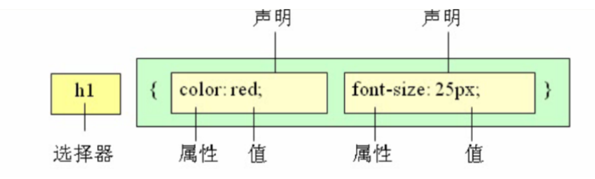

## CSS介绍

### 定义

CSS(Cascading Style Sheets)，通常称为CSS样式表或层叠样式表

### 作用
用于设置HTML页面的显示样式

### 规则



1. 选择器用于指定CSS样式作用的HTML对象，花括号内是对该对象设置的具体样式
2. 属性和属性值以“键值对”的形式出现
3. 属性是对指定的对象设置的样式属性，例如字体大小、文本颜色等
4. 属性和属性值之间用英文“:”连接
5. 多个“键值对”之间用英文“;”进行区分

### 注释
css中注释使用 `\* *\`


## CSS引入

### html标签行内

```html
<div style=""></div>
```

### style标签

```html
<style>
</style>
```

### css文件

```html
<link ref="stylesheet" href="target.css" />
```


## CSS三大特性

### 层叠性

定义：层叠性是指多种CSS样式的叠加

作用：层叠性是浏览器处理冲突的一个能力,如果一个属性通过两个选择器设置到同一个元素上，那么这个时候一个属性就会将另一个属性层叠掉

特点：如果出现样式冲突，则会按照CSS书写的顺序，以最后的样式为准

### 继承性

定义：继承性是指书写CSS样式表时，子标签会继承父标签的某些样式

常见会继承的属性：color，text-xxx，font-xxx，line-xxx

常见不会继承的属性：display，边框相关，文本相关，背景相关，定位相关，盒子模型相关

### 优先性(权重)

| 权重项                       | 权重     |
| ---------------------------- | -------- |
| 继承，*，层级选择器 的贡献值 | 0,0,0,0  |
| 每个元素，伪元素贡献值为     | 0,0,0,1  |
| 每个类，伪类贡献值为         | 0,0,1,0  |
| 每个ID贡献值为               | 0,1,0,0  |
| 每个行内样式贡献值           | 1,0,0,0  |
| 每个!important贡献值         | ∞ 无穷大 |
