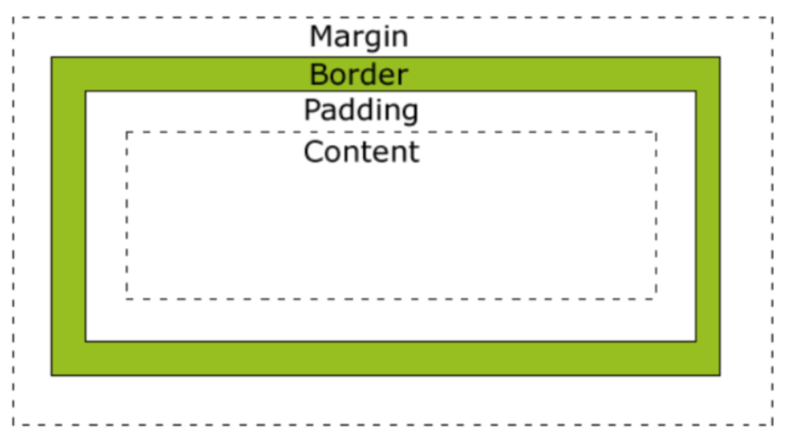
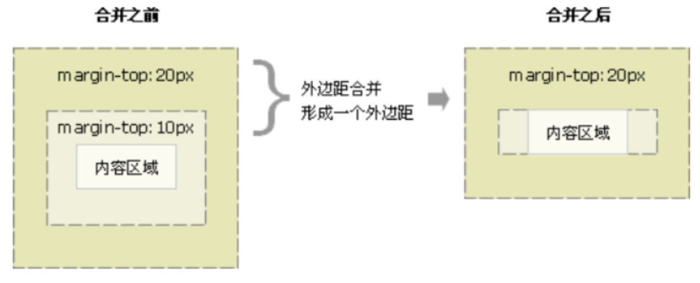

## 介绍

### 盒子模型是什么

在网页中，一个元素占有空间的大小由几个部分构成，其中包括元素的内容（content），元素的内边距（padding），元素的边框（border），元素的外边距（margin）四个部分。

这四个部分占有的空间中，有的部分可以显示相应的内容，而有的部分只用来分隔相邻的区域或区域。

4个部分一起构成了css中元素的盒模型。

### 分类

盒子模型分为：**W3C标准盒模型**和**IE传统盒模型**


## W3C标准盒模型 [content-box]

### 示意图



### content

盒子中放置的内容（嵌套的内容）

### padding

盒子的内边距

| 属性           | 说明                                  |
| -------------- | ------------------------------------- |
| padding-top    | 上内边距                              |
| padding-right  | 右内边距                              |
| padding-bottom | 下内边距                              |
| padding-left   | 左内边距                              |
| padding        | 上内边距 右内边距  下内边距  左内边距 |

| 值的个数 | 表达意思                                     |
| -------- | -------------------------------------------- |
| 1个值    | padding：上下左右边距                        |
| 2个值    | padding: 上下边距 左右边距                   |
| 3个值    | padding：上边距 左右边距 下边距              |
| 4个值    | padding: 上内边距 右内边距 下内边距 左内边距 |

### border

盒子的边框

| 属性          | 说明       | 可选值                                                       |
| ------------- | ---------- | ------------------------------------------------------------ |
| border-width  | 边框宽度   | 数值+单位                                                    |
| border-style  | 边框样式   | none, solid, dashed, dotted, double                          |
| border-color  | 边框颜色， | 预定于颜色，16进制颜色，rgb(a)颜色                           |
| border        | 简写模式   | [宽度] [样式] [颜色]                                         |
| border-radius | 圆角的半径 | 四个值：左上角 右上角 右下角 左下角<br />如果某个角没写，则与它的对角相同<br />如果只写一个角，则四个角相同 |

指定特定边框

* border-top: 指定上边框
* border-right: 指定右边框
* border-bottom: 指定下边框
* border-left: 指定左边框

### margin

盒子的外边距

| 属性          | 说明                                  |
| ------------- | ------------------------------------- |
| margin-top    | 上外边距                              |
| margin-right  | 右外边距                              |
| margin-bottom | 下外边距                              |
| margin-left   | 左外边距                              |
| margin        | 上外边距 右外边距  下外边距  左外边距 |

| 值的个数 | 表达意思                                    |
| -------- | ------------------------------------------- |
| 1个值    | margin：上下左右边距                        |
| 2个值    | margin: 上下边距 左右边距                   |
| 3个值    | margin：上边距 左右边距 下边距              |
| 4个值    | margin: 上内边距 右内边距 下内边距 左内边距 |

#### margin实现水平居中

```css
margin: 上下外边距 auto;
```

* 必须是块级元素
* 盒子必须指定了宽度

#### margin上下塌陷问题

#### margin塌陷问题

##### 相邻外边距合并问题

当**上下相邻**的两个块元素相遇时，如果上面的元素有下外边距margin-bottom，下面的元素有上外边距margin-top，则他们之间的垂直间距不是margin-bottom与margin-top之和，而是两者中的较大者

解决方法：避免就好

##### 嵌套外边距的合并(外边距塌陷)问题

对于两个嵌套关系的块元素，如果父元素没有内边距及边框，则父元素的外边距会与子元素的外边距发生合并，合并后的外边距为两者中的较大者，即使父元素的外边距为0，也会发生合并，合并后子元素的外边距为0


解决方法

* 可以为父元素定义1像素的上边框或上内边距
* 可以为父元素添加overflow:hidden

### W3C标准盒子大小计算

#### 外盒尺寸计算（元素空间尺寸）

element空间高度＝内容高度＋内距＋边框＋外距

element空间宽度＝内容宽度＋内距＋边框＋外距

#### 内盒尺寸计算（元素大小）

element高度＝内容高度＋内距＋边框

element宽度＝内容宽度＋内距＋边框


## IE传统盒模型 [border-box]

### 与W3C盒模型的联系和区别

与W3C标准盒模型一样都有：margin, border, padding, content

与W3C标准盒模型区别

* IE传统盒模型的width属性包括border, padding和content
* IE传统盒模型的height属性包括border, padding和content

### 计算IE传统盒模型大小

#### 外盒尺寸计算（元素空间尺寸）

element空间高度＝内容高度＋外距（height包含了元素内容宽度、边框、内距）

element宽间宽度＝内容宽度＋外距（width包含了元素内容宽度、边框、内距）

#### 内盒尺寸计算（元素大小）

element高度＝内容高度（height包含了元素内容宽度、边框、内距）

element宽度＝内容宽度（width包含了元素内容宽度、边框、内距）


## 切换盒子模式

使用样式`box-sizing`，可选值：`border-box`(W3C标准盒模型)，`content-box`(IE传统盒模型)

```css
box-sizing: border-box; 
box-sizing: content-box;
```

当为content-box时

> 宽度，高度只算content

当为border-box时

> 宽度，高度包括 border, padding, content
