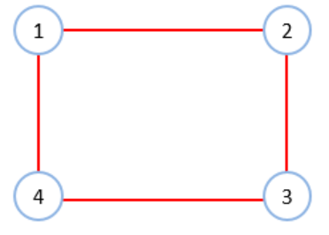
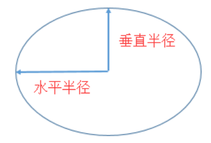

## 显示模式

```css
display: block|inline|inline-block
```

### block

块级显示

* 独占一行
* 高度，行高、外边距以及内边距都可以控制
* 宽度默认是容器的100%
* 可以容纳内联元素和其他块元素

### inline

行内显示

* 和相邻行内元素在一行上
* 高、宽无效，但水平方向的padding和margin可以设置，垂直方向的无效
* 默认宽度就是它本身内容的宽度
* 行内元素只能容纳文本或则其他行内元素（a标签除外）

#### inline-block

行内块元素

* 和相邻行内元素（行内块）在一行上,但是之间会有空白缝隙
* 默认宽度就是它本身内容的宽度
* 高度，行高、外边距以及内边距都可以控制


## 边框样式

| 边框样式     | 说明     | 可选值                        |
| ------------ | -------- | ----------------------------- |
| border-width | 边框宽度 | 数字+单位                     |
| border-style | 边框样式 | solid, double, dotted, dashed |
| border-color | 边框颜色 | 英文颜色，rgba，16进制        |
| border       | 简便写法 | [style] [color] [width]       |

可以通过 border-top|left|bottom|right来单独设置特定的边


## 圆角样式

```css
border-radius: 1-4 length|% / 1-4 length|%;
```

### 1-4代表意思



### / 意思

**/**前的四个数值表示圆角的水平半径，后面四个值表示圆角的垂直半径



### 缺省值

如果不写 **/**，则默认水平半径等于垂直半径

顺序为 左上，右上，右下，左下，如果有省略值，则与其对角相同

| 圆角样式值 | 说明                     |
| ---------- | ------------------------ |
| 1个值      | 四个角                   |
| 2个值      | (左上右下) (右上左下)    |
| 3个值      | (左上) (右上左下) (右下) |
| 4个值      | (左上，右上，右下，左下) |

* 可以使用 border-top-left, border-top-right, border-bottom-left, border-bottom-right来单独设置值

* 如果使用百分比，则参考值为自身


## 溢出

```css
overflow: scroll | auto | hidden | visible
```

| 可选值  | 说明                                       |
| ------- | ------------------------------------------ |
| auto    | 超出自动显示滚动条，不超出不显示滚动条     |
| visible | 不剪切内容也不添加滚动条                   |
| hidden  | 不显示超过对象尺寸的内容，超出的部分隐藏掉 |
| scroll  | 不管超出内容否，总是显示滚动条             |


## 尺寸控制

```css
width: 300px;
height: 300px;
min-width: 500px;
min-height: 500px;
max-width: 500px;
max-height: 500px;
```

| 属性       | 说明   |
| ---------- | ------ |
| width      | 宽     |
| height     | 高     |
| min-width  | 最小宽 |
| min-height | 最小高 |
| max-width  | 最大宽 |
| max-height | 最大高 |

width和height如果使用百分比，则参考对象为父级，所以经常设置

```css
html, body {
    height: 100%;
    width: 100%;
}
```

#### 由内容自适应宽高

```css
width: fill-available;
width: fit-content;
width: min-content;
width: max-content;
```

| 可选值         | 说明                                                         |
| -------------- | ------------------------------------------------------------ |
| fill-available | 表示撑满可用空间                                             |
| fit-content    | 表示将元素宽度收缩为内容宽度                                 |
| min-conent     | 表示采用内部元素最小宽度值最大的那个元素的宽度作为最终容器的宽度 |
| max-content    | 表示采用内部元素宽度值最大的那个元素的宽度作为最终容器的宽度 |


## 阴影

```css
box-shadow: 水平阴影的位置 垂直阴影的位置 模糊距离 阴影大小 阴影颜色 内/外阴影；
```

| 值             | 说明                |
| -------------- | ------------------- |
| 水平阴影的位置 | 必需的，允许负值    |
| 垂直阴影的位置 | 必需的，允许负值    |
| 模糊距离       | 可选                |
| 阴影大小       | 可选                |
| 阴影颜色       | 可选                |
| 内/外阴影      | 可选，只能选填inset |

