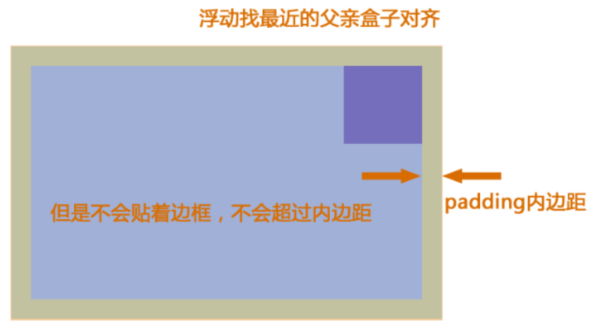
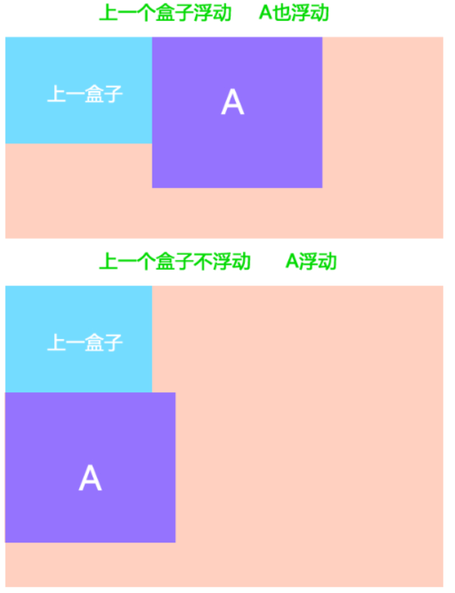
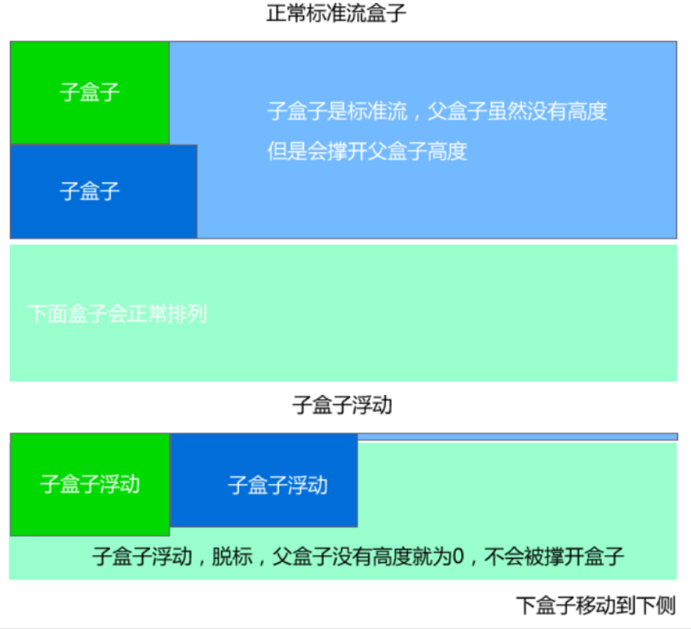

## 文档流

HTML文档中的元素在渲染时，行内元素会从左向右渲染，块元素会从上到下进行渲染，这种渲染顺序称为文档流

比如块级元素会独占一行，行内元素会按顺序依次前后排列


## 浮动

### 来源以及衍生作用

浮动最早是用来控制图片，以便达到其他元素（特别是文字）实现"环绕"图片的效果，即图文混排，而不是用来布局的，但后来人们发现浮动能让任何盒子可以一行排列，所以就开始使用浮动来布局了

衍生效果：可以用来布局

### 定义

浮动是指设置了浮动属性的元素会脱离标准普通流的控制，移动到特定位置的过程

### 局限性

需要清除浮动，否则父盒子高度不好处理

### 效果

浮动后显示模式自动会变为行内块模式，inline-block

浮动会脱离文档流，从而不占用原始空间

如果多个元素浮动，它们会紧紧靠近在一起

### 分类

浮动分为：左浮动，右浮动，不浮动

### 设置浮动

| 浮动方式         | 设置          |
| ---------------- | ------------- |
| 左浮动           | float: left;  |
| 右浮动           | float: right; |
| 不浮动（默认值） | float: none;  |

### 规律

浮动的元素总是找理它最近的父级元素对齐，但是不会超出内边距的范围，如果强制超出，则会移动到下面


对于浮动元素A，如果A的上一个元素也浮动，则A元素顶部会和上一个元素的顶部对齐；如果上一个元素是标准流，则A元素的顶部会和上一个元素的底部对齐


总结

* 浮：加了浮动的元素盒子是浮起来的，漂浮在其他的标准流盒子上面
* 漏：加了浮动的盒子，不占位置的，它浮起来了，它原来的位置漏给了标准流的盒子
* 特：特别注意，这是特殊的使用，有很多的不好处，使用要谨慎


## 清除浮动

### 清除浮动是什么

清除浮动的意思是**清除浮动带来的影响**

### 浮动带来什么影响

因为在使用浮动布局时，很多时候不能确定浮动元素的高度，所以父盒子也不设定高度，由浮动元素的高度决定父盒子的高度

但是这带来一个问题，因为父盒子不设置高度，而浮动元素脱离了文档流，这导致文档流中父盒子后的元素会顶上来，即浮动元素漂浮在父盒子后的文档流元素上，显示有问题，这种问题称为**高度塌陷**

所以需要清除浮动带来的影响



### 用于清除浮动的属性

使用clear属性，清除浮动带来的影响【W3C推荐做法】

clear属性可选值：both(清除左右浮动)，left(清除左浮动)，right(清除右浮动)

```css
clear: both | left | right
```

使用 clear: both 需要元素必须是块级元素

### 清除浮动的5种方法

#### 方法1：让父元素本身也浮动

不推荐使用，如果父元素本身也浮动，父元素宽度就会随着子元素变化

```css
.father-box {
  float: left;
}
```

#### 方法2：使用clear属性

使用位置：在浮动元素后添加一个空的div标签，里面使用clear属性

```html
<head>
  <style>
    .box {
      width: 100%;
      background-color: green;
    }

    .box div:nth-of-type(1) {
      width: 100px;
      height: 300px;
      background-color: blue;
      margin: 20px;
      float: left;
    }

    .box div:nth-of-type(2) {
      width: 200px;
      height: 50px;
      background-color: orange;
      margin: 10px;
      float: right;
    }

    .box div:nth-of-type(3) {
      clear: both;
    }
  </style>
</head>
<body>
  <div class="box">
    <div></div>
    <div></div>
    <div></div>
  </div>
</body>
```

> 在需要清除浮动的元素下方额外添加一个空div，对它只设置 clear: both

第三个div使用了`clear:both`，消除它上面两个div浮动对它造成的影响，所以第三个div的高度就计算出来了，从而父元素的高度被第三个div撑开了

优点：通俗易懂，书写方便

缺点：添加许多无意义的标签，结构化较差

#### 方法3：触发BFC

父盒子使用overflow属性

```html
<html>
<head>
  <style>
    .box {
      width: 100%;
      background-color: green;
      overflow: hidden;
    }

    .box div:nth-of-type(1) {
      width: 100px;
      height: 300px;
      background-color: blue;
      margin: 20px;
      float: left;
    }

    .box div:nth-of-type(2) {
      width: 200px;
      height: 50px;
      background-color: orange;
      margin: 10px;
      float: right;
    }
  </style>
</head>
<body>
  <div class="box">
    <div></div>
    <div></div>
    <div></div>
  </div>
</body>
</html>
```

优点：代码简洁

缺点：内容增多时候容易造成不会自动换行导致内容被隐藏掉，无法显示需要溢出的元素

#### 方法4：after伪元素法

> 使用 clear: both，但不需要额外添加空div
>
> 对父元素设置::after伪元素，将其content设置为空，并设置 clear: both
>
> 还要设置 display: block; 这是因为 clear: both只对块级元素生效，且块级元素才可以设置高度，而伪元素添加的元素默认是行内元素

```css
.clearfix::after {  
  content: "."; 
  display: block;
  clear: both;
  height: 0; 
  visibility: hidden; 
}   

/* IE6、7 专用 */
.clearfix { 
  *zoom: 1;
}
```

优点：结构语义化正确

缺点：由于IE6-7不支持:after，使用 *zoom:1触发hasLayout

#### 方法5：before和after双伪元素法

```css
.clearfix:before,
.clearfix:after { 
  content:".";
  display:table;
}
.clearfix:after {
  clear:both;
}

.clearfix {
  *zoom:1;
}
```

优点：代码更简洁

缺点：由于IE6-7不支持:after，使用 zoom:1触发 hasLayout


## 浮动样式

### 文字环绕

```css
shape-outside: border-box | padding-box | content-box;
```

当 `shape-outside` 与 `clip-path` 值相同时，即可实现文字环绕浮动区域

```css
clip-path: polygon(50% 0, 100% 100%,0 100%);
shape-outside: polygon(50% 0, 100% 100%,0 100%);
```

### 浮动区域形状定制

```css
clip-path: ellipse(50% 50%)
clip-path: circle(50% at 100% 100%)
clip-path: polygon(50% 0, 100% 100%,0 100%)
```

### 图片环绕

前提：有透明度的`png`图片

不用设置`clip-path`

```css
shape-outside: url(xxx.png);
```

