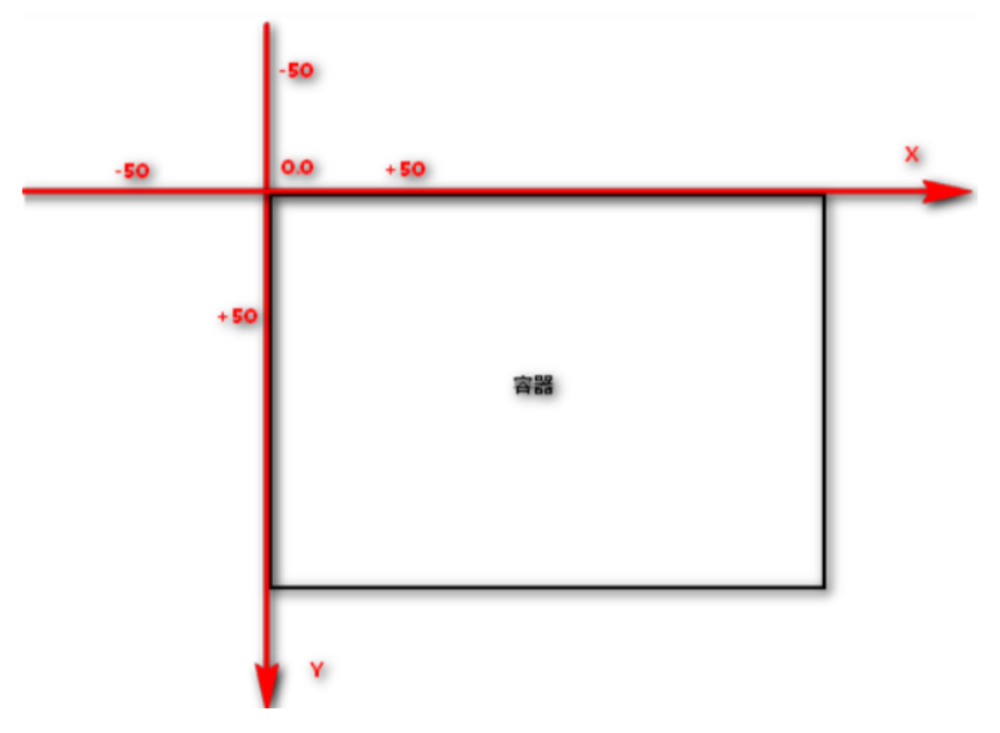
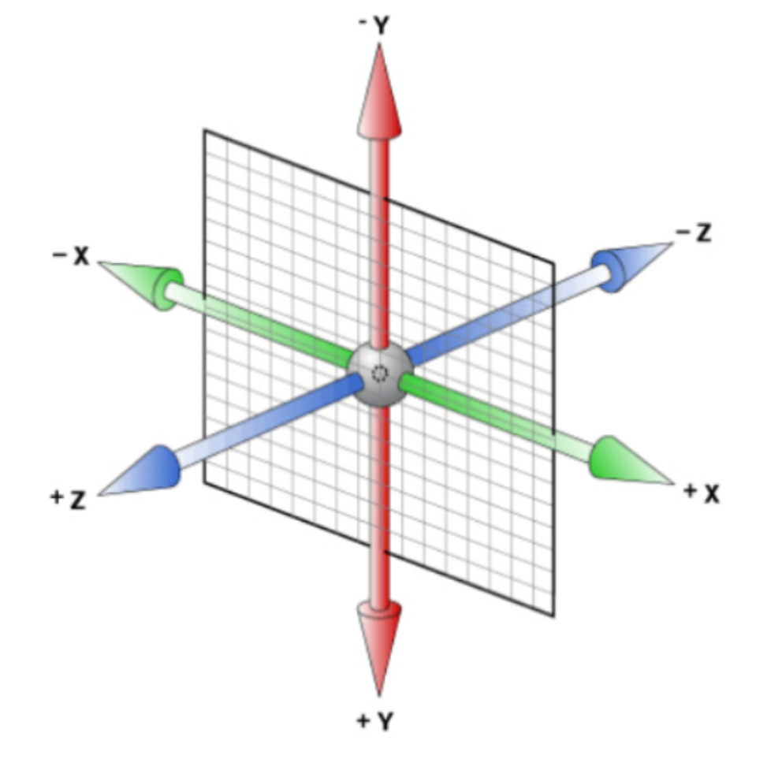
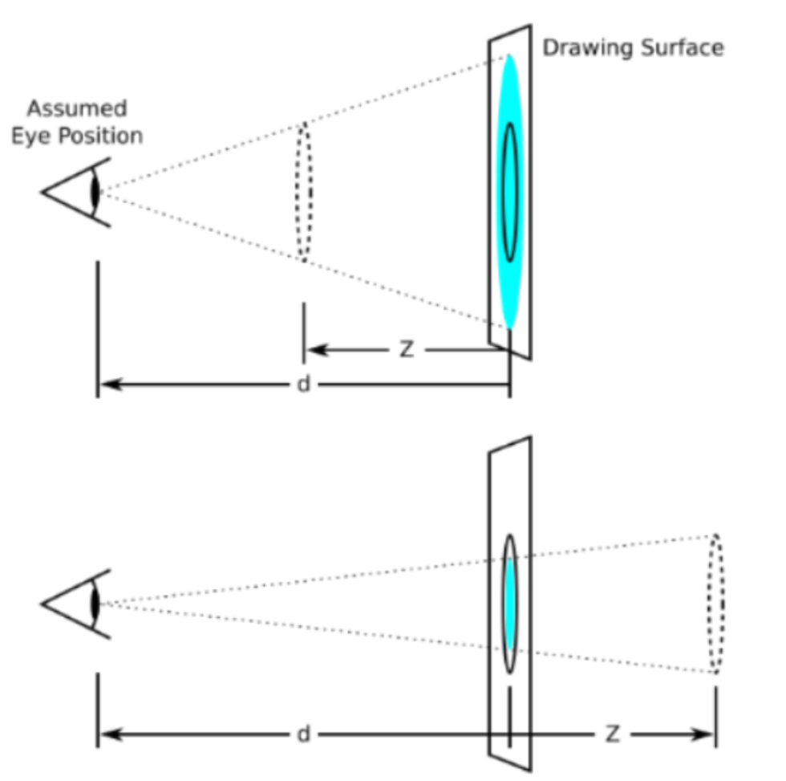

## 介绍

`transform`可以实现元素的位移、旋转、倾斜、缩放

配合过渡和动画，可以取代大量之前只能靠Flash才可以实现的效果


## 坐标轴

### 2D坐标轴



### 3D的坐标轴




## 变形

使用属性`transform`

包括移动，缩放，旋转，倾斜，透视

注意：只能用于block或inline-block元素


## 移动

### 单独写法

#### X轴

```css
transform: translateX(100px); /* 往右移动100px */
transform: translateX(-100px); /* 往左移动-100px */
transform: translateX(50%); /* 往右移动自身宽度的50% */
transform: translateX(-50%); /* 往左移动自身宽度的50% */
```

#### Y轴

```css
transform: translateY(100px); /* 往下移动100px */
transform: translateY(-100px); /* 往上移动-100px */
transform: translateY(50%); /* 往下移动自身宽度的50% */
transform: translateY(-50%); /* 往上移动自身宽度的50% */
```

#### Z轴

```css
transform: translateZ(100px); /* 朝向你走100px */
transform: translateZ(-50px); /* 背离你走100px */
/* 不支持百分比，因为没有参考值 */
```

### 合并写法

```css
transform: translate(100px -50px); /* 往右100px 往上50px*/
transform: translate3d(100px -50px, 200px); /* 往右100px 往上50px 朝向你走100px*/
```


## 缩放

### 单独写法

#### X轴

```css
transform: scaleX(2); /* 水平变为原来2倍 */
transform: scaleX(0.5); /* 水平变为原来0.5倍 */
```

#### Y轴

```css
transform: scaleY(2); /* 垂直变为原来2倍 */
transform: scaleY(0.5); /* 垂直变为原来0.5倍 */
```

#### Z轴

```css
transform: scaleZ(2) /* Z轴变为原来2倍 */
transform: scaleZ(0.5) /* Z轴变为原来0.5倍 */
```

### 合并写法

```css
transform: scale(2, 0.5) /* 水平变为原来2倍, 垂直变为原来0.5倍 */
transform: scale3d(2, 0.5, 3) /* 水平变为原来2倍, 垂直变为原来0.5倍, Z轴变为原来3倍 */
```


## 旋转

### 单独写法

#### X轴

```css
transform: rotateX(45deg) /* 以X轴为中心轴顺顺时针旋转45度 */
transform: rotateX(-90deg) /* 以X轴为中心轴顺顺逆时针旋转90度 */
```

#### Y轴

```css
transform: rotateY(45deg) /* 以Y轴为中心轴顺顺时针旋转45度 */
transform: rotateY(-90deg) /* 以Y轴为中心轴顺顺逆时针旋转90度 */
```

#### Z轴

```css
transform: rotateZ(45deg) /* 以Z轴为中心轴顺顺时针旋转45度 */
transform: rotateZ(-90deg) /* 以Z轴为中心轴顺顺逆时针旋转90度 */
```

### 合并写法

```css
transform: rotate(45deg, -75deg) /* 以X轴为中心轴顺顺时针旋转45度, 以Y轴为中心轴顺顺逆时针旋转-75度 */
transfrom: rotate3d(1,1,0, 135deg) /* 以向量[1,1,0]为中心轴顺时针旋转135度 */
```


## 倾斜

### 单独写法

#### X轴

```css
transform: skewX(45deg) /* X轴正方向倾斜45度 */
```

#### Y轴

```css
transform: skewY(-45deg) /* Y轴负方向倾斜45度 */
```

#### Z轴

```css
transform: skewZ(45deg) /* Z轴正方向倾斜45度 */
```

### 合并写法

```css
transform: skew(50deg, -60deg) /* X轴正方向倾斜45度, Y轴负方向倾斜60度 */
transform: skew3d(50deg, -60deg, 90deg) /* X轴正方向倾斜45度, Y轴负方向倾斜60度, Z轴正方向倾斜90度 */
```


## 变形参考点

### 2d参考点

```css
transform-origin: X轴坐标 Y轴坐标;
```

* 可以用数字+单位
* 可以用预选值：left, center, right

### 透视参考点

```css
perspective-origin: X轴坐标 Y轴坐标;
```

* 可以用数字+单位
* 可以用预选值：left, center, right


## 同时定义多个变形

```css
transform: translate(100%, 100%) rotateX(45deg); /* 同时使用移动和旋转 */
```


## 透视

### 说明

电脑显示屏是一个2D平面，图像之所以具有立体感（3D效果），其实只是一种视觉呈现，通过透视可以实现此目的

透视可以将一个2D平面，在转换的过程当中，呈现3D效果

* 透视原理： 近大远小
* 浏览器透视：把近大远小的所有图像，透视在屏幕上
* perspective：视距，表示视点距离屏幕的长短
* 视点：用于模拟透视效果时人眼的位置



### 设置透视的方法

1. 每个元素独立设置透视
2. 设置统一透视，多个元素使用同一个透视（为父元素设置透视）

### 设置透视

1. 每个元素独立设置透视

```css
transform: prespective(100px); /* 透视100px */
```

2. 为父元素设置透视

```css
prespective: 100px;
```

### 开启3维空间

```css
transform-style: preserve-3d;
```


