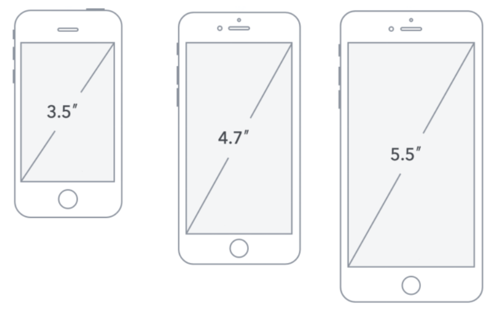
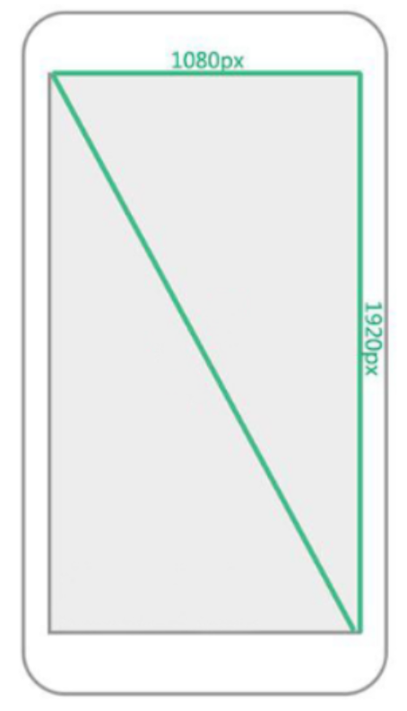
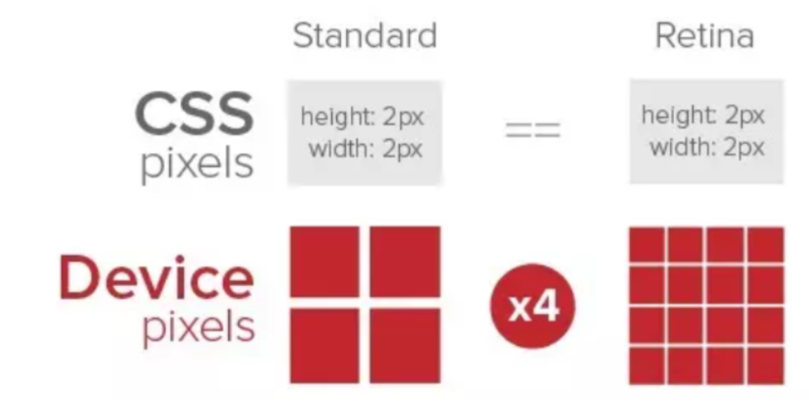
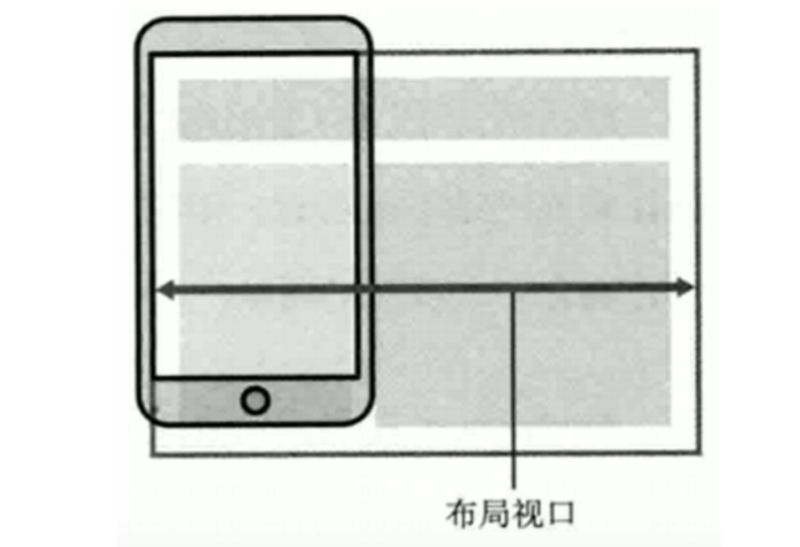
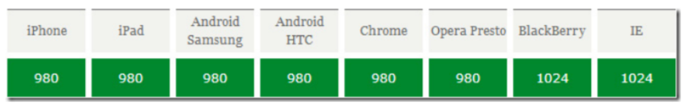

## 主流浏览器和内核

### PC端浏览器

产品：Chrome、Firefox、Edge...

内核：Chromium、Gecko、Webkit、Trident

### 移动端浏览器

产品：Chrome、Firefox、Edge ...

内核：主要以Webkit为主，即主要兼容Webkit内核即可

注意：因为是Webkit内核，所以可以放心使用HTML5标签和CSS3样式，同时兼容旧版本浏览器时，加上-webkit前缀即可


## 屏幕

可以从这个网站获取常见设备的屏幕信息：https://screensiz.es/

### 屏幕尺寸

屏幕尺寸指的是屏幕对角线的长度，一般用英寸来度量



### 屏幕像素

幕是由一个一个小方块组成的，每个方块只能显示一种颜色，这种方块称为像素

一个像素的物理大小，即一个小方块的物理大小不是固定的

### 屏幕像素尺寸（屏幕分辨率）

屏幕像素尺寸分辨指的是屏幕水平和垂直方向的像素数目，像素尺寸也称分辨率

例如1920*1080指的是屏幕垂直方向和水平方向分别有1920和1080个像素点而构成

因为一个像素的物理大小是没有固定的，所以不同大小的屏幕都可以是1920 * 1080分辨率（大屏幕的像素物理大小比较大）



注意：

* 屏幕分辨率是一个固定值，生产出来就固定了，无论是手机屏幕还是电脑屏幕
* 屏幕分辨率与显示频率不同，计算机可以修改显示分辨率

### 屏幕像素密度

PPI定义

Pixels Per Inch：对角线每英寸的像素点数

PPI是计算机显示设备从打印机中借鉴了DPI的概念

PPI计算公式
> ppi 
>
> = 屏幕对角线上的像素点数 / 对角线长度 
>
> = √（屏幕横向像素点^2 + 屏幕纵向像素点^2）/ 对角线长度

PPI值的越大说明单位尺寸里所能容纳的像素数量就越多，所能展现画面的品质也就越精细，反之就越粗糙

屏幕尺寸固定时，PPI越大，像素的实际大小就会越小，PPI越小，像素实际大小就越大

### 设备像素与设备像素比

#### 定义

设备像素是指屏幕上的实际像素点

#### 需求

为了屏幕的清晰度更高，需要提高的屏幕的像素密度(PPI)，但是手机的屏幕又不能做的太大，所以只能将每个设备像素点做小

#### 问题

这会造成同样大小的元素在不同PPI设备上的显示大小不一样

假设存在宽度相同的屏幕A和屏幕B，且屏幕B的PPI是屏幕A的两倍，即屏幕B宽度上的像素点数量是屏幕A宽度上的像素点数量的两倍

则如果一个元素能刚好占满屏幕A的宽度，则这个元素只能占满屏幕B的宽度的一半，**即在超高清屏幕下元素会变得很小**

#### 解决

**为了解决同一元素在高PPI屏幕下显示过小的问题，屏幕使用多个设备像素来表示一个CSS像素**


#### devicePixelRadio

设备像素比，简称dpr，指的是CSS像素与设备像素的比值，即一个CSS等价于dpr个物理像素

| 设备          | 物理像素分辨率                 | 逻辑像素分辨率 | PPI  | 设备像素比(device pixel ratio) |
| ------------- | ------------------------------ | -------------- | ---- | ------------------------------ |
| IPhone 4      | 640 x 960                      | 320 x 480      | 326  | 2                              |
| IPhone 5      | 640 x 1136                     | 320 x 568      | 326  | 2                              |
| IPhone 6      | 750 x 1334                     | 375 x 667      | 326  | 2                              |
| IPhone 6 plus | 1080 x 1920<br />(1242 x 2208) | 414 x 736      | 401  | 2.6（3）                       |

#### 多倍图技术

在高dpr下，图片很容易出现模糊，**原因就是设备将原来的一个css像素点放大成了多个设备像素点**

为了保证图片不出现模糊，我们需要对图片进行处理，通过提高图片的像素密度来消除模糊现象，这就是多倍图技术

* 页面不缩放的情况下，CSS像素 == 独立设备像素 == 逻辑像素 == DPI == 位图像素
* 在一个标准的显示密度下（普通屏幕），一个CSS像素对应一个物理像素；在高清屏幕下，一个CSS像素等于N个物理像素


## 视口

### 视口分类

视口可以分为：布局视口，可视视口，理想视口

### 布局视口 (layout viewport)

布局视口指的是可以进行网页布局区域的大小，代表html标签内容的显示区域

获取方式

```js
document.documentElement.clientWidth;  // 不包含滚动条
document.documentElement.clientHeight; // 不包含滚动条

window.innerWidth;  // 包含滚动条
window.innerHeight; // 包含滚动条
```



### 可视视口 (visual viewport)

可视视口指设备屏幕区域

获取方式

```js
window.screen.width;
window.screen.height;
```

#### 布局视口与可视视口的联系

布局视口与可视视口大小不一致时

* 安卓端：会出现水平/垂直滚动条

* 苹果端：会将视口缩放为屏幕大小

布局视口与可视视口默认大小

PC浏览器：布局视口等于可视视口，即等于浏览器显示区域

移动端浏览器：布局视口大小不再受限于浏览器显示区域，而是不同浏览器有不同默认值，且默认值一般比屏幕大



### 理想视口 (ideal viewport)

指最方便于浏览器进行浏览、阅读的视口

当布局视口宽度等于可视视口宽度时，就是理想视口

可以通过meta视口标签来设置

### meta视口标签

#### 作用

通过meta视口标签的设置，可以让移动端设备的布局视口大小等于理想视口大小，从而使移动端显示和体验最佳

#### 属性和值

| 属性          | 解释说明                                         |
| ------------- | ------------------------------------------------ |
| width         | 设置布局视口的宽度，一般等于设备宽度device-width |
| user-scalable | 用户是否可以进行缩放，yes/no(1/0 )               |
| initial-scale | 初始布局视口与理想视口比值，大于0的数字          |
| minimum-scale | 最小布局视口与理想视口比值，大于0的数字          |
| maximum-scale | 最大布局视口与理想视口比值，大于0的数字          |

#### 标准写法

```html
<meta name="viewport" 
    content="width=device-width, 
             user-scalable=no, 
             initial-scale=1.0, 
             maximum-scale=1.0, 
             minimum-scale=1.0" />
```

#### 解决刘海屏适配问题

使用 viewport-fit: cover 解决

```html
<meta name="viewport" 
    content="width=device-width, 
             user-scalable=no, 
             initial-scale=1.0, 
             maximum-scale=1.0, 
             minimum-scale=1.0,
      		 viewport-fit=cover" />
```


## 适配

### 核心思想

前提：设置viewport，实现理想视口

移动端适配的核心思想是：等比例缩放

因为移动端阅读的特点是：宽度不变，高度可以通过滚动延伸，所以对宽度使用等比例缩放

### 方式1：使用vw

1vw为屏幕宽度的 1/100

计算公式推导过程：

> 假设设计稿宽度为 design-width，设计稿一个元素A的宽度为 dw，屏幕宽度为 screen-width
>
> 设该元素A实际书写大小为x，由等比例（元素宽度占的百分比要一样）
>
> ​                 dw                                   x
>
> ​       \-------------------------  =  ------------------------
>
> ​          design-width              screen-width
>
> 可得：
>
> ​                             screen-width
>
> ​     x  = dw * ---------------------------------- （单位 vw）
>
> ​                             design-width

### 方式2：使用rem

因为 vw和vh 的兼容性并不如 rem 好，所以可以使用 rem 实现类似 vw 的效果

在应用加载时，获取屏幕宽度，设置html元素的fontSize为宽度的百分之一，从而实现 1rem = 1vw 的效果

```js
document.addEventListener("DOMContentLoaded", () => {
    // 获取屏幕宽度的 1/100
    const fontSize = document.documentElement.clientWidth / 100
    // 获取html元素
    const html = document.querySelector("html")
    // 设置html元素的fontSize，即完成rem的设置
    html.style.fontSize = `${fontSize}px`
})
```


## 清除移动浏览器默认样式

### 清除浏览器的默认样式

> normalize.css
>
> reset.css

### 清除点击高亮样式

```css
-webkit-tap-highlight-color: transparent;
```

### 禁止长按时弹出菜单

```css
img, a {
  -webkit-touch-callout: none;
}
```

### 允许自定义按钮和输入框样式

```css
/* 在iOS只有加上下面这句代码，才能自定义按钮和输入框样式 */
-webkit-apperance: none;
```

### 1px边框问题

高清屏幕下，1px对应更多的物理像素，所以看起来比较粗

#### 解决方法1：使用