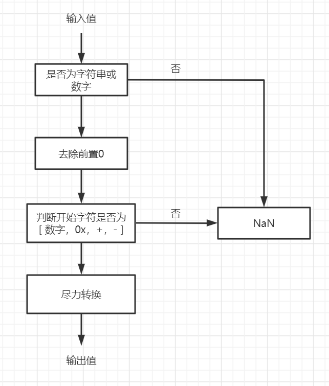

## Number类型介绍

Number类型表示数值类型，包括整数和小数


## 创建Number类型对象

创建Number类型有两种方式：使用字面量或使用Number构造函数

使用字面量创建Number类型对象时，不会调用构造函数

```js
let a = 123;
let b = new Number(123);

let c = 3.14;
let d = new Number(3.14);
```

### 2进制、8进制和16进制

| 进制   | 写法                                                  | 示例          |
| ------ | ----------------------------------------------------- | ------------- |
| 2进制  | 以0b或0B开头                                          | 0b10101010101 |
| 8进制  | 以0o或0O开头（老版本以 0 开头，严格模式下被禁止使用） | 0o1234567     |
| 16进制 | 以0x或0X开头                                          | 0xFF6666      |

注意：老版8进制的前缀是`0`，这在严格模式下是进制的，否则会有下列问题

```js
console.log(077); // 63
console.log(078); // 78
```


## NaN

### 概念

NaN 意思是 Not a Number，即表示不是一个数值

它是Number类型中的特殊值，会在其他类型对象非法转为Number类型时出现

### 运算

任何涉及到NaN的运算，结果都是NaN

### 判断是否等于NaN

NaN不等于任何值，包括它自己，要判断一个值是不是NaN，需要使用特殊的函数

#### Number.isNaN

```js
let a = Number("zxx");

console.log(a === NaN); // false
console.log(Number.isNaN(a)); // true
```

#### Object.is

Object.is类似于`===`，唯二区别：可以判断NaN，`+0`不等于`-0`

```js
let a = Number("zxx");

console.log(a === NaN); // false
console.log(Object.is(a, NaN)); // true
```


## Infinity值

### 概念

`Infinity`表示无限值

如果计算结果得到了一个超出JavaScript数值范围的值【**Number.MAX_VALUE**和**Number.MIN_VALUE**】

那么这个数值将被自动转换成特殊的Infinity值：如果这个数值是负数，则会被转换成`-Infinity`，如果这个数值是正数，则会被转换成 `Infinity`

### 参与计算

Infinity 不是能够参与计算的数值，如果某次计算返回了正或负的Infinity值，那么该值将无法继续参与下一次的计算

Infinity与0相乘，则结果是NaN，Infinity与非0数值相乘，则结果是Infinity 或-Infinity，取决于有符号操作数的符号

0除以0才会返回 NaN，正数除以0返回 Infinity，负数除以0返回-Infinity

### 判断

要想确定一个数值是不是有穷的，可以使用 `Number.isFinite` 函数

```js
console.log(Number.isFinite(10/0)); // true
console.log(Number.isFinite(10)); // true
```

### 获取

访问**Number.NEGATIVE_INFINITY**和**Number.POSITIVE_INFINITY**可以得到负和正 Infinity 的值，因为这两个属性中分别保存着`-Infinity` 和 `Infinity`

### 与最大最小安全整数值区别

Number.MAX_VALUE和Number.MIN_VALUE是理论的最大值和最小值，但并不安全（指有可能会丢失精度）

JS有最大的安全值和最小的安全值

* 最大安全值 Number.MAX_SAFE_：2<sup>53</sup> - 1


## 最大最小值

### 最大最小值

最大值：`Number.MAX_VALUE`

最小值：`Number.MIN_VALUE`

### 最大最小安全整数值

`Number.MAX_VALUE`和 `Number.MIN_VALUE` 是理论的最大值和最小值，但并不安全（指有可能会丢失精度）

而JS有最大的安全整数值和最小的安全整数值

* 最大安全值 `Number.MAX_SAFE_INTEGER`：2<sup>53</sup> - 1
* 最小安全值 `Number.MIN_SAFE_INTEGER`：- (2<sup>53</sup> - 1)

判断是否是安全整数

Number.isSafeInteger

```js
Number.isSafeInteger(10); // true
Number.isSafeInteger(Number.MAX_SAFE_INTEGER+10); // false
```


## Number的小数表示

### 保留小数点【num.toFixed】

会进行四舍五入的操作

```js
let num = 10; 
console.log(num.toFixed(2));     //"10.00"

let num = 10.005; 
console.log(num.toFixed(2));     //"10.01"

let num = 10.004; 
console.log(num.toFixed(2));     //"10.00"
```

### 科学计数法【num.toExponential】

```js
let num = 10; 
console.log(num.toExponential(1));  //"1.0e+1" 

let num = 99; 
console.log(num.toPrecision(1));  //"1e+2" 
console.log(num.toPrecision(2));  //"99" 
console.log(num.toPrecision(3));  //"99.0" 
```


## typeof 和 instanceof 对于数值类型

由于数值类型分为字面值和Number类型，所以typeof和instanceof对它们的结果不一样

### typeof

```js
let numberObject = new Number(10); 
let numberValue = 10; 

console.log(typeof numberObject);   //"object" 
console.log(typeof numberValue);    //"number" 
```

### instanceof

```js
let numberObject = new Number(10); 
let numberValue = 10; 

console.log(numberObject instanceof Number);  //true 
console.log(numberValue instanceof Number);   //false
```


## 非数值转数值

有 3个函数可以把非数值转换为数值：`Number`、`parseInt` 和 `parseFloat`

### Number

**与使用一元加操作符"+"的效果相同**

| 非数值类型 | 说明                                                         |
| ---------- | ------------------------------------------------------------ |
| Boolean    | true 和 false 将分别被转换为1和 0                            |
| Number     | 直接返回本身                                                 |
| String     | 只含数字（包括正负号、0x）：将其转换为十进制数值，前导0和前后空格会被忽略<br />包含有效浮点格式：将其转为浮点数值，前导0和前后空格会被忽略<br />空字符串：将其转换为 0<br />含其他字符：将其转换为 NaN |
| Undefined  | NaN                                                          |
| Null       | 0                                                            |
| Symbol     | 报错                                                         |
| BigInt     | 转为Number类型                                               |
| Object     | 调用对象的valueOf()方法，然后依照前面的规则转换返回的值      |

### parseInt

#### 语法

```js
parseInt(转换的对象, [数字基数(可选，默认为10)]);
```

#### 核心规则

忽略前后空格，尽力转为整数，转换失败返回NaN

* 如果参数不是数值类型或字符串类型，肯定转换失败，返回NaN
* 忽略字符串前后的空格，相当于执行`trim`操作，直至找到第一个非空格字符
* 如果第一个字符不是数字字符或正负号或`0x`，会返回NaN，所以空字符串也返回NaN
* 如果第一个字符是数字字符，会继续解析第二个字符，直到解析完所有后续字符或者遇到了一个非数字字符
  * `"1234blue"`会被转换为 1234，因为"blue"会被完全忽略
  * `"22.5"`会被转换为 22，因为小数点并不是有效的数字字符
* 如果字符串中的第一个字符是数字字符，也能够识别出各种整数格式
  * 字符串以"0x"开头且后跟数字字符，就会将其当作一 个十六进制整数
  * 字符串以"0"开头且后跟数字字符，则会将其当作一个八进制数



#### 数字基数

第二个参数用来决定转换的对象的基数（即以什么进制进行转换），范围为2-32，如果基数为0，则以十进制进行转换

###  parseFloat() 函数

用于转换浮点数，语法类似 parseInt

核心规则：忽略前后空格，尽力转为整数，转换失败返回NaN

### Number与parse函数对待字符串

#### 共同点

都会去除前导0和前后空格

#### 区别

Number：字符串必须整个是数字，不能含有其他非数字字符，否则返回NaN

parse：字符串只要前面满足数字，就可以转换，就算后面不满足数字要求，也可以进行转换

### parseInt面试题

#### 第一题

```js
let nums = ["1", "2", "3"].map(parseInt);
console.log(nums);
```

解析

1. map的回调函数形式为

   ```js
   function(当前值, 下标, 数组引用)
   ```

2. parseInt的语法格式为

   ```js
   parseInt(转换值，转换进制)
   ```

3. 剖析

   ```js
   let nums = ["1", "2", "3"].map(parseInt);
   
   // 相当于
   
   let source = ["1", "2", "3"];
   let nums = [];
   
   for (let i=0; i<source.length; i++) {
       let num = parseInt(source[i], i);
   }
   
   // 相当于
   
   [parseInt("1", 0), parseInt("2", 1), parseInt("3", 2)]
   ```

4. 由于不存在`1进制`且`"3"`不符合`2进制`，所以最终结果为

   ```js
   // nums为
   [1, NaN, NaN];
   ```

#### 第二题

```js
let num = parseInt("09/08/2009");
console.log(num);
```

解析

1. parseInt遇到第一个字符`0`，会以`8进制`形式解析后面的字符
2. parseInt遇到第二个字符`9`，不符合条件，结束解析，返回0

#### 第三题

```js
let num = "123";

console.log(parseInt(num, 0));
console.log(parseInt(num, 1));
console.log(parseInt(num, 2));
```

解析

1. 对于`parseInt(num, 0)`，相当于`parseInt("123", 10)`，结果为123
2. 对于`parseInt(num, 1)`，相当于`parseInt("123", 1)`，因为不存在1进制，所以结果为NaN
3. 对于`parseInt(num, 2)`，相当于`parseInt("123", 2)`，结果为1


## Number常用属性方法

#### 静态属性

| 静态属性                 | 说明         |
| ------------------------ | ------------ |
| Number.MAX_VALUE         | 最大值       |
| Number.MIN_VALUE         | 最小值       |
| Number.MAX_SAFE_INTEGER  | 最大安全整数 |
| Number.MIN_SAFE_INTEGER  | 最小安全整数 |
| Number.POSITIVE_INFINITY | 正无穷值     |
| Number.NEGATIVE_INFINITY | 负无穷值     |

### 静态方法

| 静态方法             | 说明               |
| -------------------- | ------------------ |
| Number.isNaN         | 判断是不是NaN      |
| Number.isFinite      | 判断是不是Finite   |
| Number.isSafeInteger | 判断是不是安全整数 |

### 实例方法

| 实例方法       | 说明        |
| -------------- | ----------- |
| num.toFixed(n) | 保留n位小数 |

