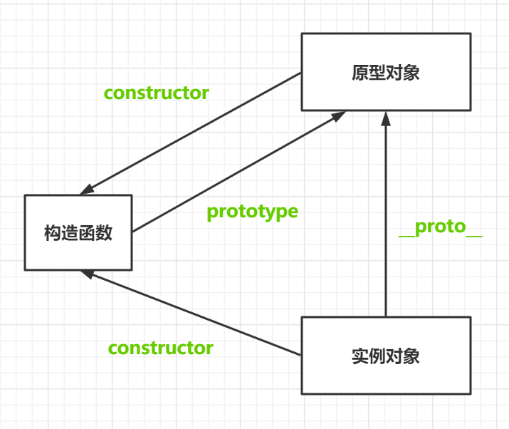
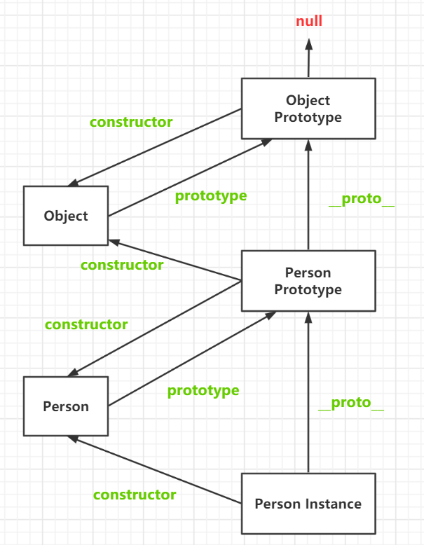
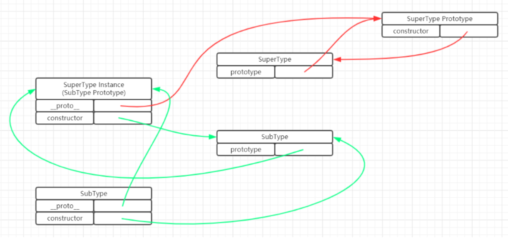

## 原型与原型链

### 概念

创建的一个构造函数时，引擎会根据一组特定的规则为该函数创建一个prototype属性，这个属性是一个指针，指向一个对象，该对象称为该构造函数的原型对象

原型对象都会自动获得一个constructor属性，这个属性是一个指向对应构造函数的指针

当调用构造函数创建一个新实例后，该实例就会拥有一个`__proto__`属性和constructor属性，`__proto__`属性指向构造函数对应的原型对象，constructor属性指向构造函数

原型对象用途是包含由对应的函数生成的所有实例所共享的属性和方法，即由同一个函数构造出来的实例，它们的`__proto__`属性指向同一个对象，从而可以实现对象共享同一个对象的属性和方法



### 原型链的根



### \_\_proto__和prototype区别

\_\_proto__：所有的对象都有，**构造函数也有**

prototype：只有构造函数有

### 链式查找

当读取某个对象的某个属性时，都会执行一次搜索，目标是搜索具有给定名字的属性

搜索首先从对象实例本身开始：如果在实例中找到了具有给定名字的属性，则返回该属性的值，如果没有找到， 则继续搜索指针指向的原型对象，在原型对象中查找具有给定名字的属性，如果在原型对象中找到了这个属性，则返回该属性的值，否则一直沿着原型链找，如果到了Object还没有找到，就报错说找不到该属性

### 不可直接重写原型值

虽然可以通过对象实例访问保存在原型中的值，但却不能通过对象实例重写原型中的值。如果我们在实例中添加了一个属性，而该属性与实例原型中的一个属性同名，那我们就在实例中创建该属性，该属性将会屏蔽原型中的那个属性

```js
function Person(){} 

Person.prototype.name = "Nicholas"; 
Person.prototype.age = 29; 
Person.prototype.job = "Engineer"; 
Person.prototype.sayName = function() {     
	console.log(this.name); 
}; 

var person1 = new Person(); 
var person2 = new Person(); 

person1.name = "Greg"; 
alert(person1.name);     //"Greg"——来自实例 
alert(person2.name);     //"Nicholas"——来自原型 
```

即使将属性设置为null，也只会在实例中设置这个属性，而不会恢复其指向原型的连接

但是，使用delete操作符则可以完全删除实例属性，从而让我们能够重新访问原型中的属性

```js
function Person(){} 

Person.prototype.name = "Nicholas"; 
Person.prototype.age = 29; 
Person.prototype.job = "Engineer"; 
Person.prototype.sayName = function() {     
alert(this.name); 
}; 

var person1 = new Person(); 
var person2 = new Person(); 

person1.name = "Greg"; 
alert(person1.name);     //"Greg"——来自实例 
alert(person2.name);     //"Nicholas"——来自原型 

delete person1.name; 
alert(person1.name);     //"Nicholas"——来自原型 
```

### 原型检查

| 原型检查方法  | 参数     | 检查原理                                                     |
| ------------- | -------- | ------------------------------------------------------------ |
| instanceof    | 构造函数 | 不断递归 `__proto__`，查看原型对象的`constructor`是否等于目标值 |
| isPrototypeOf | 原型对象 | 不断递归 `__proto__`，查看原型对象是否等于目标值             |

### 属性检查

| 属性检查方法    | 特点                         |
| --------------- | ---------------------------- |
| in操作符        | 会查找本身以及原型链         |
| hasOwnProperty  | 判断属性是否是对象自身的属性 |
| Reflect.ownKeys | 获取对象自身的属性组成的数组 |

组合使用：由于 in 操作符只要通过对象能够访问到属性就返回true，hasOwnProperty()只在属性存在于实例中时才返回true，因此只要in操作符返回true而hasOwnProperty()返回false，就可以确 定属性是原型中的属性

### 获取原型

| 获取原型方法          | 特点                                     |
| --------------------- | ---------------------------------------- |
| _\_proto__属性        | 不符合规范的用法，但是兼容绝大多数浏览器 |
| Object.getPrototypeOf | 符合规范的用法                           |

### 设置原型

| 设置原型方法          | 特点                                     |
| --------------------- | ---------------------------------------- |
| \_\_proto__           | 不符合规范的用法，但是兼容绝大多数浏览器 |
| Object.create         | 创建新对象时使用                         |
| Object.setPrototypeOf | 符合规范的用法                           |

### \_\_proto__详解

\_\_proto__ 本质上不是属性，而是 getter 和 setter

```js
let obj = { name: "Hello" };

obj.__proto__ = {
    show() {
        console.log(this.name);
    }
}

obj.__proto__ = 99;

obj.show(); // Hello
```

证明`__proto__`是一个setter和getter，在进行赋值时，会检查`__proto__`是不是一个对象，如果不是对象，则设置`__proto__`失败

### 创建对象的特殊用法

```js
Object(指定原型, {对象描述符})
```

#### 创建没有原型的对象

```js
const obj = Object.create(null, {
    name: {
        value: "Hello"
    }
});
```

#### 设置\_\_proto__为非对象

唯一解：使用`Object.create`，因为`__proto__`是定义在`Object`上的，所以其他方式创建的对象都有`__proto__`，又因为是setter和getter，所以改不了

```js
let obj = Object.create(null, {});
obj.__proto__ = "Hello";
console.log(obj.__proto__);
```


## 创建对象

### 版本1 : 使用 new Object() 或 {} 

#### 示例

```js
var obj = {
    name: "小明",
    age: 20,
    gender: "male"
}

obj.sayHello = function() {
    console.log("Hello World");
}

// 创建另外一个同样的对象
var obj2 = {
    name: "小明",
    age: 20,
    gender: "male"
}

obj2.sayHello = function() {
    console.log("Hello World");
}
```

#### 优点

最简单，几乎没有学习和理解成本

#### 缺点

* 如果想要创建多个同样的对象，会使用大量重复的代码，而如果需要对对象做出修改，则需要更改很多个地方
* 无法通过函数创建，即没有办法做模块化处理
* 不能使用`instanceof`操作符
* 对象拥有的方式应该是同一个函数，即多个对象共享一个函数对象，但是由这种方式创建的对象的方法各自不同，这样子会大大浪费内存空间

### 版本2 : 使用工厂方法

#### 示例

```js
function createPerson(name, age, job) {     
  var o = new Object();     
  o.name = name;     
  o.age = age;     
  o.job = job;     
  o.sayName = function() {         
    alert(this.name);     
  };         
  return o; 
} 
 
var person1 = createPerson("Nicholas", 29, "Software Engineer"); 
var person2 = createPerson("Greg", 27, "Doctor"); 
```

#### 优点

能通过函数进行创建了，解决了大量重复代码和不能一改全改的问题

#### 缺点

没有解决对象识别的问题（使用`instanceof`也不能清楚具体是什么对象）

对象拥有的方式应该是同一个函数，即多个对象共享一个函数对象，但是由工厂模式创建的对象的方法各自不同，这样子会大大浪费内存空间

### 版本3 : 使用构造函数

#### 示例

```js
function Person(name, age, job) {     
  this.name = name;     
  this.age = age;     
  this.job = job;     
  this.sayName = function() {         
    alert(this.name);     
  };     
} 
 
var person1 = new Person("Nicholas", 29, "Software Engineer"); 
var person2 = new Person("Greg", 27, "Doctor");
```

#### 与工厂方法的区别

* 构造函数都应该以一个 大写字母开头，而非构造函数则应该以一个小写字母开头
* 构造函数能显式地创建对象
* 直接将属性和方法赋给了 this 对象
* 没有 return 语句

#### 与普通函数区别

* 构造函数与其他函数的唯一区别，就在于调用它们的方式不同

* 构造函数也是函数，构造函数没有特殊的语法

* 任何函数，只要通过new操作符来调用，那它就可以作为构造函数

* 而任何函数，如果不通过new操作符来调用，那它跟普通函数也不会有什么两样

  ```js
  // 当作构造函数使用 
  var person = new Person("Nicholas", 29, "Software Engineer"); 
  person.sayName(); //"Nicholas" 
  
   // 作为普通函数调用 
  Person("Greg", 27, "Doctor"); // 添加到 
  window window.sayName(); //"Greg"  // 严格模式下会报错
  ```

* 箭头函数不能作为构造函数，因为箭头函数没有自己的 this

#### 使用构造函数生成对象会经历下列4个步骤

1. 创建一个新对象

2. 将构造函数的作用域赋值给这个新对象（让 this 指向了这个新对象）

3. 执行构造函数中的代码（为这个新对象添加属性）

4. 返回新对象

#### 优点

创建自定义的构造函数意味着将来可以将它的实例标识为一种特定的类型，即可以使用`instanceof`操作符，而这正是构造函数模式胜过工厂模式的地方

```js
alert(person1.constructor == Person);  //true 
alert(person2.constructor == Person);  //true 

alert(person1 instanceof Object);  //true 
alert(person1 instanceof Person);  //true 
alert(person2 instanceof Object);  //true 
alert(person2 instanceof Person);  //true
```

#### 缺点

还是没有实现不同对象共享相同的函数对象

### 版本4 : 原型对象模式

#### 示例

```js
function Person(){} 
 
Person.prototype = {
  constructor : Person,
  name : "Nicholas",     
  age : 29,     
  job: "Software Engineer",     
  sayName : function () {         
    alert(this.name);     
  } 
}; 
```

#### 优点

解决了函数共享问题

#### 缺点

无法在创建时使用参数

在方法属性共享的同时，成员属性也共享了

### 版本5 : 构造函数 + 原型对象模式

```js
function Person(name, age, job) {     
  this.name = name;     
  this.age = age;     
  this.job = job;     
  this.friends = ["Shelby", "Court"]; 
} 

Person.prototype.sayName = function() {         
  alert(this.name);     
} 

var person1 = new Person("Nicholas", 29, "Software Engineer"); 
var person2 = new Person("Greg", 27, "Doctor"); 

person1.friends.push("Van"); 
alert(person1.friends);    //"Shelby,Count,Van" 
alert(person2.friends);    //"Shelby,Count" 
alert(person1.friends === person2.friends);    //false 
alert(person1.sayName === person2.sayName);    //true
```

* 使用构造函数解决创建对象时可传入参数以及成员属性私有的问题
* 使用原型模式解决共享方法属性的问题
* 这是 ES5 时代最完美的创建对象方式

### 版本6 : 动态原型模式

```js
function Person(name, age, job){ 
  //属性     
  this.name = name;     
  this.age = age;     
  this.job = job; 

  //方法     
  if (typeof this.sayName !== "function") {              
    Person.prototype.sayName = function() {             
      alert(this.name);         
    };              
  } 
}

var friend = new Person("Nicholas", 29, "Software Engineer"); 
friend.sayName(); 
```

构造函数模式 + 原型模式的优化版，可以将方法属性定义和成员属性定义放在一起，具有比较好的封装性和可维护性

本质上还是构造函数模式 + 原型模式


## 继承

### 前提

既然要继承，则需要继承成员属性和方法属性，而方法属性是定义在原型链上的，所以为了实现继承，则必须用到原型链

### 思路1 : 将构造函数prototype直接指向父类的原型对象

不可行，虽然拥有了父类的方法，但存在下列问题

1. 两个构造函数共享一个原型对象，会使原型对象的construor指向存在错误

2. 为子类添加自己的方法时，也会使父类也拥有该方法，破坏了封装性

3. 子类无法继承父类的成员属性

### 思路2 : 借用父类构造函数

我们知道，非箭头函数中的this始终指向调用它的对象，所以可以在子类构造方法中将子类的this传递到父类的构造方法中使用，从而使子类拥有私有的成员属性

```js
function SuperType() {     
  this.colors = ["red", "blue", "green"]; 
} 

function SubType() {       
  //借用父类构造函数     
  SuperType.call(this); 
} 

var super = new SuperType();
var sub = new SubType();

console.log(super.colors); // "red", "blue", "green"
console.log(sub.colors); // "red", "blue", "green" 

console.log(super.colors === sub.colors); // false

sub.colors.push("black"); 

console.log(super.colors); // "red", "blue", "green"
console.log(sub.colors); // "red", "blue", "green", "black"
```

存在问题：虽然解决了成员属性的继承问题，但还是无法解决方法继承问题

### 思路3 : 构造函数prototype指向父类实例

让构造函数的prototype指向父类实例，而不是指向父类的原型，这样做的好处

1. 让子类对象拥有父类的方法

   因为原型链的存在，子类对象使用父类方法时，会先在子类对象的原型对象，即父类的实例对象上寻找

   此时会找不到，然后会继续沿原型链寻找，然后就会在父类实例的原型对象上找到方法）

2. 父类和子类的原型对象不同，所以不会存在constructor指向问题，且为子类添加方法时，是添加到父类的实例对象上的，不会影响到父类

### 思路4：借助父类构造方法 + 构造函数prototype指向父类实例

这是 ES5 时代实现继承的完美方法

```js
function SuperType(name) {     
  this.name = name;     
  this.colors = ["red", "blue", "green"]; 
} 

SuperType.prototype.sayName = function() {     
  alert(this.name);
}; 

function SubType(name, age) {    
  //继承属性     
  SuperType.call(this, name);          
  this.age = age; 
} 

//继承方法 
SubType.prototype = new SuperType(); 
// 不能写成 SubType.prototype = SuperType.prototype;
// 因为这样 SubType 会和 SuperType 共享一个原型对象，导致原型对象的constructor存在错误

// 添加父类实例constructor属性，使其满足原型链规范，同时要让它是不可枚举的
Object.defineProperty(SubType.prototype, "constructor", {
    value: SubType,
    enumerable: false
})

SubType.prototype.sayAge = function() { // 为子类添加方法
  alert(this.age); 
}; 

var instance1 = new SubType("Nicholas", 29); 
instance1.colors.push("black"); 
alert(instance1.colors);      //"red,blue,green,black" 
instance1.sayName();          //"Nicholas"; 
instance1.sayAge();           //29 

var instance2 = new SubType("Greg", 27); 
alert(instance2.colors);      //"red,blue,green" 
instance2.sayName();          //"Greg"; 
instance2.sayAge();           //27 
```




### ES5中面向对象的缺点

> 写法不统一，写法不优雅

* 没有专门的类声明方法，既是构造函数也是类声明
* 方法定义在类之外，缺乏封装性（可以通过动态原型解决）
* 没有专门的继承方法


## 对象工厂实现面向对象

对象工厂实现面向对象

### 写法1

```js
function admin(name,age) {
    const instance = {};
    instance.__proto__ = User.prototype;
    User.call(instance, name, age);
    
    instance.show = function() {}
    
    return instance;
}
```

### 写法2

```js
function admin(name,age) {
    const instance = Object.create(User.prototype);
    User.call(instance, name, age);
    
    instance.show = function() {}
    
    return instance;
}
```

### 方法的继承

```js
function extend(sub, sup) {
    sub.prototype = Object.create(sup.prototype);
    Object.defineProperty(sub.prototype, "constructor", {
        value: sub,
        enumerable: false
    })
}
```


## 多继承与Mixin

### 概述

JS不存在多继承，不要通过继承再继承的实现方式

解决方法：使用Mixin使用类似多继承的效果

### 核心方法

```js
Object.assign(目标对象, ...其他对象) // 目标对象会被修改，且返回值目标对象
```

### Minix

将功能封装为对象中的方法，想要Mixin时，绑定方法——**定义功能对象**

```js
const Request = {
    ajax() {
        console.log("ajax");
    }
}

const Auth = {
    check() {
        console.log("check");
    }
}

Admin.prototype = Object.assign(Admin.prototype, Request, Auth)
```

### Mixin内部继承

```js
const Request = {
    ajax() {
        console.log("ajax");
    }
}

const Auth = {
    __proto__: Request,
    check() {
        console.log(this.__proto__.ajax());
    }
}

Admin.prototype = Object.assign(Admin.prototype, Auth)
```
