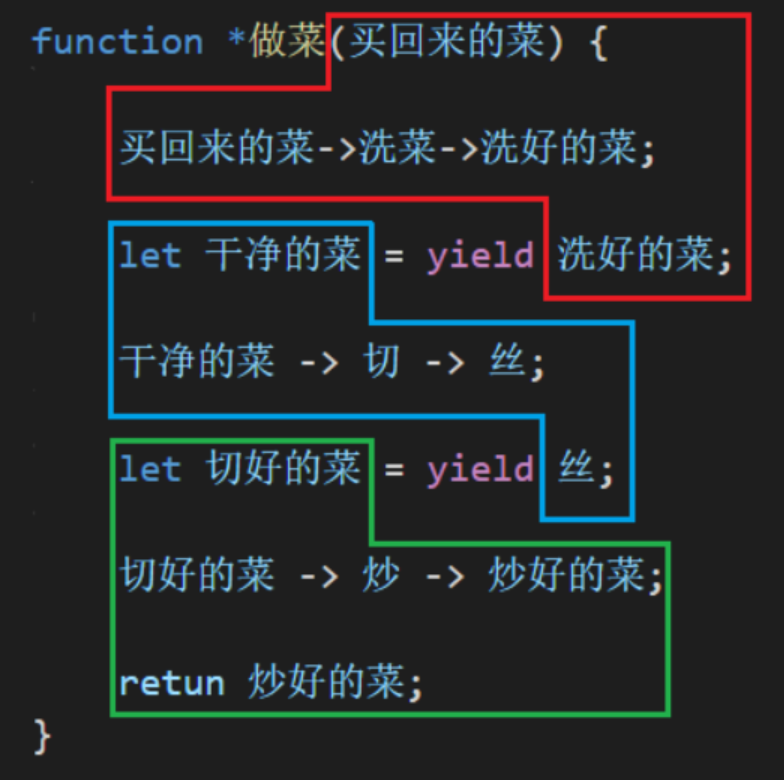

## 生成器

生成器（Generator）是一种函数，作用是创建迭代器对象

可以将生成器（返回迭代器对象的函数）作为`[Symbol.iterator]`的值，使一个对象成为`可迭代对象`


## 创建

在`function`关键字后加上 * 号，表示这个函数是一个生成器，它可以返回迭代器对象

相当于拥有了一个新的关键字`function*`

```js
function* show() {} // 加 * 表示是生成器函数
```

注意：不能使用箭头函数定义生成器 

```js
*() => {} // error
```


## yield关键字

### 含义

yield的中文意思可以翻译为`放弃` 或 `让步`

yield是代码片段与代码片段之间的分隔点，作为**双重**角色

### 作用

使用生成器生成的迭代器对象，调用`next`函数有下列行为

1. 一直执行，遇到 `yield`时停止

2. 将 `yield`后面的表达式作为 `next` 函数的返回值（第一重角色：决定 next 函数返回值）
3. 在下一次`next`时，`yield`会将`next`函数的参数作为 `yield` 关键字的返回值（第二重角色：接收 next 参数，并作为返回值）

### 示意图



### 示例

代码

```js
function* gen() {
    let num = 0;
    
    let para1 = yield num;
    
    num = num + para1;
 
    let para2 = yield num;
    
    num = num + para2;
    
    let para3 = yield num;
    
    num = num + para3;
    
    yield num;
    
    return "Finish"
}
```

执行过程

```js
const it = gen(); // 调用生成器，获取迭代器对象

// 遇到第一个yield时停止 | 结果：{value: 0, done: false}
console.log(it.next()); 

// 遇到第二个yield时停止 | 传入参数：1 para1值为1 | 结果：{value: 1, done: false}
console.log(it.next(1)); 

// 遇到第三个yield时停止 | 传入参数：2 para2值为2 | 结果：{value: 3, done: false}
console.log(it.next(2)); 

// 遇到第四个yield时停止 | 传入参数：3 para3值为3 | 结果：{value: 6, done: false}
console.log(it.next(3)); 

// 到函数体结束 | 结果：{value: "Finish", done: true}
console.log(it.next());  
```


## yield*关键字

### 概念

1. `yield*`后跟一个迭代器对象或可迭代对象
2. 系统会不断调用该迭代器对象的`next`方法，并将value值`yield`回去

### 作用

`yield*`是一种将迭代器对象或可迭代对象的值进行`yield`返回的语法糖

即不用写那么多`yield`语句，也不用自己进行迭代获取值了

### 注意

`yield*`需要用在生成器中，即`function*`内部

### 示例

代码

```js
// 该迭代器会不断返回 1 2 3 4 5
function* gen1() {
    yield 1;
    yield 2;
    yield 3;
    yield 4;
    yield 5;
}

function* gen2() {
    let it1 = gen1(); // 获取迭代器对象
    yield* it1;
}

let it2 = gen2();

console.log(it2.next()); // { value: 1, done: false }
console.log(it2.next()); // { value: 2, done: false }
console.log(it2.next()); // { value: 3, done: false }
console.log(it2.next()); // { value: 4, done: false }
console.log(it2.next()); // { value: 5, done: false }
```

gen2的本质

```js
function* gen2() {
    let it2 = gen1();
    for (const value of it2) {
        yield value;
    }
}
```

### yield* 的自己实现

```js
function myYield(it) {
    for (const value of it) {
        yield value;
    }
}
```

