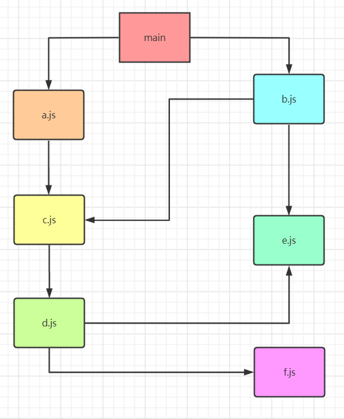

## 模块化是什么

事实上模块化开发最终的目的是将程序划分成一个个小的结构

这个结构中编写属于自己的逻辑代码，有自己的作用域，不会影响到其他的结构

这个结构可以将自己希望暴露的变量、函数、对象等导出给其结构使用

也可以通过某种方式，导入另外结构中的变量、函数、对象等


## 简单模块化

### 全局函数模式

将不同的功能封装为不同的全局函数

```js
const msg = "module";

function foo() {
    console.log("foo > ", msg);
}

function bar() {
    conosole.log("bar > ", msg);
}
```

缺点：容易造成命名冲突问题，模块无封装性和隔离性，不安全

```js
foo(); // foo > module
bar(); // bar > module

msg = "哈哈哈"; // 改变了全局变量msg

foo(); // foo > 哈哈哈
bar(); // bar > 哈哈哈
```

### 简单对象封装模式

将不同的功能封装到不同的对象中

```js
const obj = {
    msg: "module",
    foo() {
        console.log("foo > ", this.msg);
    }
}
```

优点：模块与模块之间具有一定的封装性和隔离性

缺点：模块封装性太差，外部能够随意修改模块内部变量，不安全

```js
obj.foo(); // "foo > moudle

obj.msg = "呵呵呵"; // 改变了模块内部变量msg

obj.foo(); // "foo > 呵呵呵
```

### IIFE模式

使用立即执行函数与闭包的形式，将内部变量封装起来，只保留需要暴露的变量和函数

```js
(function(w){
	const msg = "module";
    
    function foo() {
        console.log("foo > ", msg);
    }
    
    w.module = {foo}
})(window)
```

优点：隔离性和封装性强

缺点：无法引用第三方模块

```js
window.module.foo(); // foo > module
```

### IIFE模式增强

在`IIFE`的基础上加入可以引入第三方模块的功能

这是现代模块化实现的基石

```js
(function(w,$) {
    const msg = "module";
    
    function foo() {
        console.log("foo > ", msg);
    }
    
    w.module = foo;
    
    $("body").css("background", "red");
})(window, jQuery)
```

### 缺陷与问题

如果需要引入多个模块文件，则会出现下列问题

* 请求过多

  如果依赖多个模块，那样就会发送多个请求，导致请求过多

* 依赖模糊，难以维护依赖关系

  模块之间可能存在依赖关系，也就是说很容易导致依赖关系错误

  ```html
  <script src="test1.js"></script>
  <script src="test2.js"></script>
  <script src="test3.js"></script>
  <script src="test4.js"></script>
  <script src="test5.js"></script>
  <script src="test6.js"></script>
  <script src="test7.js"></script>
  ```

* 使用时必须记得每一个模块中返回对象的命名

* 没有一个事实的规范，不同的人使用的方法可能不同，限制了JavaScript生态的发展


## 模块化规范发展

在 ECMAScript 标准化组织推出标准的模块化规范之前，社区中已经出现了几种流行的模块化方案

| 模块化方案 | 全称                           |
| ---------- | ------------------------------ |
| CommonJS   | CommonJS                       |
| AMD        | Asynchronous Module Definition |
| CMD        | Common Module Definition       |
| UMD        | Universal Module Definition    |

此后，ECMAScript标准化组织推出标准的模块化规范：ES Module

现今流行的模块化方案有两种

* 服务器端：使用 CommonJS
* 浏览器端：使用 ES Module


## CommonJS

### 概述

`CommonJS` 最开始名字为 `ServerJS` 应用在服务器端领域，后来为了体现它的广泛性，修改为 `CommonJS`，平时我们也会简称为 `CJS`

### 规范实现

浏览器端：使用 `Browserify.js` 进行打包

服务器端：`Node.js` 原生支持，直接使用即可

### 特点

* 每个文件当作一个模块

* 服务器端：模块的加载是运行时**同步**加载的

* 浏览器：模块需要提前进行编译和打包处理

浏览器端需要事先编译和打包的原因

* 避免在浏览器端编译和加载过慢
* 浏览器没有内置 **require** 函数

### 导出

导出的是 `exports` 对象，默认是空， 即`{}`

```js
// 写法1
module.exports = value;
// 写法2
exports.xxx = value; 
```

示例

```js
module.exports = {
    name: "alice",
    age: 18,
    gender: "female"
}

// 等价于下列写法

exports.name = "alice";
exports.age = 18;
exports.gender = "female";
```

### 导入

#### 语法

```js
const moduleName = require("路径/包名");
```

#### 特点

使用 `require` 关键字，导入时会将模块代码（文件）执行一遍，所以是同步的，且模块内部有缓存标记（**module.loaded**），所以多次导入时，模块代码只会被执行一次

### 核心理解

在 `Node.js` 中，实现了 `CommonJS` 规范，其实现原理是通过 `Module` 类

实际模块导出的是`module.exports` 所指向的对象， `exports` 是 `module.exports` 的引用，即在模块最开始进行了赋值

```js
exports = module.exports;
```

所以重点关注模块（文件）中，`module.exports`实际指向哪个对象即可，`exports`只是为了兼容`CommonJS`规范

### 双向修改

`CommonJS` 是**运行时**实现模块导入的

模块导出的是 `module.exports` 所指向的对象，而使用者导入的也是 `module.exports` 所指向的对象，所以两者都是指同一个对象，即支持双向修改

#### 示例：模块主动修改

```js
// util.js
const util = {
  name: 'first'
};

setTimeout(() => {
    util.name = 'second';
}, 2000); // 模块主动修改

module.exports = {
  util
};

// main.js
const pkg = require('./util.js');

console.log('main.js >', pkg.util.name); // main.js > first

setTimeout(() => {
    console.log('main.js >', pkg.util.name);
}, 3000); // main.js > second
```

#### 示例：模块使用者主动修改

```js
// util.js
const util = {
    name: 'first'
};

setTimeout(() => {
    console.log('util.js >', util.name);
}, 3000); // util.js > second

module.exports = {
    util
};

// main.js
const pkg = require('./util.js');

console.log('main.js >', pkg.util.name); // main.js > first

setTimeout(() => {
    pkg.util.name = 'second';
    console.log('main.js >', pkg.util.name); // main.js > second
}, 2000); // 模块使用者主动修改
```

### 查找规则

```js
// 对于
require(X);
```

#### 情况1：X是一个核心模块，比如path、http

直接返回核心模块，并且停止查找

#### 情况2：X是以 ./ 或 ../ 或 / 开头

第一步：将X当做一个文件在对应的目录下查找

* 如果有后缀名，按照后缀名的格式查找对应的文件
* 如果没有后缀名，会按照如下顺序进行查找
  * 直接查找文件X
  * 查找X.js文件
  * 查找X.json文件
  * 查找X.node文件

第二步：没有找到对应的文件，将X作为一个目录，查找目录下面的index文件

* 查找X/index.js文件
* 查找X/index.json文件
* 查找X/index.node文件

如果都没有找到，那么抛出异常

#### 情况3：X不是路径，且不是核心模块

沿着当前目录逐级向上查找`node_modules`中的模块，查找路径可以通过下列代码查看

```js
console.log(module.paths);
```

如果都没有找到，那么抛出异常

### 模块加载过程

* 结论1：模块在被第一次引入时，模块中的js代码会被运行一次

* 结论2：模块被多次引入时，会缓存，最终只加载（运行）一次

  每个模块对象module都有一个属性：loaded，用于标识是否已经进行了导入

* 结论3：有循环引入，那么加载顺序按照深度优先进行

  

  加载顺序为

  ```js
  main => a.js => c.js => d.js => e.js => f.js => b.js
  ```


## AMD

### 概述

| 项   | 说明                                             |
| ---- | ------------------------------------------------ |
| 全称 | Asynchronous Module Definition，异步模块定义     |
| 特点 | 专门用于浏览器模块的加载，是异步加载的           |
| 来源 | AMD是RequireJs在推广过程中对模块定义的规范化产出 |
| 实现 | require.js 和 curl.js                            |

### 定义暴露模块

使用函数 `define`，模块标识可以省略

```js
define("模块标识", [依赖的模块], 模块实现)
```

定义没有依赖的模块

```js
define(funtion() {
	return 模块对象;
})
```

定义有依赖的模块

```js
define(["module1", "module2"], function(m1, m2) {
    // m1 变量代表 module1
    // m2 变量代表 module2
    return 模块对象;
})
```

### 引入使用模块

使用 `requirejs` 函数

```js
requirejs([依赖的模块], 实现);
```

示例

```js
requirejs(["module1", "module2"], function(m1, m2) {
    // 使用 m1，m2
})
```

### 使用示例

目录

```
|-js
  |-libs
    |-require.js
  |-modules
    |-alerter.js
    |-dataService.js
  |-main.js
|-index.html
```

定义模块：dataService.js

```js
define(function() {
    const name = "dataService.js";
    
    function getName() {
        return name;
    }
    
    return {getName};
})
```

定义模块：alerter.js

```js
define(["dataService"],function(dataService){
    const msg = "alerter.js";
    
    function showMsg() {
        console.log(msg, dataService.getName());
    }
    
    return {showMsg};
})
```

根模块：main.js

```js
(function() {
    requirejs.config({
        baseUrl: "js/lib", // 基本路径
        paths: { // 配置路径
            dataService: "./modules/dataService", // 不能加后缀 .js
            alerter: "./modules/alerter" // 不能加后缀 .js 因为会默认加js，且不智能
        }
    })
    
    requirejs(["alerter"],function(alerter) {
        alerter.showMsg();
    })
})
```

引入文件：index.html

```html
<script data-main="js/main.js" src="js/libs/require.js"></script>
```


## CMD

### 概述

| 项   | 说明                                                         |
| ---- | ------------------------------------------------------------ |
| 全称 | Common Module Definition                                     |
| 特点 | 专门用于浏览器端，模块在使用才会进行加载，模块加载是异步的   |
| 现状 | 出品自阿里巴巴，市场使用不多，且已经卖给了国外的公司，了解即可 |
| 实现 | sea.js                                                       |

### 定义暴露模块

需要使用一个factory函数

```js
function(require, exports, module) {}
```

示例

```js
define(function(require, exports, module) {
    export.xxx = value;
    module.exports = value;
})

define(function(require, exports, module) {
	// 引入依赖模块（同步）
    const module2 = require("./module2");
    // 引入依赖模块（异步）
    require.async("./module3", function(m3) {
    })
    // 暴露模块
    exports.xxx = value;
})
```

### 引入使用模块

```js
define(function(require) {
    const m1 = require("./module1");
    const m2 = require("./module2");
    m1.show();
    m2.show();
})
```

### 使用实例

模块：module1.js

```js
define(function (require,exports,module) {
    const msg = "module1";
    
    function foo() {
        return msg;
    }
    
    module.exports = {foo};
})
```

模块：module2.js

```js
define(function(require,exports,module){
    const msg = "module2";
    
    function bar() {
        console.log(msg);
    }
    module.exports = bar;
})
```

模块：module3.js

```js
define(function(require,exports,module) {
    const msg = "module3";
    
    function fun() {
        console.log(msg);
    }
    
    exports.module3 = {fun}
})
```

模块：module4.js

```js
define(function(require,exports,module) {
    const msg = "module4";
    // 同步引入
    const module2 = require("./module2");
    
    module2();
    
    // 异步引入
    require.async("./module3",function(module3) {
        module3.module3.fun();
    })
    
    function fun2() {
        console.log(msg);
    }
    
    exports.fun2 = fun2;
})
```

根文件：main.js

```js
define(function(require) {
    let module1 = require("./module1");
    console.log(module1.foo());
    let module4 = require("./module4");
    module4.fun2();
})
```

引入文件：index.html

```html
<script src="js/lib/sea.js"></script>
<script>
	seajs.use("./js/modules/main.js");
</script>
```

### AMD与CMD区别

* AMD推崇依赖前置，在定义模块的时候就要声明其依赖的模块
* CMD推崇就近依赖，只有在用到某个模块的时候再去require


## ES Module

### 浏览器使用ES Module

浏览器要引入ES Module的模块文件时，需要指明类型为`module`

```html
<!-- type为 module 而不是 text/javascript，说明含有ES Module的语法 -->
<!-- 使用 type='module' 后，加载js脚本是异步的，即相当于加上了 async 属性 -->
<script type="module">
	import { title } from "./m.js";
    console.log(title);
</script>

<script src="./mymodule.js" type="module"></script>
```

### 模块导出

#### 定义型导出

```js
export const site = "ES Module";

export function show() {
    return "show function"
}
```

#### 引用型导出

::: warning 注意

export 导出的不是一个对象，而是导出的引用列表

这是一种固定的，特殊的写法

:::

```js
const abc = 123;
const obj = {
    name:"this is obj"
};

export {
	abc,
    obj
}

/* 错误写法 
export {
  abc: abc,
  obj: obj
}
*/
```

#### 引用型导出时起别名

```js
const num = 123;
const obj = {
    name:"this is obj"
};

export {
	num as myNum,
    obj as myObj
}
```

#### 默认型导出

只能跟对象，不能跟语句（原因是default关键字语法糖）

```js
const num = 123;
export default num; // ok

export default let number = 456; // error，不能跟语句

export default function() {} // ok，function(){}定义了一个函数对象

export default class {} //ok，class定义了一个类对象（本质上是函数对象）
```

#### 默认型导出是一种语法糖

`default`是一个特殊的关键字

```js
const num = 123;
export default num;
```

等价于

```js
const num = 123;
export {
	num as default
}
```

所以 `export default` 只能跟对象，不能跟语句

注意：在一个模块中，只能有一个默认导出

#### 混合型导出

写法1：

```js
// 定义型导出
export const num = 123;

// 引用型导出
const esmodule = "ES Module";
const commonjs = "CommonJS"

export {
  esmodule,
  commonjs
}

// 默认型导出
export default function() {
    console.log("this is default export");
}
```

### 模块导入

#### 具名导入

```js
import { obj } from "mymodule.js";
```

#### 导入时起别名

```js
import { obj as myobj } from "mymodule.js";
```

#### 导入默认导出的

```js
import defaultObj from "mymodule.js";
```

#### 默认导入是语法糖

```js
import mm from "mymodule.js";
等价于
import { default as mm } from "mymodule.js";
```

#### 批量导入

```js
import * as globalObj from "mymodule.js";
```

#### 批量导入时的默认导出

```js
import * as api from "mymodule.js";

console.log(api.default); // 使用默认导出对象
```

#### 混合导入

写法1

```js
import num, { User } from "mymodule.js";
```

写法2

```js
import { User, default as num } from "xx.js";
```

### 模块合并

#### 需求

下列导出方法无法避免不同模块中的同名问题

```js
import { site, url } from "./m1.js";
import { url }, User from "./m2.js";

export {
	site,
    url,
    User,
    url // 重名了
}
```

#### 解决

使用一个文件作为合并文件

```js
// super.js
import * as m131 from "./m1.js";
import * as m132 from "./m2.js";

export {
	m131,
    m132
}
```

```js
import { m131, m132 } from "super.js";

console.log(m131.site);
```

#### export与from配合使用

上述代码可以进行简写

```js
export { * as m131 } from "./m1.js";
export { * as m132 } from "./m2.js";
```

### ES Module特点

#### 编译期静态分析（Tree Shaking）

ES Module使用编译期静态分析，在编译时分析模块的依赖关系，所以需要在文件最开头进行全部的import，即无法实现懒加载

静态引入的优点：能够使用 **Tree Shaking** 进行优化——不需要的东西不进行导入，从而减少体积，提高性能

CommonJS使用的是动态引入，所以无法进行动态分析，即无法使用 **Tree Shaking** 优化

#### 预解析

因为是静态导入，所以在导入时会进行分析，同一个模块导入多次时，不会重复解析

```js
// m.js
console.log("我只会出现一次")
```

```html
<script type="module">
	import * from "./m.js";
    import * from "./m.js";
    import * from "./m.js";
    import * from "./m.js";
    import * from "./m.js";
</script>
```

#### 后解析

如果同时存在module型脚本和非module型脚本，则会先解析非module型脚本

```html
<head>
  <script type="module">
    console.log("我第二次出现")
  </script>
  <script>
    console.log("我第一次出现")
  </script>
</head>
```

#### 默认严格模式

```html
<script>
  a = "123"; // ok
</script>
<script>
  "use strict";
  b = "456"; // error
</script>
<script type="module">
  c = "789"; // error
</script>
```

#### 异步解析

在加载js时，是异步的，即设置了 type=module 的代码，相当于在script标签上也加上了 async 属性

### 动态引入（import函数）

默认情况下，ES Module无法使用按需加载，因为ES Module使用的是静态引入，imort语句只能写在最开头

```html
<script type="module">
	if (true) {
        import { site, url } from "./m.js"; // 报错
    }
</script>
```

解决方法：使用`import`函数，返回值为Promise对象，resolve的值就是导入的模块对象

```html
<script type="module">
if (true) {
    import("./m.js").then({site,url} => {
        console.log(site.url);
    })
}
</script>
```

可用于实现懒加载，示例如下

```html
<button id="btn">进行懒加载</button>
<script type="module">
	const btn = document.getElementById('btn');
    
    btn.onclick = function () {
        import("./m.js").then(m => {
            m.hello();
        })
    }
</script>
```

```js
// m.js

export function hello() {
    alert("Hello");
}
```
