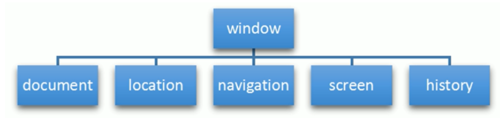

## BOM概述

### 定义

BOM全称是Browser Object Model，即浏览器对象模型

### 作用

BOM是JS与浏览器进行交互的媒介

### 特点

BOM缺乏标准，JS标准化组织是ECMAScript，DOM标准化组织是W3C，而BOM则由浏览器产商自己决定


## BOM的组成



window对象是BOM的顶级对象，具有双重角色（BOM和Global）

* 它是JS与浏览器进行交互的接口，提供了很多内置的属性和函数
* 它是一个全局对象，定义在全局作用域的变量、函数等等都会变成window对象的属性和方法


## window对象

### 常用属性

| 属性        | 说明                                            |
| ----------- | ----------------------------------------------- |
| innerWidth  | 当前屏幕宽度，不包括边框大小                    |
| innerHeight | 当前屏幕高度，不包括边框大小                    |
| outerWidth  | 当前屏幕宽度，包括边框大小                      |
| outerHeight | 当前屏幕高度，包括边框大小                      |
| screenLeft  | 窗口相对屏幕左边的位置                          |
| screenTop   | 窗口相对屏幕上边的位置                          |
| pageYOffset | 窗口滚动过的水平距离，只读                      |
| pageXOffset | 窗口滚动过的垂直距离，只读                      |
| scrollX     | 窗口滚动过的水平距离，等价于pageXOffset，但可写 |
| scrollY     | 窗口滚动过的垂直距离，等价于pageYOffset，但可写 |

注意：

* `document.documentElement.clientWidth == window.innerWidth`
* `document.documentElement.clientHeight == window.innerHeight`
* `document.documentElement.scrollTop == window.pageYOffset == window.scrollY`
* `document.documentElement.scrollLeft == window.pageXOffset == window.scrollX`

### 常用方法

| 方法     | 功能         | 参数                       | 返回值       | 示例                       |
| -------- | ------------ | -------------------------- | ------------ | -------------------------- |
| open     | 打开窗口     | 打开的URL                  | 无           | open("https://google.com") |
| close    | 关闭窗口     | 无                         | 无           | close()                    |
| moveTo   | 移动窗口     | 新位置坐标值x, y           | 无           | moveTo(0,0)                |
| moveBy   | 移动窗口     | 新位置与旧位置x, y 之差    | 无           | moveBy(-50, 0)             |
| resizeTo | 调整窗口大小 | 新窗口宽度和高度           | 无           | resizeTo(100,100)          |
| resizeBy | 调整窗口大小 | 新窗口与原窗口宽度高度之差 | 无           | resizeBy(100, 50)          |
| alert    | 警告框       | 警告的内容                 | 无返回值     | alert("未保存")            |
| confirm  | 确认框       | 示文本                     | true/false   | confirm("确认内容")        |
| prompt   | 输入框       | 提示文本                   | 字符串或null | prompt("请输入您的内容")   |

#### open方法详解

```js
window.open(URL, [已有窗口或iframe名称], [新窗口参数])
```

特殊窗口名称：`_self`，`_blank`，`_top`，`_parent`

新窗口参数之间用逗号分隔

| 新窗口参数 | 值               | 说明                     |
| ---------- | ---------------- | ------------------------ |
| fullscreen | yes/no           | 是否全屏，只有IE能用     |
| height     | 数值             | 新窗口高度，不能少于100  |
| width      | 数值             | 新窗口大小，不能少于100  |
| top        | 数值             | 新窗口上坐标，不能是负值 |
| left       | 数值             | 新窗口左坐标，不能是负值 |
| location   | yes/no（默认no） | 是否显示地址栏           |
| menubar    | yes/no（默认no） | 是否显示菜单栏           |
| toolbar    | yes/no（默认no） | 是否显示工具栏           |
| status     | yes/no（默认no） | 是否显示状态栏           |
| resizable  | yes/no（默认no） | 是否可以改变窗口大小     |
| scroolbars | yes/no（默认no） | 是否允许滚动             |

示例

```js
window.open("https://google.com", "_blank",
           "height=400,width=400,top=10,left=10,resizable=yes");
```

### 常用事件

| 事件     | 说明                   | 特点                                                         |
| -------- | ---------------------- | ------------------------------------------------------------ |
| load     | 页面加载完毕时触发     | 只能写一个，如果写了多个，以最后一个为准                     |
| pageshow | 重新加载页面触发的事件 | 和load的区别是为了兼容火狐，因为火狐的后退按钮不能触发load事件 |
| resize   | 窗口大小变化时触发     | 能够实现响应式布局                                           |
| onscroll | 窗口滚动时触发回调函数 |                                                              |

与load功能类似的DOM事件

* DOMContentLoaded：仅当DOM加载完毕时执行，不管此时图片，样式等是否已经加载完毕
* load：当页面全部加载完毕后才执行，即执行时，DOM、图片、样式表等均已加载完毕

### 定时器

> 定时器只要开和关，没有暂停重启的概念 

#### setTimeout

| 定义                                         | 作用           | 返回值                               |
| -------------------------------------------- | -------------- | ------------------------------------ |
| setTimeout( 回调函数, 定时毫秒, ...参数列表) | 一直循环执行   | 该定时器的ID，可以通过ID清除该定时器 |
| clearTimeout(定时器ID)                       | 清除setTimeout |                                      |

#### setInterval

| 定义                                       | 作用               | 返回值                               |
| ------------------------------------------ | ------------------ | ------------------------------------ |
| setInterval(函数名, 定时毫秒, ...参数列表) | 定时完成后执行一次 | 该定时器的ID，可以通过ID清除该定时器 |
| clearInterval(定时器ID)                    | 清除setInterval    |                                      |


## location对象

### 作用

window对象给我们提供了一个location属性，它用于获取或设置窗体的URL，并且可以用于解析URL，因为这个属性返回一个对象，所以称为location对象

##### 注意：window.location与docuement.location引用的是同一个对象

### 常用属性

| 属性              | 说明                    |
| ----------------- | ----------------------- |
| location.href     | 获取或设置整个URL       |
| location.host     | 返回host                |
| location.port     | 返回端口                |
| location.pathname | 返回路径                |
| location.search   | 返回参数                |
| location.hash     | 返回片段，即#之后的内容 |

### 常用方法

| 方法                        | 说明                                            |
| --------------------------- | ----------------------------------------------- |
| location.assign(URL)        | 跟href，重定向页面，可以后退                    |
| location.replace(URL)       | 替换当前页面，因为不记录历史，所以不能后退页面  |
| location.reload(true/false) | 刷新页面，true为强制刷新清除缓存，false普通刷新 |


## navigator对象

### 概念

navigator对象包含浏览器的相关信息

### 用户代理信息

最常用的是`window.navigator.userAgent`，该属性能够返回由客户端发送给服务器的`userAgent`头部的值，从而可以识别用户是通过PC访问，还是移动端设备访问

```js
const userAgent = window.navigator.userAgent;

const regExp = /(phone|pad|pod|iPhone|iPod|ios|iPad|Android|Mobile|BlackBerry|IEMobile|MQQBrowser|JUC|Fennec|wOSBrowser|BrowserNG|WebOS|Symbian|Windows Phone)/i;
if(userAgent.test(regExp)) {
    window.location.href = ""; // 手机
} else {
    window.location.href = ""; // 电脑
}
```

### 检查是否能联网

使用`window.navigator.onLine`，返回一个布尔值，能联网true，不能联网false

### 检查浏览器安装的插件

使用`window.navigator.plugins`属性

每个插件拥有三个属性

* name：插件的名称
* description：插件的描述
* filename：插件的文件名
* legnth：插件所处理的MIME类型数量

```js
function hasPlugin(name) {
    name = name.toLowerCase();
    let plugins = [...window.navigator.plugins];
    return plugins.some(pluginItem => {
        return name = pluginItem.name;
    });
}
```


## history对象

### 作用

history对象记录了浏览器的历史记录，包含用户访问过的URL

### 常用属性

history.length：保存着历史记录的数量

### 常用方法

| 方法           | 说明                                                    |
| -------------- | ------------------------------------------------------- |
| back()         | 后退                                                    |
| forward()      | 前进                                                    |
| go(数字参数)   | 参数如果是n，则前进n个页面，参数如果是-n，则后退n个页面 |
| go(字符串参数) | 前进或后退到最近的一个含有字符串的页面中                |


## Screen

### 概念

`window.screen`对象存储的是屏幕的物理信息：如DPI，位深等

### 总结

对编程而言，基本没用，不进行介绍


