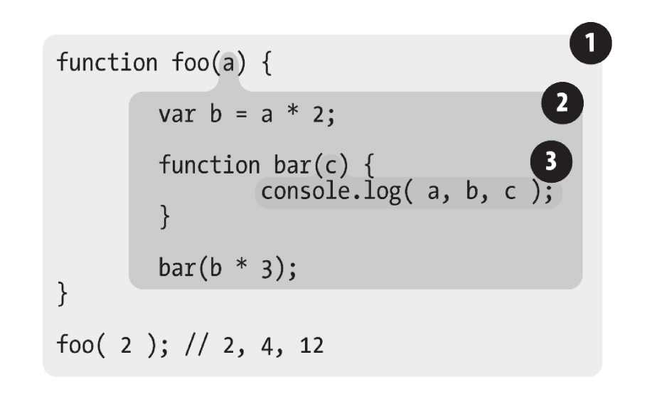

## 前置知识

### JavaScript代码是片段执行，而不是按行执行

JavaScript 程序在执行时，会以语句为单位进行解析和执行，而一个语句可以跨越多行（比如函数声明）

即 JavaScript 是按一段一段代码进行执行的，而不一定是一行一行执行的

### JavaScript也会进行编译

虽然通常情况下，会将 JavaScript 归类为**动态语言**

但 JavaScript 程序在实际运行的过程中也是有**编译**阶段的

### JavaScript不会全量编译

对于编译，传统静态语言（如Java, C#）都会对整个程序进行完整编译，即**提前编译，全量编译**

而 JavaScript 不会对整个程序进行完整编译，而是**边编译边执行**，大部分编译发生在执行前几微秒

即执行一段代码前，JavaScript引擎会对这段代码进行编译，然后执行


## 编译过程

对于一段JavaScript代码，JS引擎对其的编译过程分为三个阶段

### 阶段1：分词/词法分析

这个阶段会对代码文本进行分析，将由字符组成的字符串分解成有意义的代码块，这些代码块被称为词法单元

这个阶段也会进行**词法作用域**的构建，JavaScript引擎内部会维护一个作用域模块，用于记录作用域

比如对于下列代码

```js
var a = 2;
```

这段代码通常会被分解为这些语法单元：`var`、`a`、`=`、`2`、`;`

### 阶段2：解析/语法分析

这个阶段会将词法单元转换为一个由元素逐级嵌套所组成的带啊吗程序语法结构的树，称为**抽象语法树(AST)**

### 阶段3：代码生成

这个阶段会将**AST**转换为目标平台可执行代码

这个过程与语言、目标平台（如Linux，Windows、Mac OS等）息息相关


## 词法作用域

### 作用域定义

作用域是一套规则，是一套用于**根据标识符查找对应对象**的规则

### 作用域分类

在编程语言的设计中，作用域常常可以分为两类

| 作用域分类 | 说明                                                         | 例子           |
| ---------- | ------------------------------------------------------------ | -------------- |
| 词法作用域 | 在代码词法分析阶段，构建的作用域（多数语言都采用词法作用域的设计） | JavaScript，C# |
| 动态作用域 | 在代码执行过程中，构建的作用域                               | Bash、Perl     |

JavaScript采用的是**词法作用域**，即在代码在词法分析阶段构建出作用域

词法作用域也可以记作：静态作用域

### 作用域嵌套与作用域链

当一个代码块或函数嵌套在另一个代码块或函数中时，就会发生作用域的嵌套

嵌套的作用域之间就会形成作用域链

### 标识符查找过程

代码执行过程中，遇到标识符，会查找标识符所指向的对象

查过过程：先在代码执行的当前作用中进行查找，如果没有，再沿着作用域链在外层作用域中进行查找，如此重复，如果在最外层作用域（全局作用域）中都没有找到对应标识符，则抛出异常



* ①：包含着整个全局作用域，其中只有一个标识符：foo
* ②：包含着 foo 所创建的作用域，其中有三个标识符：a、bar 和 b
* ③：包含着 bar 所创建的作用域，其中只有一个标识符：c

对于`console.log(a, b, c);`语句，会在语句当前作用域中找到 `c`，并沿着作用域链在外层找到`a` 和 `b`


## JavaScript中的作用域

### 三大作用域

1. 全局作用域：位于最外层，有且只有一个
2. 函数作用域：每一个函数，都会有对应的函数作用域
3. 块级作用域：ES6新增作用域，每一个代码块`{}`都会有对应的作用域

### 欺骗（动态修改）词法作用域

如果词法作用完全由写代码期间函数和代码块所声明的位置来定义，那么该如何才能在运行时，动态地"修改"（也可以说是欺骗）词法作用域？

JavaScript中有两种机制来实现这个目的，但社区普遍认为在代码中使用这两种机制并不是好的选择，因为它们常常会导致性能下降

#### eval

JavaScript中的eval函数可以接受一个字符串作为参数，并将其中的内容视为好像在书写时就存在于程序中这个位置的代码，即可以在携带代码中用程序生成代码并执行，就好像代码就是写在那个位置一样

```js
function foo() {
    eval("var a = 1;");
}

// 类似于下面的代码

function foo() {
    var a = 1;
}
```

在执行eval之后的代码时，引擎并不"知道"或"在意"前面的代码是以动态形式插入进来，并对词法作用域的环境进行了修改，引擎只会像往常及逆行词法作用域查找

思考下面的代码

```js
function foo(str, a) {
    eval(str); // 欺骗词法作用域
    console.log(a, b);
}

var b = 2;

foo("var b = 3;", 1); // 1, 3
```

对于上面代码，eval调用中的`var b = 3;`这段代码会被当作本来就在那里一样来处理，即它对已经存在的`foo`的词法作用域进行了修改

所以在执行`console.log(a, b);`时，会沿着作用域链查找`a`和`b`对应的对象，在`foo`的作用域中找到了`a`为1，`b`为3，所以最终结果输出`1, 3`

注意：在严格模式下，eval具有自己的词法作用域，意味着其中的声明无法修改所在的作用域

```js
function foo(str, a) {
    "use strict";
    eval(str); // 欺骗词法作用域
    console.log(a, b);
}

var b = 2;

foo("var b = 3;", 1); // 1, 2
```

#### with

with通常被当作重复引用同一个对象中的多个属性的快捷方式，可以不需要重复引用对象本身，比如

```js
var obj = {
    a: 1,
    b: 2,
    c: 3
};

// 普通地重复"obj"
obj.a = 2;
obj.b = 3;
obj.c = 4;

// 快捷方式
with(obj) {
    a = 3;
    b = 4;
    c = 5;
}
```

使用with可以修改传入的对象词法作用域

```js
function foo(obj) {
    with(obj) {
        a = 2;
    }
}

var o1 = {
    a: 3;
};

var o2 = {
   b: 3; 
};

foo(o1);
console.log(o1.a); // 2

foo(o2);
console.log(o2.a); // undefined
console.log(a); // 2 —— a被泄露到全局作用域上了
```

结论：严格模式下，完全进制`with`，强烈不推荐使用`with`，因为它性能很差，又不安全

#### 性能问题

JavaScript引擎会在编译阶段进行数项性能优化，其中有些优化依赖于能够根据代码的词法进行静态分析，并预先确定所有变量和函数的定义位置，从而能够在执行过程中迅速寻找到标识符

而如果引擎在代码中发现了eval和with，因为无法在词法分析阶段明确知道eval会接收到怎样的代码，也无法确定with中的对象到底是什么，所以无法进行性能优化，从而造成性能问题

### try/catch

在`try/catch`语句中的`catch`分句，会创建一个块级作用域，其中声明的标识符仅仅在该catch块级作用域中有效

```js
try {
    undefined(); // 执行一个非法操作来强制制造一个异常
} catch (err) {
	console.log(err); // 能够正常执行
}

console.log(err); // ReferenceError: err not found
```

