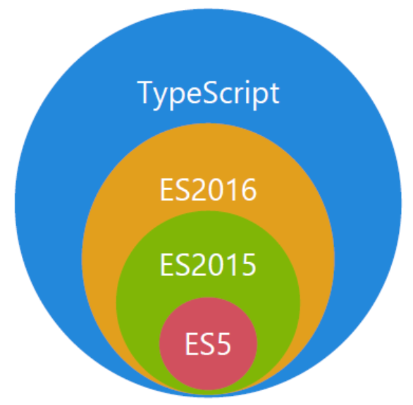
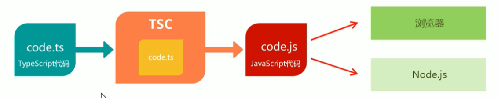

## 编程语言类型

**动态类型语言**：JavaScript，Python，Ruby等

解决方案：ESLint等编码过程中代码规范检查器

**静态类型语言**：TypeScript，C#，Java等


## TypeScript是什么

**TypeScript** 是由微软出品的开源的编程语言，简称**TS**，是 JavaScript 的超集，以 JavaScript 为基础，扩展了 JavaScript，添加了类型系统

**超集**意味着：JS有的功能，TS都支持，且TS在此基础上扩展出其他功能

**TypeScript** = **Type** + **JavaScript**




## TypeScript优点

1. 开发过程中，发现潜在的问题，避免低级错误
2. 良好的代码智能感应，代码补全，代码跳转
3. 语义性更强，程序更容易理解
4. 完全兼容JavaScript，第三方库可以编写描述文件(**.d.ts**)来接入TypeScript


## 安装TypeScript

### TypeScript官方网站

https://www.typescriptlang.org/zh/

### 安装TypeScript

```shell
yarn global add typescript
npm install -g typescript
```

### 查看TypeScript版本

```shell
tsc -v
```


## 使用TypeScript

> TypeScript 不能 JavaScript 解析器直接执行

### 编写.ts 文件

```ts
// code.ts
const num: number = 123;

console.log(num);
```

### 编译特定.ts 文件

```shell
tsc code.ts
```

编译后会生成 `code.js` 文件



### 直接执行 .ts 文件

安装 `ts-node`

```shell
yarn global add ts-node
npm install -g ts-node
```

使用`ts-node`能直接运行`.ts`文件

```shell
ts-node code.ts
```

### tsconfig.json配置编译

```shell
tsc
tsc -w # 监控文件改动
```

