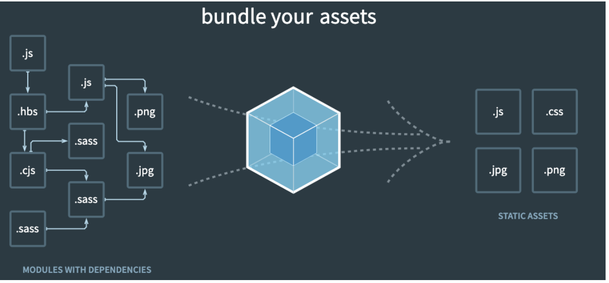

## 前端发展和需求

### 发展概述

前端的发展经历下列几个典型的阶段

1. 后端渲染的 JSP、PHP、ASP 开发方式
2. 前端原生 JavaScript 开发方式
3. jQuery 开发
4. 三大框架 Vue、React、Angular 开发

JavaScript也从ES5到ES6 ... ES10，再到 TypeScript

CSS也衍生出 LESS，SCSS，CSS-in-JS等CSS框架

| 发展阶段    | 说明                                                         |
| ----------- | ------------------------------------------------------------ |
| web早期阶段 | 互联网发展早期，前端只负责写静态页面，纯粹的展示功能，JavaScript的作用也仅仅是进行一些简单的表单验证和增加特效，为了动态在页面中填充一些数据，也出现了 JSP，ASP，PHP的等开发模式 |
| web近期阶段 | AJAX技术的诞生改变了前端的发展历史，使得开发者发现，前端的作用不仅仅是展示页面，还可以管理数据、数据交互以及和用户互动，在这样的背景下，jQuery这样优秀的前端工具库也大放异彩 |
| web现代阶段 | 现代Web开发变得更加多样化和复杂化，开发的多样性包括需要开发PC web页面，移动端web页面，小程序，公共号，甚至包括APP，这些都属于前端开发的范畴 |

为了应对越来越复杂的要求，前端三大框架开始成为主流的开发方式

### 现代前端开发面临的复杂问题和需求

#### 现代开发的需求

1. 需要采用模块化开发
2. 需要使用高级语言与特性来提高开发效率和安全性，比如ES6+和TypeScript，还有LESS，SCSS的等技术
3. 需要系统能够自动监听文件的变化，实现浏览器自动刷新，从而提高开发效率
4. 需要在开发完毕后，对代码和图片进行压缩混淆，合并以及其他相关的配置和优化
5. ...

#### 现代开发存在的问题

现代代码存在什么问题呢？—— 某些语法浏览器是不认识的（尤其在低版本浏览器上）

* 使用了ES6的语法，JSX语法，比如const、箭头函数等语法
* 使用了ES6中的模块化语法
* 使用CommonJS的模块化语法
* 在通过script标签引入时，必须添加上 type="module" 属性

显然，上面存在的问题，让我们在发布静态资源时，是不能直接发布的，因为运行在用户浏览器必然会存在各种各 样的兼容性问题，所以我们需要通过某个工具对其进行打包，让其转换成浏览器可以直接识别的语法

为了解决复杂上述复杂和多样的需求，前端构建工具应运而生，常见的前端构建工具有：webpack，vite，gulp，rollup，parcel，snowpack等，而其中最为主流，最为强大就是webpack

### 前端构建工具的发展过程

阶段1：ant +yui tool

阶段2：grunt

阶段3：fis3，gulp

阶段4：webpack，rollup，parcel，snowpack

## 初识webpack

### webpack是什么

webpack 是一种前端资源构建工具，一个静态模块打包器，webpack 会将前端所有资源文件（js/json/css/img/less/...等）视为模块处理，它会根据模块的依赖关系进行静态分析，打包生成对应的静态资源

> webpack is a static module bundler for modern JavaScript applications.
>
> webpack是一个为现代的JavaScript应用程序而生的静态模块化打包工具，

对上面的解释进行拆解：

| 描述         | 说明                                                      |
| ------------ | --------------------------------------------------------- |
| 打包bundler  | webpack可以将帮助我们进行打包，所以它是一个打包工具       |
| 静态的static | 代码最终可以打包成为静态资源（部署到静态服务器）          |
| 模块化module | webpack默认支持各种模块化开发，ES Module、CommonJS、AMD等 |
| 现代的modern | webpack就是解决现代前端开发的需求和难点的工具             |

### webpack文档

webpack的官方文档：https://webpack.js.org/

webpack的中文官方文档：https://webpack.docschina.org/