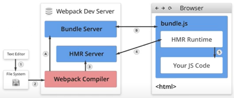

## 文件变化监听

### 作用

文件监听是自动监听文件的修改，在发现文件源码发生改变时，自动重新构建出新的输出文件

### 开启方式

方式1：在使用 webpack 命令时，带上 `--watch` 参数

方式2：在配置 `webpack.config.js` 时，添加 `watch: true`

```js
module.exports = {
    watch: true, // 默认为false
    watchOption: { // watch配置，只有在开启watch时，才有效
        // 不监听的文件或文件夹，支持正则匹配，默认值为空
        ignored: /node_modules/,
        // 监听到变化后会等待300ms后才执行，默认值为300
        aggregateTimeout: 300,
        // 判断文件是否发生变化是通过不断询问操作系统指定文件有没有改变，默认值是1000，即1秒1次
        poll: 1000 // poll是指间隔时间，单位ms
    }
}
```

### 缺点

需要手动刷新浏览器


## 热更新(HMR)

### 作用

热更新也称为热模块替换（HDR, Hot Module Replacement ），指在不需要手动刷新浏览器的前提下，页面能够自动刷新，从而获取最新的资源

### 使用

通过 webpack-dev-server （简称 WDS）来实现热更新

WDS不刷新浏览器，不输出文件，而是将输出的内容放置于内存中

```shell
webpack-dev-server --open # --open 指自动打开浏览器运行
```

使用WDS的前提是配置  `hot-module-replacement-plugin` 插件，该插件为 webpack 内置插件

```js
module.exports = {
    plugins: [
        new webpack.HotModuleReplacementPlugin()
    ]
}
```

### 配置dev-server

```js
module.exports = {
    devServer: { 
        // 运行代码的目录 
        contentBase: resolve(__dirname, 'build'), 
        // 监视 contentBase 目录下的所有文件，一旦文件变化就会 reload 
        watchContentBase: true, 
        watchOptions: { 
            // 忽略文件 
            ignored: /node_modules/ 
        },
        // 启动 gzip 压缩 
        compress: true, 
        // 端口号 
        port: 5000, 
        // 域名 
        host: 'localhost', 
        // 自动打开浏览器 
        open: true, 
        // 开启 HMR 功能 
        hot: true, 
        // 不要显示启动服务器日志信息 
        clientLogLevel: 'none', 
        // 除了一些基本启动信息以外，其他内容都不要显示 
        quiet: true, 
        // 如果出错了，不要全屏提示~ 
        overlay: false, 
        // 服务器代理 --> 解决开发环境跨域问题 
        proxy: { 
            // 一旦 devServer(5000)服务器接受到 /api/xxx 的请求，就会把请求转发到另外一个服务器 (3000)
            '/api': { 
                target: 'http://localhost:3000', 
                // 发送请求时，请求路径重写：将 /api/xxx --> /xxx （去掉/api） 
                pathRewrite: { 
                    '^/api': '' 
                } 
            } 
        } 
    }
}
```

### 原理

Webpack Compile：将 JS 编译为 Bundle

HMR Server：将热更新的文件输出给 HMR Runtime

HMR Runtime：会被注入到 bundle.js，更新文件的变化，使用了 `websocket`

Bundle Server：提供文件在浏览器的访问功能

bundle.js：构建输出的文件



