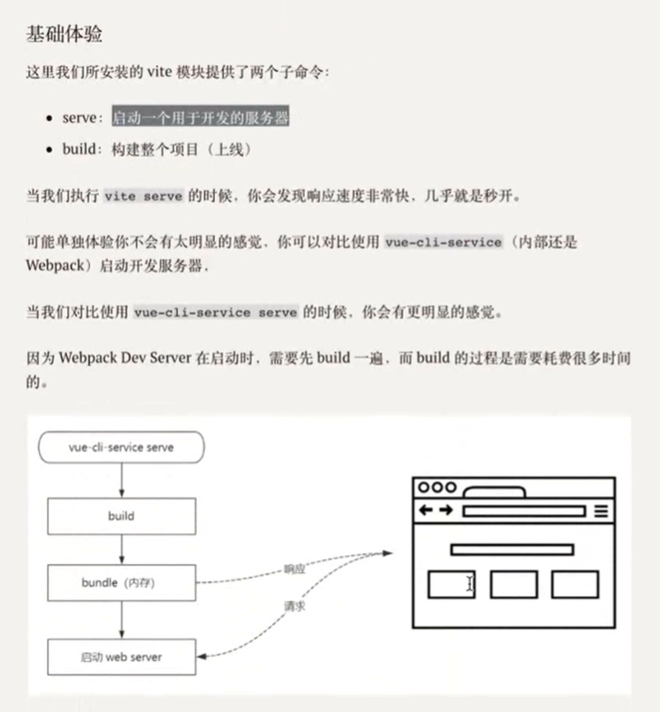
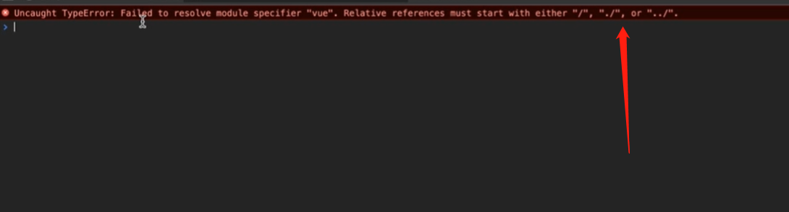
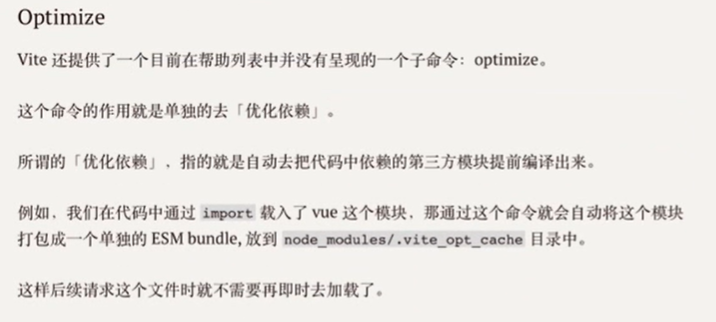
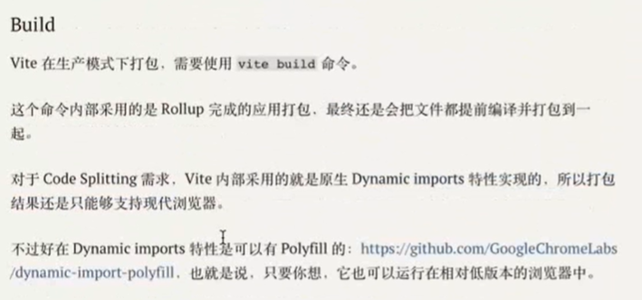
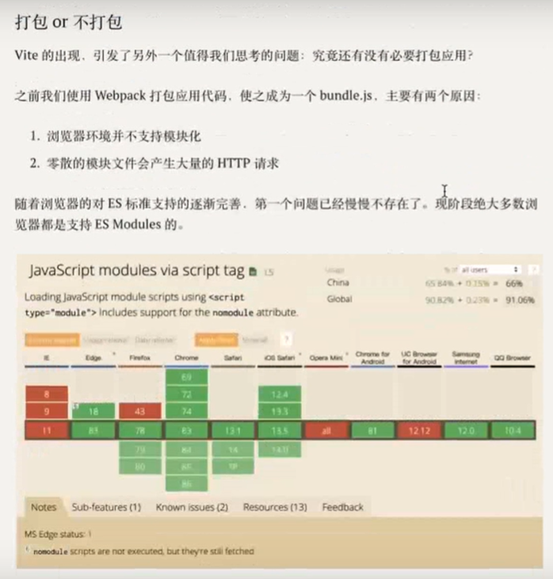
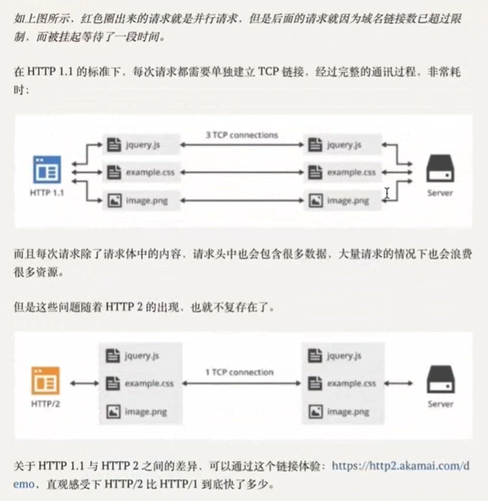
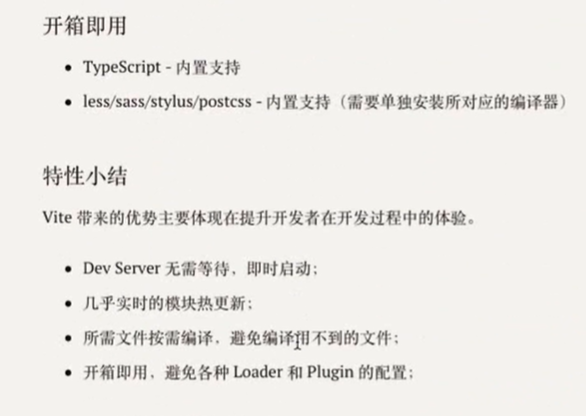

## Vite定义

面向现代浏览器的一个更轻，更快的Web应用开发与应用打包工具

基于ECMAScript标准原生模块系统（ES Module）实现

## Vite由来

如果应用比较复杂，使用Webpack的开发过程相对没有那么丝滑

* Webpack Dev Server 冷启动时间比较长
* Webpack HMR热更新的反应速度较慢


## 快速上手

```shell
npm init vite-app <project-name>
cd <project-name>
npm install
npm run dev
```

使用yarn

```shell
yarn create vite-app <project-name>
cd <project-name>
yarn
yarn dev
```

> `npm init`和`yarn create`是这两个包管理工具提供的新功能
>
> 其内部就是自动去安装一个`create-<xxx>`的模块，然后自动执行这个模块中的bin
>
> 例如
>
> `yarn create react-app my-react-app`就相当于先`yarn global add create-react-app`，然后再执行`create-react-app my-react-app`





```shell
npx server
```




```
运行时编译，按需编译

注意：按需编译和按需加载是不同的东西

按需编译，会在运行时变慢，但可以做缓存（第一次较慢，但只针对特定文件，所以整体上是很快的）
```

```shell
vite打包时会使用rollup，vite本质上是一个开发时使用的工具
```






打包的目的是为了减少HTTP请求的次数






而且不打包的好处：就是可以实现真正的按需加载

