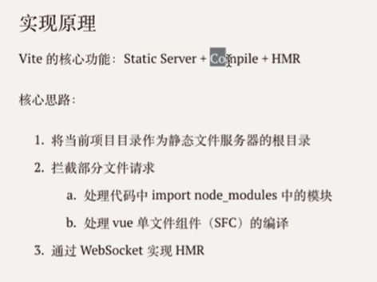

#### my-vite/cli.js

```js
#!/usr/bin/env node
```

#### 安装本地依赖包

```shell
npm install ../my-vite
```

#### 0.基础》my-vite/cli.js

```js
#!/usr/bin/env node

const Koa = require("koa");

const app = new Koa();

app.use(async (ctx, next) => {
   ctx.body = "my-vite"; 
});

app.listen(3000);

console.log("server running at http://localhost:3000")
```

#### 1.静态文件》my-vite/cli.js

```shell
npm i koa-send --save
```

```js
#!/usr/bin/env node

const path = require("path");
const Koa = require("koa");
const send = require("koa-send");
const { Readable } = require("stream");
const compilerSfc = require("@vue/compile-sfc");

const app = new Koa();

const cwd = process.cwd();

// 重写请求路径，/@modules/xxx => /node_modules/
app.use(async (ctx, next) => {
    if (ctx.path.startsWith("/@modules/")) {
        const moduleName = ctx.path.substr(10) // => vue
        const modulePkg = require(path.join(cwd,"node_modules", moduleName, "package.json"));
        ctx.path = path.join("/node_modules", moduleName.module);
    }
    await next();
})

// 根据请求路径得到相应文件
app.use(async (ctx, next) => {
    // ctx.path // http://localhost:3000 /src/main.js
    ctx.body = "my-vite";
    await send(ctx, ctx.path, { root: process.cwd(), index: "index.html"});
    await next();
});

const streamToString = stream => new Promise((resolve, reject) => {
    const chunks = [];
    stream.on("data", chunk => chunks.push(chunk));
    stream.on("end", () => resolve(Buffer.concat(chunks).toString("utf-8")));
    stream.on("error", reject)
});

// .vue 文件请求的处理，即时编译
app.use(async (ctx,next) => {
    if (ctx.path.endsWith(".vue")) {
        const contents = await streamToString(ctx.body);
        const { descriptor } = compilerSfc.parse(contents);
        
        let code;
        if (ctx.query.type === undefined) {
            code = descriptor.script.content;
        	code = code.replace(/export\s+default\s+/, 'const __script = ');
        	code += `
import { render as __render } from "${ctx.path}?type=template"
__script.render = __render;
export default __script;`;
        	ctx.type = "application/javascript";
        	ctx.body = Readable.from(Buffer.from(code));
        } else if (ctx.query.type === "template") {
            const templateRender = compilerSfc.complieTemplate({ source: descriptor.template.content });
            code = templateRender.code
        }
    }
    await next();
})

// 替换代码中的特殊位置
app.use(async (ctx, next) => {
    if (ctx.type === "application/javascript") {
    	const contents = await streamToString(ctx.body);
        ctx.body = contents
            .replace(/(from\s+['"])(?![\.\/])/g, "$1/@modules/")
        	.replace(/process\.env\.NODE_ENV/g, "'productions'")
    }
})

app.listen(3000);

console.log("server running at http://localhost:3000")
```


## Vite内部编译ts使用的是ES Build

它是用Go写，而不是使用微软官方的  tsc  工具

## 核心是解决

开发的体验