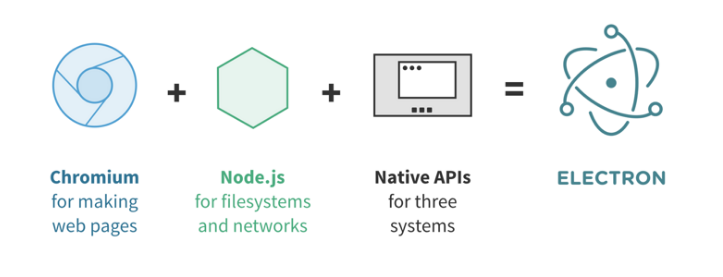

## 桌面应用开发

### 概述

常见的桌面应用开发有几种的方式：原生开发，基于托管平台，基于Web开发

### 原生开发

概述：原生开发是指使用系统支持的原生语言（常见如C、C++），直接调用系统提供的API完成界面UI和功能开发

优点：运行性能好，冷启动很快

缺点：C/C++的学习难度高，开发速度难且慢，基本不能跨平台

例子：

* 使用 C/C++ 开发 Windows/Linux 应用
* 使用 Object-C/Swift 开发 Mac OS 应用

### 基于托管平台

概述：基于托管平台是指使用如Java/C#的语言，编译完成后形成中间代码，中间代码运行在语言对应的虚拟机上

优点：开发速度较原生快，且语言的学习难度较低，基于托管平台可以基本的跨平台

缺点：开发速度不是很快，生态不是很好

例子：

* C# 使用 WPF 等框架开发 Windows 应用
* Java 使用 Swing/Javafx 等框架开发跨平台应用

### 基于Web开发

概述：基于Web开发是指使用Web技术配合Chromimum内核和Node.js开发桌面应用，本质上是一个套壳的Web应用

优点：开发速度快，学习难度低，生态好，能够很好地跨平台

缺点：性能不好，打包体积大，安全性较差，冷启动慢

例子：

* 使用 Electron 开发桌面应用，如 VS Code
* 使用 Nw.js 开发桌面应用

## 初识Electron

### 概述

Electron是由Github开发的，使用 JavaScript，HTML 和 CSS 构建跨平台的桌面应用程序的开源库

官方网站：https://www.electronjs.org

官方文档：https://www.electronjs.org/docs

### 优势

基于Web技术：Electron 基于 Chromium 和 Node.js, 可以使用 HTML, CSS 和 JavaScript 构建应用

开源：Electron 是一个由 GitHub 及众多贡献者组成的活跃社区共同维护的开源项目

跨平台：Electron 兼容 Mac、Windows 和 Linux，可以构建出三个平台的应用程序

### 实际案例

`Visual Studio Code`，`Microsoft Teams`，`Figma`，`Atom`，`Slack`，`迅雷`

## Electron底层原理

### 概述

Electron 使用 Chromium 提供渲染页面能力，使用 Node.js 提供调用操作系统本地功能的API 的能力

### Chromium

Electron 使用 Chromium 提供渲染页面/窗口的能力，并提供完善且方便的跨平台能力

### Node.js

Electron 使用 Node.js 提供与本地操作系统交互的能力

### Native APIs

Electron 提供了原生应用程序接口，能够调用一些系统功能，如系统通知、打开系统文件夹等

## 对比 Nw.js

### 概述

两个框架的原理都很相似，都是利用 Chromium 和 Node 提供跨平台的桌面开发能力

### Nw.js优点

Nw.js支持xp，Electron不支持xp

Nw.js支持源码二进制加密（源代码编译成assembly），Electron不支持源码二进制加密

### Nw.js缺点

开发团队比 Electron（Github）要小名气一些

文档没有 Electron 详细和内容多

Nw.js社区没有 Electron社区活跃

### Nw.js使用案例

`DingDing`，`微信开发工具`