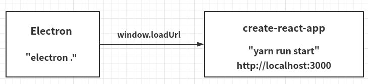

## 配置 Electron 开发环境

官网：http://www.electronjs.org/

```shell
# 克隆示例项目的仓库
git clone https://github.com/electron/electron-quick-start

# 进入这个仓库
cd electron-quick-start

# 安装依赖并运行
npm install && npm start
# OR
yarn && yarn start
```

> main.js

```js
const { app, BrowserWindow } = require('electron');
const isDev = require('electron-is-dev');

let mainWindow;

app.on('ready', () => {
   mainWindow = new BrowserWindow({
       width: 1024,
       height: 680,
       webPreferences: {
           nodeIntegration: true
       }
   });
    
    const urlLocation = isDev ? 'http://localhost:3000' : 'dummyurl';
    
    mainWindow.loadURL(urlLocation);
});
```


## 配置 Electron + React 开发环境

### 思路



### 创建项目

```shell
npx create-react-app <project-name>
```

### 安装依赖

```shell
yarn add electron --dev
yarn add electron-is-dev --dev
yarn add concurrently --dev
yarn add wait-on --dev
yarn add cross-env --dev
```

### 配置脚本命令

```json
{
    "scripts": {
        "dev": "concurrently \"cross-env BROWSER=none yarn start \" \" wait-on http://localhost:3000 && electron . \"",
    }
}
```

### 依赖说明

| 依赖            | 说明                                                       |
| --------------- | ---------------------------------------------------------- |
| electron        | Electron开发所需依赖                                       |
| electron-is-dev | 判断Electron是否处于开发环境                               |
| concurrently    | 能够并行执行两个命令，并且有良好的提示输出                 |
| wait-on         | 能够阻塞直到资源(URL)可以访问                              |
| cross-env       | 能够跨平台设置环境变量，设置BROWSER=none是为了不打开浏览器 |
| electron-is-dev |                                                            |

### main.js

```js
const { app, BrowserWindow } = require('electron');
const isDev = require('electron-is-dev');

let mainWindow;

app.on('ready', () => {
   mainWindow = new BrowserWindow({
       width: 1024,
       height: 680,
       webPreferences: {
           nodeIntegration: true
       }
   });
    
    const urlLocation = isDev ? 'http://localhost:3000' : 'dummyurl';
    
    mainWindow.loadURL(urlLocation);
});
```

