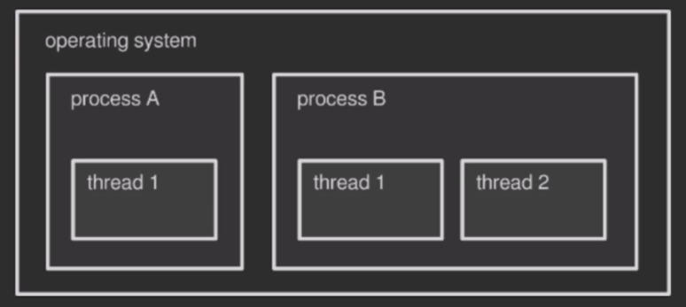
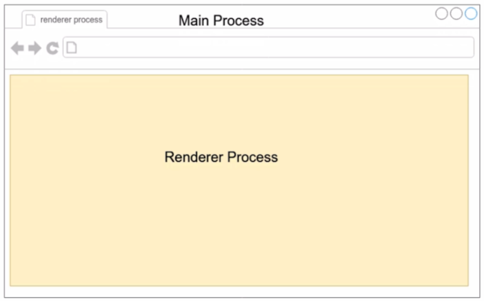
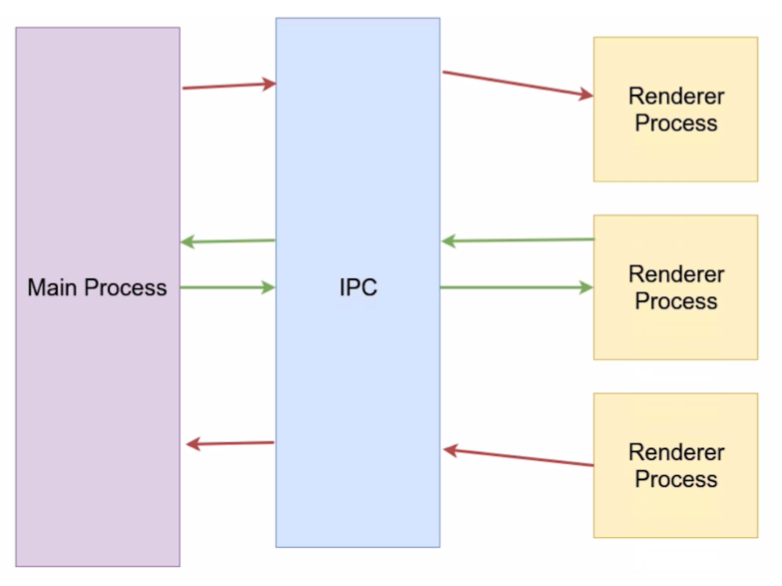

## 进程和线程

### 进程 Process 是什么

一个正在运行的计算机程序的实例

An instance of a computer program that is being executed

### 线程 Thread 是什么

线程是操作系统能够进行运算调度的最小单位，它被包含到进程之中，是进程中的实际运作单位



### 进程与线程区别

内存：进程之间的内存是隔离的，线程之间的内存是共享的

通信：进程与进程之间比较困难，需要 IPC，线程与线程之间很容易通信（因为共享内存）

量级：进程创建慢，占用资源多；线程相反


## 主进程和渲染进程

### 概述

一个Electron程序可以拆分为：一个主进程 + 一个或多个渲染进程



### 主进程

主进程只有一个，作为整个程序的入口

主进程的能力

* 创建一个或多个渲染进程
* 控制了应用生命周期，如应用启动，退出
* 调用系统底层功能、调用原生资源

主进程可以使用的API

* Node.js API
* Electron API

### 渲染进程

一个页面或者一个窗口对应一个渲染进程，使用多渲染进程而不是多渲染线程的原因是：避免因一个页面/窗口的崩溃导致其他页面/窗口崩溃

渲染进程的能力

* 通过 HTML + CSS + JavaScript 渲染页面和进行界面交互
* 渲染窗口/页面

渲染进程可以使用的API

* DOM API
* Node.js API
* Electron API


## BrowserWindow

### 概述

BrowserWindow这个Electron用于创建一个页面/窗口（渲染进程）

### 示例1

基础使用，创建一个窗口（一个渲染进程）

> main.js

```js
const { app, BrowserWindow } = require('electron');

app.on('ready', () => {
  const mainWindow = new BrowserWindow({
    width: 800,
    height: 600,
    webPreferences: {
      nodeIntegration: true // 让主进程开启node功能
    }
  });
    
  mainWindow.loadFile('./index.html');
});
```

> index.html

```html
<!DOCTYPE html>
<html>
  <head>
    <meta charset="UTF-8">
    <!-- https://developer.mozilla.org/en-US/docs/Web/HTTP/CSP -->
    <meta http-equiv="Content-Security-Policy" content="default-src 'self'; script-src 'self'">
    <meta http-equiv="X-Content-Security-Policy" content="default-src 'self'; script-src 'self'">
    <title>Hello World!</title>
  </head>
  <body>
    <h1>Hello World!</h1>
    We are using Node.js <span id="node-version"></span>,
    Chromium <span id="chrome-version"></span>,
    and Electron <span id="electron-version"></span>.

    <!-- You can also require other files to run in this process -->
    <script src="./renderer.js"></script>
  </body>
</html>
```

### 示例2

创建多个窗口（多个渲染进程），并建立父子联系

> main.js

```js
const { app, BrowserWindow } = require('electron');

app.on('ready', () => {
  const mainWindow = new BrowserWindow({
    width: 800,
    height: 600,
    webPreferences: {
      nodeIntegration: true
    }
  });
  mainWindow.loadFile('./index.html');
    
  const secondWindow = new BrowserWindow({
    width: 400,
    height: 300,
    webPreferences: {
      nodeIntegration: true
    },
    parent: mainWindow
  });
  secondWindow.loadFile('./second.html');
    
});
```


## 主进程与渲染进程之间通讯

### 概述

默认情况下，每个进程就像一个小岛，进程之间无法通讯

操作系统提供了 IPC（interprocess communication） 的通讯方式，使进程之间能够进行通讯



### 通讯方式1：IPC

核心理念：使用事件机制

> main.js 主进程

```js
const { app, BrowserWindow, ipcMain } = require('electron');

app.on('ready', () => {
  const mainWindow = new BrowserWindow({
    width: 1500,
    height: 1000,
    webPreferences: {
      nodeIntegration: true
    }
  });
  mainWindow.loadFile('./index.html');
  
  ipcMain.on('message', (event, args) => {
    console.log(args);
    event.reply('reply', 'hello from main process')
  });
});
```

> index.html 渲染进程页面

```html
<!DOCTYPE html>
<html>
  <head>
    <meta charset="UTF-8">
    <meta http-equiv="Content-Security-Policy" content="default-src 'self'; script-src 'self'">
    <meta http-equiv="X-Content-Security-Policy" content="default-src 'self'; script-src 'self'">
    <title>Hello World!</title>
  </head>
  <body>
    Node.js Version is : <span id="node-version"></span>
    <br />
    <button id='send'>Click Me</button>
    <br />
    ipcRenderer receive: <span id='reply'></span>
    <script src="./renderer.js"></script>
  </body>
</html>
```

> render.js 渲染进程

```js
const { ipcRenderer } = require('electron');

window.addEventListener('DOMContentLoaded', () => {
    document.getElementById('node-version').innerHTML = process.versions.node;
    document.getElementById('send').addEventListener('click', () => {
        ipcRenderer.send('message', 'hello from renderer');
    });
    ipcRenderer.on('reply', (event, args) => {
        console.log(args);
        document.getElementById('reply').innerHTML = args;
    });
});
```

### 通讯方式2：remote模块

使用 ipc 事件通讯的机制比较麻烦，所以 Electron 提供了 remote 模块来快速实现进程之间的通讯

> main.js 主进程

```js
const { app, BrowserWindow, ipcMain } = require('electron');
require('@electron/remote/main').initialize(); // 初始化远程模块

app.on('ready', () => {
  const mainWindow = new BrowserWindow({
    width: 1500,
    height: 1000,
    webPreferences: {
      nodeIntegration: true,
      enableRemoteModule: true // 开启渲染进程的remote模块
    }
  });
  mainWindow.loadFile('./index.html');

  ipcMain.on('message', (event, args) => {
    console.log(args);
    event.reply('reply', 'hello from main process')
  });
});
```

> render.js 渲染进程

```js
const { ipcRenderer } = require('electron');
const { BrowserWindow } = require('@electron/remote');  // 引入 remote 模块
// 调用了属于 main 进程的类与方法
// 本来创建渲染进程（新窗口）必须在main进程中进行，而不能在渲染进程中进行
// 但因为 remote 模块的出现，现在可以很方便地在渲染进程中使用属于main进程的类和方法了
// 本质是一种语法糖，还是要通过IPC通讯，但这在electron内部自动完成了

window.addEventListener('DOMContentLoaded', () => {
    document.getElementById('node-version').innerHTML = process.versions.node;
    document.getElementById('send').addEventListener('click', () => {
        ipcRenderer.send('message', 'hello from renderer');
        let win = new BrowserWindow({
            width: 800,
            height: 600
        });
        win.loadURL('https://baidu.com');
    });
    ipcRenderer.on('reply', (event, args) => {
        console.log(args);
        document.getElementById('reply').innerHTML = args;
    });
});
```


## 渲染进程与渲染进程之间

### 通信

Electron 没有提供直接的渲染进程与渲染进程之间通信的机制

解决方案：使用主进程进行中转

### 共享数据

两个渲染进程之间可以使用`LocalStorage`或`SessionStorage`实现