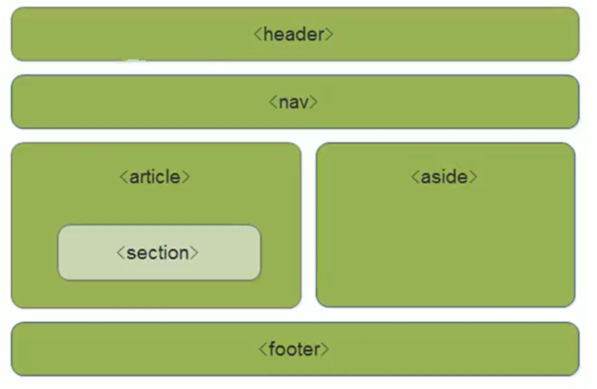
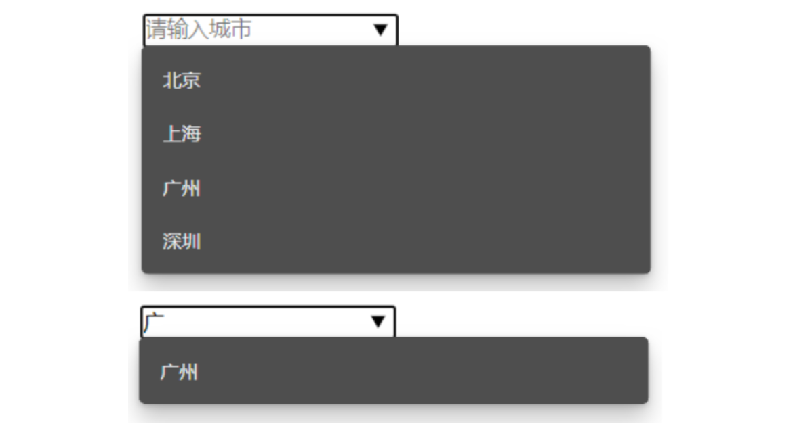
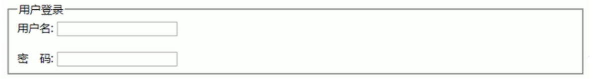

# HTML


## 基础

### 后缀名

标准为`html`，但由于早期win不支持4位长度的后缀名，所以也可以设置为`htm`，但建议使用完整的后缀名

### 注释

HTML文档中注释使用

```html
<!-- 这是注释 -->
```

### 页面基础结构

```html
<!DOCTYPE html>
<html lang="zh-CN">
    <head>
        <meta charset="UTF-8"/>
        <meta name="viewport" content=""/>
        <meta name="keyword" content="这是网站关键字"/>
        <meta name="description" content="这是网站描述" />
        <title>标题</title>
    </head>
    <body>
        
    </body>
</html>
```


## 标签

### 标签作用

用于进行区域划分，为区域添加语义

注意：部分标签（如h1 h2 p）等会带有一些默认的样式

### 标签分类

双标签：如`<div></div>`，`<h1></h1>`，`<span></span>`

单标签：如``，`<br />`，`<hr />`

### 常用标签

| 常用标签   | 分类       | 说明       |
| ---------- | ---------- | ---------- |
| h1         | 语义化标签 | 一级标题   |
| h2         | 语义化标签 | 二级标题   |
| h3         | 语义化标签 | 三级标题   |
| h4         | 语义化标签 | 四级标题   |
| h5         | 语义化标签 | 五级标题   |
| h6         | 语义化标签 | 六级标题   |
| br         | 语义化标签 | 换行符     |
| header     | 语义化标签 | 头部区域   |
| main       | 语义化标签 | 主体区域   |
| footer     | 语义化标签 | 尾部区域   |
| nav        | 语义化标签 | 导航区域   |
| article    | 语义化标签 | 文章区域   |
| aside      | 语义化标签 | 侧边栏区域 |
| section    | 语义化标签 | 章节区域   |
| div        | 结构化标签 | 区域结构   |
| p          | 结构化标签 | 段落标签   |
| pre        | 结构化标签 | 原样输出   |
| span       | 结构化标签 | 文本标签   |
| small      | 语义化标签 | 声明类文本 |
| time       | 语义化标签 | 放置时间   |
| addr       | 语义化标签 | 简写       |
| sup        | 语义化标签 | 上标       |
| sub        | 语义化标签 | 下标       |
| del        | 语义化标签 | 删除线     |
| ins        | 语义化标签 | 下划线     |
| s          | 语义化标签 | 错误的     |
| code       | 语义化标签 | 放置代码的 |
| progress   | 语义化标签 | 进度条     |
| strong     | 语义化标签 | 强调       |
| mark       | 语义化标签 | 马克笔效果 |
| cite       | 语义化标签 | 一句引用   |
| blockquote | 语义化标签 | 大段引用   |
| address    | 语义化标签 | 地址       |
| img        | 语义化标签 | 图片       |

`pre`标签能够保留缩进与空格，如果需要显示代码或者JSON数据，可以考虑使用 `pre` 标签


## 语义化标签

### 新增标签

| 标签    | 说明       |
| ------- | ---------- |
| header  | 头部标签   |
| nav     | 导航标签   |
| article | 内容标签   |
| section | 块级标签   |
| aside   | 侧边栏标签 |
| footer  | 尾部标签   |
| center  | 中心标签   |



### 语义化的作用

* div对于搜索引擎和浏览器来说是没有语义的
* 语义化标签主要针对于搜索引擎和浏览器
* 对于搜索引擎：更好的大纲目录，利于SEO
* 对于浏览器：提供更好的辅助阅读功能

### 注意事项

* 语义化标签主要用于移动端

* 在IE9中，这些新的语义标签被当为行内元素，所以需要设置

  ```css
  display: block;
  ```


## 超链接

### a标签

a标签之所以取名叫a标签，因为超链接是Web的灵魂

```html
<a href="" target="_blank" title="_blank|_self">aaa</a>
```

### 属性

#### href

用于写入链接

1. 如果是发送邮件

   ```html
   <a href="mailto:123@qq.com"></a>
   ```

2. 如果是打电话（用于移动端）

   ```html
   <a href="tel:123456789"></a>
   ```

   

#### title属性

鼠标长时间悬停时的提示信息

#### target属性

用于描述来链接的打开行为

| target属性 | 说明           |
| ---------- | -------------- |
| _self      | 在当前窗口打开 |
| _blank     | 在新窗口打开   |


## 图片

### img标签

```html

```

#### 属性

| 属性 | 说明                                 |
| ---- | ------------------------------------ |
| src  | 图片链接地址                         |
| alt  | 当图片加载失败时，用于替换的文字信息 |

#### 支持的图片类型与特点

| 图片类型 | 特点                      | 使用场景             |
| -------- | ------------------------- | -------------------- |
| PNG      | 清晰度较大，支持透明      | 小图，需要透明，图标 |
| JPEG/JPG | 清晰度比PNG差，不支持透明 | 大图                 |
| GIF      | 能动                      | 需要动图             |

### 图片存储策略

把图片放在专门的图片服务器，加CDN


## 列表

### 无序列表

使用到的标签：`ul`，`li`

```html
<ul>
    <li>芒果</li>
    <li>苹果</li>
    <li>西瓜</li>
</ul>
```

### 有序列表

使用到的标签：`ol`，`li`

```html
<ol>
    <li>星期一</li>
    <li>星期二</li>
    <li>星期三</li>
</ol>
```

### 描述列表

使用到的标签：`dl`，`dt`，`dd`

```html
<dl>
    <dt>编程语言</dt>
    <dd>JS</dd>
    <dd>GO</dd>
    <dt>数据库</dt>
    <dd>MYSQL</dd>
    <dd>MongoDB</dd>
    <dd>Redis</dd>
</dl>
```


## 表格

### 表格相关标签

table, caption, thead, tbody, tfoot, th, tr, td

### table标签
表格的根标签，表示这是一个表格

| 属性        | 值                | 说明                                        |
| ----------- | ----------------- | ------------------------------------------- |
| border      | 数值              | 设置表格边框                                |
| width       | 数值              | 设置表格宽度                                |
| height      | 数值              | 设置表格高度                                |
| align       | left/center/right | 表格整体与外部的对齐方式                    |
| cellspacing | 数值              | 单元格之间的空隙，默认为2px                 |
| cellpadding | 数值              | 单元格元素与单元格边框之间的间隙，默认为1px |

示例
```html
<table width="500px" height="500px" border="1px">
</table>
```

### caption标签
表格标题标签
```html
<table width="500px" height="500px" border="1px">
  <caption>表格标题</caption>
</table>
```

### thead标签，tbody标签，tfoot标签
thead划分th，tbody划分tr，tfoot划分表尾
```html
<table width="500px" height="500px" border="1px">
  <caption>表格标题</caption>
  <thead></thead>
  <tbody></tbody>
  <tfoot></tfoot>
</table>
```

### th标签
表头标签，用于表格第一行/第一列，其文本加粗居中显示
```html
<table width="500px" height="500px" border="1px">
  <caption>表格标题</caption>
  <thead>
    <th></th>
  </thead>
  <tbody></tbody>
</table>
```

### tr标签和td标签
tr标签表示一行，td标签表示一个单元格
```html
<table width="500px" height="500px" border="1px">
  <caption>表格标题</caption>
  <thead>
    <th>
      <td>姓名</td>
      <td>性别</td>
      <td>年龄</td>
    </th>
  </thead>
  <tbody>
    <tr>
      <td>姓名</td>
      <td>性别</td>
      <td>年龄</td>
    </tr>
    <tr>
      <td>姓名</td>
      <td>性别</td>
      <td>年龄</td>
    </tr>
  </tbody>
</table>
```

### 合并单元格

跨行合并: rowspan
```html
<tbody>
  <tr>
    <td>名字</td>
    <td>性别</td>
    <td rowspan="2">同岁</td>
  </tr>
  <tr>
    <td>名字</td>
    <td>性别</td>
  </tr>
</tbody>
```

跨列合并: colspan
```html
<tbody>
  <tr>
    <td>名字</td>
    <td>性别</td>
    <td>年龄</td>
  </tr>
  <tr>
    <td>名字</td>
    <td colspan="2">性别</td>
  </tr>
</tbody>
```

### 表格重合边框合并

通过设置css让表格重合边框合并
```css
table{ border-collapse:collapse; }
```


## 表单

### 表单是什么

HTML 表单用于搜集不同类型的用户输入

### 表单组成

表单域：整个表单的区域，可理解为外层的盒子

提示文本：说明性质的文字，用于提示用户进行填写和操作

表单控件：包含了具体的表单功能项，如单行文本输入框，密码输入框，复选框，提交按钮，重置按钮等等

### 常用控件

#### input控件

功能：文本输入框，让用户进行信息填写的工具

| 属性         | 属性值         | 描述                             |
| ------------ | -------------- | -------------------------------- |
| type         | text           | 文本输入框                       |
|              | password       | 密码输入框                       |
|              | radio          | 单选框                           |
|              | checkbox       | 多选框                           |
|              | button         | 按钮                             |
|              | submit         | 提交                             |
|              | reset          | 重置                             |
|              | file           | 文件上传                         |
|              | image          | 图片按钮                         |
|              | hiden          | 隐藏表单，可以用于防范 CORS攻击  |
|              | email          | 限制用户输入Email类型            |
|              | url            | 限制用户输入URL类型              |
|              | date           | 日期选择控件                     |
|              | time           | 时间选择控件                     |
|              | datetime       | 日期+时间控件                    |
|              | datetime-local | 当前时区的日期+时间控件          |
|              | month          | 月份选择控件                     |
|              | week           | 星期选择控件                     |
|              | number         | 限制用户数字类型                 |
|              | tel            | 限制用户输入手机号码             |
|              | search         | 搜索框控件                       |
|              | color          | 颜色选择控件                     |
| name         | 自定义名称     | 用于定义字段名称                 |
| value        | 自定义值       | 默认值                           |
| size         | 正整数         | 输入框的长度                     |
| checked      | checked        | 默认被选中的项                   |
| maxlength    | 正整数         | 允许输入的最大字符数             |
| src          | 图片地址       | 用于设置图片按钮                 |
| placeholder  | 文本           | 提示文本                         |
| required     | required       | 必选值                           |
| autofocus    | autofocus      | 自动对焦                         |
| autocomplete | off/on         | 记录历史输入记录，默认值是on     |
| multiple     | multiple       | 多选，配合select-option控件      |
| readonly     | readonly       | 只读，值有效也会提交，但不能修改 |
| disabled     | disabled       | 不能提交也不能修改               |

注意事项：多个radio通过同一个name划分为一组，即多个拥有相同name的radio，只能选择其中一个

#### label标签

label标签用于绑定一个表单控件，当点击label标签时，被绑定表单控件获取输入焦点

用法一：直接用label标签进行包裹

```html
<label> 输入账号
  <input type="text" />
</label>
```

用法二：使用`for=id`的形式进行

```html
<label for="male">男</label>
<input type="radio" name="gender" id="male" value="" />
```

#### radio控件

单选框，多个radio通过同一个name(字段名)划分为一组，即多个拥有相同name的radio，只能选择其中一个

```html
<label>
  男
  <input type="radio" name="gender" /> 
</label>
<label>
  女
  <input type="radio" name="gender" checked /> 
</label>
```

#### checkbox控件

多选框

示例

```html
<label>
  香蕉
  <input type="checkbox" name="gender"> 
</label>
<label>
  苹果
  <input type="checkbox" name="gender"> 
</label>
<label>
  芒果
  <input type="checkbox" name="gender"> 
</label>
```

#### textarea控件

输入多行的文字

| 属性 | 说明 |
| ---- | ---- |
| rows | 行数 |
| cols | 列数 |

示例

```html
<textarea name="info" cols="30" rows="30">这是默认值</textarea>
```

#### select-option控件

下拉菜单

单选模式

```html
<select name="category">
  <option value="1">新闻</option>
  <option value="2">游戏</option>
  <option value="3">小说</option>
</select>
```

多选模式

```html
<select name="category" multiple>
  <option value="1">新闻</option>
  <option value="2">游戏</option>
  <option value="3">小说</option>
</select>
```

默认选中

```html
<select name="category" multiple>
  <option value="1" selected>新闻</option>
  <option value="2">游戏</option>
  <option value="3">小说</option>
</select>
```

分组模式

```html
<select name="category">
    <optgroup label="新闻组">
    	<option value="1">新闻</option>
    	<option value="2" selected>游戏</option>
    </optgroup>
    <optgroup label="开发">
    	<option value="1">MySQL</option>
    	<option value="2" selected>Linux</option>
    </optgroup>
</select>
```

注意事项

* \<select>\</select>中至少要包含一对\<option>\</option>
* 在option中定义selected="selected"时，当前项即为默认选中项

#### progress控件

进度条控件

示例

```html
<progress value="60" max="100">60%</progress>
```

#### datalist控件

作用：类似于select-option，但提供模糊搜索功能

使用：需要通过id值与input控件配合使用

示例

```html
<datalist id="city">
  <option>北京</option>
  <option>上海</option>
  <option>广州</option>
  <option>深圳</option>
</datalist>
<input type="text" placeholder="请输入城市" list="city" />
```

效果图



#### fieldset控件

作用：将表单元素进行分组

使用：需要配合`legend`使用，`legend`包裹分组名

使用例子

```html
<fieldset>
  <legend>用户登录</legend>
  用户名：<input type="text" name="username" />
  <br />
  密  码：<input type="password" name="password" />
</fieldset>
```

效果图


#### 文件上传

单文件

```html
<form action="xxx" method="POST" enctype="multipart/form-data">
    <input type="file" name="image" />
</form>
```

多文件

```html
<form action="xxx" method="POST" enctype="multipart/form-data">
    <input type="file" name="image" multiple />
</form>
```

限制文件上传类型

```html
<form action="xxx" method="POST" enctype="multipart/form-data">
    <input type="file" name="image" multiple accept="image/png, image/jpeg"/>
</form>
```

### 表单域

定义：表单域是一对\<form>\</form>标签，它可以看作是一个盒子，这个盒子包裹表单，即表单域中有表单控件和提示文本

| 属性   | 说明                                                        |
| ------ | ----------------------------------------------------------- |
| action | 需要提交到的服务器的url地址                                 |
| method | 表单提交的HTTP方法，如GET, POST, PUT, DELETE, PATCH, OPTION |
| name   | 指定表单的名称，以区分同一页面中多个表单                    |

示例

```html
<form action="https://www.server.com" method="POST" name="myForm">
</form>
```


## 音频

### 标签

`audio`和`source`

### 属性

| 属性     | 值                    | 说明             |
| -------- | --------------------- | ---------------- |
| src      | 音频文件地址          | 音频文件地址     |
| type     | audio/mpeg, audio/ogg | 音频格式         |
| controls | controls              | 是否显示控制控件 |
| loop     | loop                  | 是否循环播放     |
| autoplay | autoplay              | 是否自动播放     |
| muted    | muted                 | 是否静音播放     |
| preload  | preload               | 是否进行预加载   |

### 支持格式

`mp3`, `ogg`, `wav`

### 使用

#### 写法1


#### 写法2

从上往下寻找能播放的音频，一旦找到可用的，就停止寻找，播放音频

```html
<audio controls="controls" 
       autoplay="autoplay" 
       loop="loop">
  <source src="./music.mp3" type="audio/mpeg" />
  <source src="./music.ogg" type="audio/ogg" />
  您的浏览器暂时不支持audio标签
</audio>
```


## 视频

### 标签

`video`和`source`

### 属性

| 属性     | 值                   | 说明                       |
| -------- | -------------------- | -------------------------- |
| src      | 视频文件地址         | 视频文件地址               |
| width    | 数值                 | 视频宽度                   |
| height   | 数值                 | 视频高度                   |
| type     | video/mpeg,video/ogg | 视频文件格式               |
| controls | controls             | 是否有控制控件             |
| loop     | loop                 | 是否循环播放               |
| autoplay | autoplay             | 是否自动播放               |
| preload  | auto/none            | 是否进行预加载             |
| poster   | imgurl               | 加载等待的画面图片（封面） |
| muted    | muted                | 是否静音播放               |

### 支持格式

`mp4`, `ogg`, `webm`

### 使用

#### 写法1

```html
<video src="" width="" height="" 
       controls autoplay muted poster="11.png"
       preload="none|auto|metadata"
       loop
></video>
```

#### 写法2

从上往下寻找能播放的视频，一旦找到可用的，就停止寻找，播放视频

```html
<video controls="controls" 
       autoplay="autoplay" 
       loop="loop">
  <source src="./music.mp3" type="audio/mpeg" />
  <source src="./music.ogg" type="audio/ogg" />
  您的浏览器暂时不支持audio标签
</video>
```


## 实体符号

### 作用

### 常用实体符号

| 实体符号 | 说明 |
| -------- | ---- |
| `&nbsp;` | 空白 |


## 锚点定位

### 作用

配合超链接实现文档内的定位跳转

### 用法

使用`<a href="#id名">文本</a>`创建链接文本

在需要跳转到的标签处写上对应的id值

```html
<a href="#gogogo">测试锚点</a>
<div id="gogogo">需要跳转到这里</div>
```


## History

### 概述

history是HTML5新增的API，它有五种模式改变URL而不刷新页面

| 方式         | 说明               |
| ------------ | ------------------ |
| pushState    | 使用新的路径       |
| replaceState | 替换原来的路径     |
| go           | 向前或向后改变路径 |
| forward      | 向前改变路径       |
| back         | 向后改变路径       |

### 属性

#### history.length

返回一个整数，该整数表示会话历史中元素的数目，包括当前加载的页

例如，在一个新的选项卡加载的一个页面中，这个属性返回1

#### history.state

History 堆栈最上层的状态值，即State

### 方法

#### history.go

```js
history.go(-1);
```

参数：(number)

功能：通过当前页面的相对位置从浏览器历史记录( 会话记录 )加载页面，比如

* 参数为-1的时候为上一页
* 参数为1的时候为下一页

注意：当整数参数超出界限时，这个方法没有任何效果也不会报错

#### history.back

```js
history.back();
```

参数：无

功能：前往上一页, 用户可点击浏览器左上角的返回按钮模拟此方法，等价于 `history.go(-1)`

#### history.forward

```js
history.forward();
```

参数：无

功能：在浏览器历史记录里前往下一页，用户可点击浏览器左上角的前进按钮模拟此方法，等价于 `history.go(1)`

#### history.pushState

```js
history.pushState(state,title,url)
```

参数：

| 参数  | 说明                                                         |
| ----- | ------------------------------------------------------------ |
| state | 一个与添加的记录相关联的状态对象，浏览器会将这个对象序列化以后保留在本地<br />主要用于`popstate`事件，该事件触发时，该对象会传入回调函数<br />重新载入这个页面的时候，可以拿到这个对象<br />如果不需要这个对象，此处可以填`null` |
| title | 新页面的标题。但是，现在所有浏览器都忽视这个参数，所以这里可以填空字符串 |
| url   | 新的网址，必须与当前页面处在同一个域，浏览器的地址栏将显示这个网址<br />如果设置了一个跨域网址，则会报错 |

功能：用于在历史中添加一条记录，改变地址栏的地址，点击后退/前进键可以改变URL

注意：`pushState`方法不会触发页面刷新，只是导致 History 对象发生变化，地址栏会有反应

技巧：使用该方法之后，就可以用`History.state`属性读出状态对象

#### history.replaceState

```js
history.replaceState(state,title,url)
```

参数：

| 参数  | 说明                                                         |
| ----- | ------------------------------------------------------------ |
| state | 一个与添加的记录相关联的状态对象，浏览器会将这个对象序列化以后保留在本地<br />主要用于`popstate`事件，该事件触发时，该对象会传入回调函数<br />重新载入这个页面的时候，可以拿到这个对象<br />如果不需要这个对象，此处可以填`null` |
| title | 新页面的标题。但是，现在所有浏览器都忽视这个参数，所以这里可以填空字符串 |
| url   | 新的网址，必须与当前页面处在同一个域，浏览器的地址栏将显示这个网址<br />如果设置了一个跨域网址，则会报错 |

功能：用来修改 History 对象的当前记录，其他都与`pushState()`方法一模一样

### 事件

#### popstate

功能：当同一个文档的浏览历史（即`history`对象）出现变化时，就会触发`popstate`事件

注意：

* 仅仅调用`pushState()`方法或`replaceState()`方法 ，并不会触发该事件

* 只有用户点击浏览器倒退按钮和前进按钮，或者调用`history.back()`、`history.forward()`、`history.go()`方法时才会触发该事件


## 新增API

### 检测网络连接状态

检测网络连接状态主要有两个事件：online和offline

online: 用户网络连接时被调用

offline: 用户网络断开时被调用

```html
<script>
  window.addEventListener("online", function() {
    alert("网络已连接");
  })  
    
  window.addEventListener("offline", function() {
    alert("网络连接失败")  
  })
</script>
```