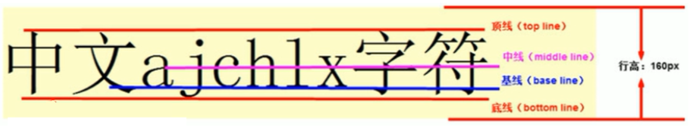
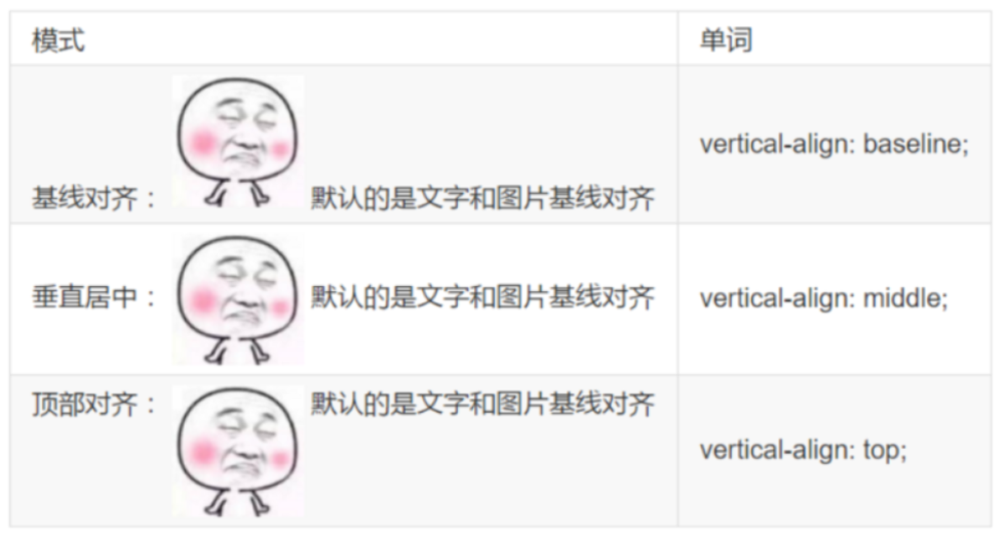

## 鼠标样式

作用：设置在对象上移动的鼠标指针采用何种系统预定义的光标形状

属性名：**cursor**

| 可选值  | 说明 |
| ------- | ---- |
| default | 默认 |
| pointer | 点   |
| move    | 移动 |
| text    | 文本 |


## 轮廓

作用：绘制于元素周围的一条线，位于边框边缘的外围，可起到突出元素的作用，一般用于突出选中的input框

轮廓线与border区别：border占用空间，轮廓线不占用空间

属性名：**outline**

可选值：

* color style width
* 0: 设置为0时，则禁用outline


## 防止拖拽文本域

属性名：**resize**

可选值：none

示例

```html
<textarea style="resize: none;"></textarea>
```


## 显示与隐藏

在CSS中有三个用于控制元素显示和隐藏的属性，它们的要目的是让一个元素在页面中消失，但是不在文档源码中删除

#### display 展示

定义：display设置元素展示

特点：隐藏之后，不再保留位置

| 可选值       | 说明                 |
| ------------ | -------------------- |
| none         | 不显示               |
| block        | 以块级模式进行显示   |
| inline-block | 以行内块模式进行显示 |
| inline       | 以行内模式进行显示   |
| table        | 以表格模式进行显示   |

inline-block与inline区别：都是行内，但inline-block可以设置宽高

#### visibility 可见性

定义：visibility设置元素的可见性

特点：隐藏之后，保留位置

| 可选值  | 说明   |
| ------- | ------ |
| visible | 可见   |
| hidden  | 不可见 |

#### opacity 透明度

定义：opacity通过设置alpha通道来改变元素的透明度

```css
opacity: [0-100];
```


## 溢出控制

使用属性 overflow 来实现溢出控制

定义：设置当对象的内容超过其指定高度及宽度时如何管理内容

注意：overflow 只对块级元素起作用

| 可选值  | 说明                                                     |
| ------- | -------------------------------------------------------- |
| auto    | 声明决策将依赖于客户端，优先使用scroll                   |
| visible | 声明内容不会被剪裁。比如内容可能被渲染到容器外面         |
| hidden  | 声明内容将被剪裁，并且也甭想使用滚动条来查看剪裁掉的内容 |
| scroll  | 声明内容将被剪裁，但有可能出现滚动条来查看被剪裁掉的内容 |


## 展示模式

### 展示模式分类

展示模式分为：行内（inline），行内块（inline-block），块级（block），表格系列（table-*），flex，inline-flex，grid

### 改变展示模式

通过设置 display 的值来改变的元素的展示模式

### display常见值

| 值           | 说明                                                         |
| ------------ | ------------------------------------------------------------ |
| inline       | 以行内元素行为展示                                           |
| block        | 以块级元素行为展示                                           |
| inline-block | 行内元素和块级元素特性兼而有之，既不会占满父元素，又可以设置width和height属性 |
| table        | 以表格的形式展示                                             |
| table-cell   | 以表格单元格的形式展示                                       |
| table-row    | 以表格行的形式展示                                           |
| table-column | 以表格列的形式展示                                           |
| flex         | flex布局                                                     |
| inline-flex  | 类似行内元素，但是可以用于制作自适应布局                     |
| grid         | 栅格布局                                                     |


## 垂直对齐

### 介绍

设置对象内容的垂直对齐方式

vertical-alig不影响块级元素中的内容对齐，它只针对于**行内元素**或者**行内块元素**

通常用来控制**图片**和**表单**等

行内、行内块对齐标准：顶线，中线，基线，底线


### 属性名与可选值

属性名：vertical-align

可选值：baseline, top, middle, bottom

### 图片和文字对齐



### 去除图片底侧空白缝隙

特性：如果一个元素没有基线，比如图片或者表单等行内块元素，则他的底线会和父级盒子的基线对齐，这样会造成一个问题，就是图片底部会有一个空白缝隙

#### 解决方法1：将图片转为块级元素

```css
img {
  display: block;
}
```

#### 解决方法2：将图片对齐方式设置为顶线对齐

```css
img {
  vertical-align: top;
}
```

