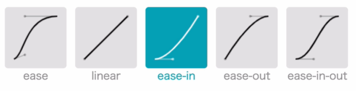

## 介绍

### 作用

transition作用于两个状态之间，用于设置变形的过渡效果（常配合transform使用）

使用transition可以实现补间动画（过渡效果），并且当前元素只要有"属性"发生变化时即存在两种状态即可

### 原则

哪个元素发生状态改变，则transition加到该元素上

### 属性中间值

属性存在中间值的都可以进行transition，而如果属性不存在中间值，则transition不生效


## transition属性

### 控制哪些属性可以进行过渡

```css
transition-property: background-color, width | all | none;
```

### 过渡时间

```css
transition-duration: 2s | 100ms;
```

可以为特定属性设置特定的过渡时间

```css
transition-property: background-color, width, height, color
transition-duration: 1s, 200ms, 3s, 300ms
```

### 延迟过渡时间

```css
transition-delay: 1s; /* 1s后才进行过渡 */
transition-delay: 1s; /* 1s后才进行过渡 */
```

可以为特定属性设置特定的延迟过渡时间

```css
transition-property: background-color, width, height, color
transition-delay: 1s, 200ms, 3s, 300ms
```

组合效果：一个效果过渡完才开始下一个效果的过渡

```css
transition-property: background-color, width, height, color;
transition-duration: 0 2s 4s 6s;
transition-delay: 2s;
```

### 过渡效果函数

```css
transition-timing-function: ease | ease-in | ease-out | ease-in-out | linear;
transition-timing-function: cubic-bezier(.78, 0, .18, 1);
transition-timing-function: step-end(相当于step(1,end)) | step-start(相当于step(1,start));

transition-timing-function: step(步数, [start|end]);
步进动画：离散动画，start表示立即开始，end表示第一step(帧)之后才开始，适合用来实现时钟
```

[参考过程](https://cubic-bezier.com)



### 合并写法

```css
transition: [property] [transition-timing-function] [transition-duration必须有] [transition-delay]
```

设置多个属性

```css
transition: border-radius linear 2s 0s,
            background 2s 2s,
            width ease-in-out 3s 1s
```


## 注意事项

可以在开始状态和结束状态设置不同的过渡效果，如果结束状态不设置，则会继承开始状态

```css
div { /* 开始状态 */
    width: 100px;
    height: 100px;
    background-color: red;
    transition-duration: 1s;
}

div:hover { /* 结束状态 */
    width: 200px;
    height: 200px;
    transition-property: width;
    transition-duration: 10s;
}
```
