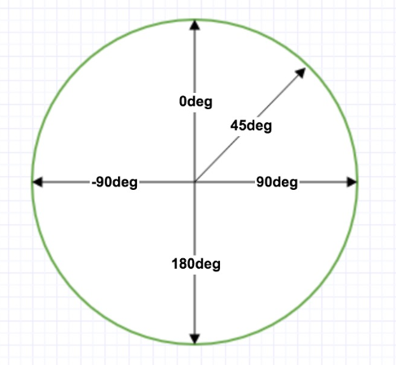
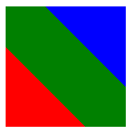
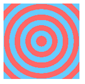

## 简介

### 作用

CSS3 渐变可以让你在两个或多个指定的颜色之间显示平稳的过渡

以前如果想实现渐变效果，必须使用图像来实现这些效果，但是通过使用 CSS3 渐变，你可以减少下载的时间和宽带的使用

此外，渐变效果的元素在放大时看起来效果更好，因为渐变是由浏览器生成的

### 分类

CSS3 定义了两种类型的渐变

* 线性渐变（Linear Gradients）：向下/向上/向左/向右/对角方向
* 径向渐变（Radial Gradients）：由它们的中心定义


## 线性渐变

### 效果

线性渐变是从沿着一条直线进行颜色的渐变

### 语法

`linear-gradient`不是`color`的属性，而是`background`的属性

```css
background: linear-gradient([渐变结束角度], 颜色 [颜色起止位置]，颜色 [颜色起止位置]，...);
```

### 渐变结束角度

#### 标准角度图



方向是：从角度对角位置开始到角度位置，比如 0deg 就是从下到上，270deg就是从右到左

#### 使用预设值

| 预设值          | 说明                                                       |
| --------------- | ---------------------------------------------------------- |
| to left         | 设置渐变为从右到左。相当于270deg                           |
| to right        | 设置渐变从左到右。相当于90deg                              |
| to top          | 设置渐变从下到上。相当于0deg                               |
| to bottom       | 设置渐变从上到下。相当于180deg。这是默认值，等同于留空不写 |
| to left top     | 设置渐变从右下到左上。相当于315deg                         |
| to left bottom  | 设置渐变从右上到左下。相当于225deg                         |
| to right top    | 设置渐变从左下到右上。相当于45deg                          |
| to right bottom | 设置渐变从左上到右下。相当于135deg                         |

### 颜色

可以使用字符串颜色，16进制颜色，rgb(a)颜色

### 颜色起止位置

| 项   | 说明                                   |
| ---- | -------------------------------------- |
| 作用 | 用于标识颜色所在地方                   |
| 值   | 可以用百分比，也可以用数字             |
| 理解 | 可以将颜色看作一条线，它向两端开始发散 |
| 可选 | 颜色起始位置可以不填，默认平分         |

```css
linear-gradient(red, green, blue);
/* 相当于 */
linear-gradient(red 0%, green 50%, blue 100%);
```

#### 例子

实现如图效果



```css
width: 100px;
height: 100px;
background: linear-gradient(
	45deg, 
	red 0%, red 33.3%, 
	green 33.3%, green 66.6%, 
	blue 66.6%, blue 100%
);
```

### 重复线性渐变

使用重复线性渐变能实现类似斑马图的效果

使用repeating-linear-gradient实现重复线性渐变

#### 例子

实现如下图效果


```css
background: repeating-linear-gradient(#ff6666 0%,#ff6666 10%,#66ccff 10%,#66ccff 20%);
```


## 径向渐变(中心渐变)

### 效果

径向渐变的效果是从圆心向四周进行扩散的渐变

### 语法

```css
background: radial-gradient([形状] [大小] [圆心位置], 颜色 [颜色起止位置], 颜色 [颜色起止位置], ...);
```

### 形状

形状有两种：圆（`cicle`）和椭圆（`ellipse`）

### 大小

#### 使用具体数值（或百分比）

| 项   | 说明                                                         |
| ---- | ------------------------------------------------------------ |
| 语法 | 数值（或百分比）定义的是圆的半径大小                         |
| 特点 | 如果传入一个数值，则是圆；如果传入两个数值，则是椭圆，对应水平长半轴和垂直短半轴 |
| 注意 | **若渐变形状为圆形，则该渐变大小不能为百分数，而椭圆既可以为具体数值也可以为百分数** |
| 原因 | 因为圆形半径若为百分数的话就无法确定是以元素的宽为标准还是以高为标准了 |

#### 使用预设值

| 预设值          | 说明                                           |
| --------------- | ---------------------------------------------- |
| closest-side    | 指定径向渐变的半径长度为从圆心到离圆心最近的边 |
| closest-corner  | 指定径向渐变的半径长度为从圆心到离圆心最近的角 |
| farthest-side   | 指定径向渐变的半径长度为从圆心到离圆心最远的边 |
| farthest-corner | 指定径向渐变的半径长度为从圆心到离圆心最远的角 |

### 圆心位置

#### 使用具体数值（或百分比）

语法：`at X轴坐标 Y轴坐标`

```css
background: radial-gradient(circle farthest-side at 0 0, red 0%, blue 100%);
```

#### 使用预设值

| 预设值          | 说明                        |
| --------------- | --------------------------- |
| at center       | 中心，相当于 at 50%, 50%    |
| at left top     | 左上角，相当于 at 0% 0%     |
| at right top    | 右上角，相当于 at 100% 0%   |
| at right bottom | 右下角，相当于 at 100% 100% |
| at left bottom  | 左下角，相当于 at 0% 100%   |

### 颜色

可以使用字符串颜色，16进制颜色，rgb(a)颜色

### 颜色起止位置

类比于线性渐变的颜色起止位置

| 项   | 说明                                   |
| ---- | -------------------------------------- |
| 作用 | 用于标识颜色所在地方                   |
| 值   | 可以用百分比，也可以用数字             |
| 理解 | 可以将颜色看作一个圆，它向两端开始发散 |
| 可选 | 颜色起始位置可以不填，默认平分         |

### 重复径向渐变

使用重复径向渐变能实现类似靶的效果

使用repeating-radial-gradient实现重复径向渐变

#### 例子

实现如下图效果



```css
width: 100px;
height: 100px;
background: repeating-radial-gradient(
	circle 50px at center, 
	#ff6666 0%, #ff6666 10%, 
	#66ccff 10%, #66ccff 20%
);
```

