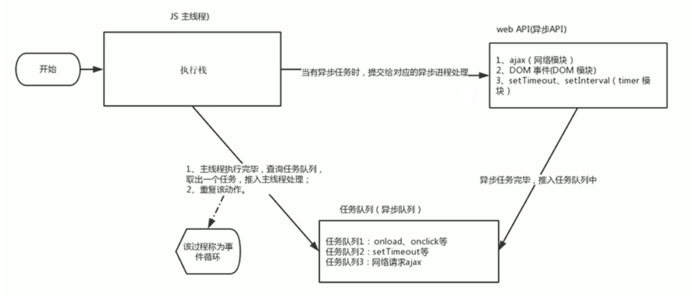

## JavaScript单线程

### 为啥是单线程的？

JS是单线程语言，即同一时间只能做一件事，原因是JavaScript最初设计的目的就是为了处理页面用户的交互，以及操作DOM而诞生的

如果JavaScript是多线程，那么如果在多个线程中都操作DOM，将带来很复杂的同步和容错问题，这可能大大消耗性能，导致页面响应时间过长

### 单线程的弊端？

因为是单线程，所以任务需要排队，一个一个地执行，这导致一个问题，如果JavaScript执行的时间过长，则会导致程序阻塞的感觉

为了解决这个问题，JavaScript中利用**事件循环**机制来处理异步操作

此外利用多核CPU的计算能力，HTML5提出了**WebWorker**标准，允许JS脚本创建多个线程，于是JS中出现了同步和异步

## JavaScript任务

### 任务分类

任务分为同步任务和异步任务

同步任务：同步任务都在主线程上执行，形成一个执行栈

异步任务：异步任务是通过回调函数执行的，异步任务又可以细分为宏任务和微任务

| 异步任务分类 | 常见异步任务                 |
| ------------ | ---------------------------- |
| 宏任务       | DOM事件，定时器，HttpRequest |
| 微任务       | Promise                      |

### 启动任务的方法

| 启动任务类型 | 方法                                               |
| ------------ | -------------------------------------------------- |
| 启动宏任务   | setTimeout(()=>{/* 这里是宏任务 */});              |
| 启动微任务   | Promise.resolve().then(_ => { /* 这里是微任务 */}) |

## JavaScript事件循环

### 事件循环流程

1. 先执行执行栈中的同步任务

2. 遇到异步任务则由浏览器其他线程执行

3. 回调函数加入到任务队列

4. 执行栈中的所有同步任务执行完毕后，系统就会次序读取任务队列中的异步任务

5. 执行完全部微任务后

6. 执行一个宏任务

7. 进入下一轮循环

### 事件循环示例图

### 注意事项

1. **异步操作**：会携带所需的相关数据，传送到浏览器的其他线程执行异步操作
2. **异步操作的回调函数**：会使用闭包保存其相关作用域，在异步操作完成时，会放到任务队列中，等待事件循环，拿到主线程中执行，放在主线程执行的目的是为了能够使用到主线程中的数据
3. 在进行异步操作执行完毕之前，需要给该异步操作绑定回调函数
4. 任务队列中放的全部是回调函数（通常会用到闭包）
5. 定义器在使用Web API时就开始计时，而不是等到回调函数执行时才计时

## 回调函数

### 定义

回调函数是特定的事件或条件发生时由另外的一方调用的，用于对该事件或条件进行响应

### 同步回调函数

理解：立即执行，完全执行了才结束，不会放入回调队列中

例子：forEach中的回调函数，Promise的excutor函数，map/filter/some/every/reduce等高阶函数

### 异步回调函数

理解：不会立即执行，会放入回调队列中将来执行

例子：定时器的回调，ajax回调，Promise的成功/失败的回调，网络请求的回调

### 回调地狱

在异步操作完成前需要绑定回调函数的模式很容会造成回调地狱

**回调地狱**：异步任务的回调函数中有其他的异步任务，所以在这里子的异步任务中也需要绑定其对应的回调函数，即造成了回调函数中有回调函数现象，即回调函数套回调函数，如果层数多了，就称为回调地狱（为了保证异步任务的顺序性）