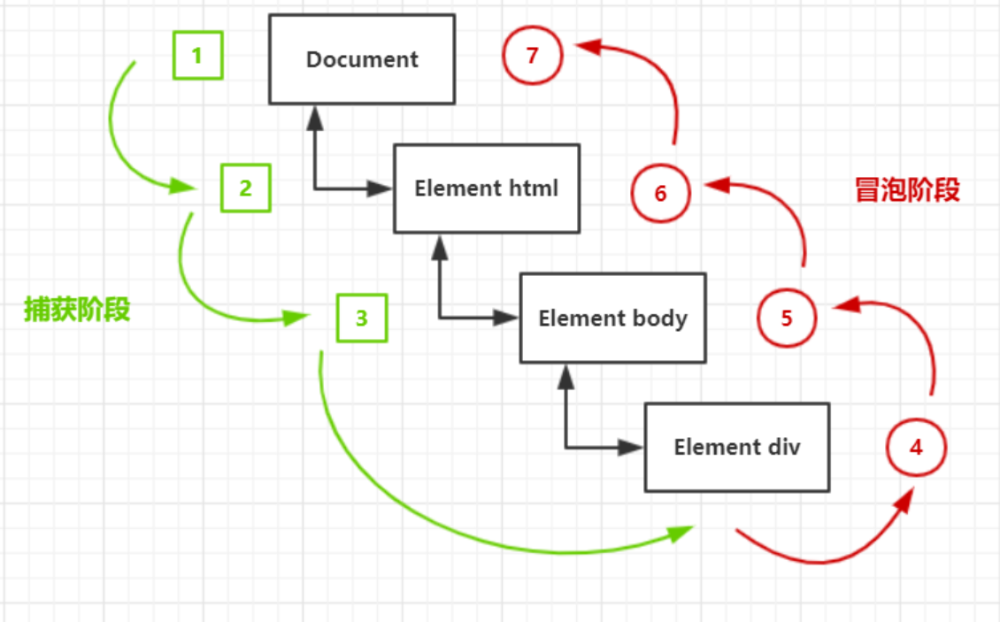

## 事件基础

### 事件介绍

事件是指发生在DOM元素上的事情

事件是触发-响应机制，即分为事件的触发和事件的响应

### 事件三要素

事件源：被绑定事件的DOM元素对象

事件类型：即事件触发的方式

事件处理程序：事件响应的函数，即回调函数

### 使用事件的步骤

获取事件源

注册事件（绑定事件）

添加事件处理程序


## 注册事件

### 概念

给元素添加事件，称为注册事件或者绑定事件

### 传统注册方式

用法：直接给元素添加"on"+事件类型和相应的事件处理函数

命名：名称全小写

例子：

```js
btn.onclick = function() {}
```

特点：注册事件的唯一性，即同一个元素的同一事件只能设置一个处理函数，最后设置的处理函数会覆盖之前的处理函数

### 方法监听注册方式

特点：同一个元素的同一事件可以设置多个处理函数，不会被覆盖

#### 用法一：addEventListener

| 参数     | 说明                                       |
| -------- | ------------------------------------------ |
| type     | 事件类型，注意不加on，比如click, mouseover |
| callback | 事件处理函数                               |
| options  | 可选参数                                   |

options：

| 选项       | 说明                                                         | 默认值 |
| ---------- | ------------------------------------------------------------ | ------ |
| useCapture | Boolean，是否选择在捕获阶段进行检查                          | false  |
| once       | Boolean，表示 listener 在添加之后最多只调用一次<br />如果是 true， listener 会在其被调用之后自动移除 | false  |
| passive    | Boolean，设置为true时，表示 listener 永远不会调用 preventDefault()<br />如果 listener 仍然调用了这个函数，客户端将会忽略它并抛出一个控制台警告 | false  |
| capture    | Boolean，表示 listener 会在该类型的事件捕获阶段传播到该 EventTarget 时触发 | false  |

使用 passive 参数优化滚动

* Chrome主要利用该特性来优化页面的滑动性能
* Passive Event Listeners特性当前仅支持mousewheel/touch相关事件
* Passive Event Listenrers特性是让Web开发者来告诉浏览器，当前页面内注册的mousewheel/touch事件监听器是否属于被动监听器，以便让浏览器更好地做决策来提高页面的滑动流畅度

```js
// 如下面的代码中，页面通过调用document.addEventListener来添加一个mousewheel事件的监听器handler
// 通过设置passive属性的值为true来声明监听器handler是被动监听mousewheel事件
// 即handler内部不会调用事件的preventDefault函数

function handler(e) { 
    doSomething(); // do something here
 }
document.addEventListener('mousewheel', handler, {passive: true})
```

#### 用法二：attachEvent

该方法只支持IE6,7,8，所以没啥实际作用

| 参数     | 说明                                         |
| -------- | -------------------------------------------- |
| type     | 事件类型，注意加on，比如onclick, onmouseover |
| callback | 事件处理函数                                 |


## 解绑事件

### 传统解绑方式

将事件处理函数置为null即可 

```js
btn.onclick = null;
```

### 方法解绑方式

#### 方法一：removeEventListener

| 参数       | 说明                                       |
| ---------- | ------------------------------------------ |
| 事件类型   | 事件类型，注意不加on，比如click, mouseover |
| callback   | 事件处理函数                               |
| useCapture | 可选参数，是一个布尔值，默认是false        |

#### 方法二：detachEvent

该方法只支持IE6,7,8，所以没啥实际作用

| 参数     | 说明                                         |
| -------- | -------------------------------------------- |
| type     | 事件类型，注意加on，比如onclick, onmouseover |
| callback | 事件处理函数                                 |


## DOM事件流

### DOM事件流定义

触发事件时，事件会在元素节点之间按照特定的顺序进行传播，这个传播过程就是DOM事件流

### DOM事件流顺序

事件传播顺序可以划分为3个部分：捕获阶段 -> 目标元素 -> 冒泡阶段

捕获阶段：事件由DOM最顶层节点开始，逐级向下传播到目标元素的过程

目标元素：执行事件处理函数

冒泡阶段：事件开始由目标元素开始，逐级向上传播到DOM最顶层节点的过程



### DOM事件流特点

事件在传播过程中，会检查经过的当前节点有没有绑定该事件的处理函数，如果有则调用该处理函数，如果没有则按顺序将事件传递给下一个元素

这样的检查和调用只能选择在**捕获阶段**或**冒泡阶段**的其中一个阶段进行

* 如果选定在冒泡阶段进行事件检查和调用，则事件在捕获阶段不会被执行
* 如果选定在捕获阶段进行事件检查和调用，则事件在冒泡阶段不会被执行

### 选定进行检查调用的阶段

对于使用**传统绑定**和**attachEvent**绑定的事件，只能选择在冒泡阶段进行检查和调用，而不能选择捕获阶段检查和调用

对于使用addEventListener绑定的事件可以选择在捕获阶段或者冒泡阶段进行检查和调用

*  addEventListener(type, callback [, useCapture])
*  第三个参数为一个布尔值，用于判断是否在捕获阶段进行检查调用

### 没有捕获阶段和冒泡阶段的事件

onblur, onfoucs, onmouseenter, onmouseleave


## 事件对象

### 事件对象定义

当触发事件后，在执行事件处理函数时，系统会自动将该事件的相关数据和信息封装到一个对象中，该对象称为事件对象

### 事件对象作用

系统会自动将事件对象作为参数传递给事件处理函数，从而让事件处理函数根据事件对象来进行相应的事件处理

### 获取事件对象

非IE6-8，事件对象会作为参数自动传给事件处理函数

IE6-8，事件对象会传给全局window.event变量

```js
function (ev) {
    let oEvent = ev || window.event;
    // ev 非 IE6-8
    // event IE6-8 
} 
```

### 通用事件对象属性和方法

| 事件属性和方法      | 说明                                           | 是否符合标准          |
| ------------------- | ---------------------------------------------- | --------------------- |
| e.type              | 返回事件的类型【不带on，比如click, mouseover】 | 符合                  |
| e.target            | 触发事件的对象                                 | 符合                  |
| e.srcElement        | 触发事件的对象                                 | 不符合，为了兼容IE6-8 |
| e.stopPropagation() | 阻止事件冒泡                                   | 符合                  |
| e.cancelBubble      | 阻止事件冒泡                                   | 不符合，为了兼容IE6-8 |
| e.preventDefault()  | 阻止事件默认行为【比如链接跳转，表单提交】     | 符合                  |
| e.returnValue       | 阻止事件默认行为                               | 不符合，为了兼容IE6-8 |

#### 阻止默认行为的第二种方法

除了e.preventDefault()和e.returnValue之外还有一种方法，直接在函数内写 `return false`

特点：只能写在函数的最后

#### event.target和this的区别

e.target是指**触发事件**的元素对象，而this是指**绑定事件**的元素对象

```html
<ul>
    <li>1</li>
    <li>2</li>
    <li>3</li>
</ul>
<script>
    document.querySelector("ul").onclick = function(e) {
        console.log(this);
        console.log(e);
    }
</script>

当点击li时，e.target指向所点击的li元素，this指向ul元素
当点击ul时，e.target指向ul元素，this指向ul元素
```

#### event.target和event.currentTarget区别

`event.target`指向引起触发事件的元素

`event.currentTarget`则是事件绑定的元素

记忆技巧：谁绑定事件谁就是currentTarget，鼠标点击谁，谁就是target

```js
// xxx 就是 currentTarget
xxx.addEventListener("", () => {})
```


## 鼠标事件

| 事件        | 事件说明         |
| ----------- | ---------------- |
| click       | 鼠标点击         |
| mousedown   | 鼠标按住左键     |
| mouseup     | 鼠标松开按键     |
| mousemove   | 鼠标移动         |
| mouseover   | 鼠标移入         |
| mouseout    | 鼠标移出         |
| focus       | 获取鼠标焦点     |
| blur        | 失去鼠标焦点     |
| contextmenu | 点击右键弹出菜单 |
| selectstart | 鼠标开始选中     |

### mouseenter和mousemove区别

* mouseover经过自身盒子会触发，经过子盒子也会触发，因为mouseover会冒泡
* mouseenter只有经过自身才会触发，因为mouseenter不会冒泡
* mouseleave与mouseenter搭配，都不会冒泡
* mouseout与mouseover搭配，都会冒泡

### 鼠标事件对象属性

| 属性      | 属性说明                            |
| --------- | ----------------------------------- |
| e.clientX | 鼠标相对于浏览器可视区的X坐标       |
| e.clientY | 鼠标相对于浏览器可视区的Y坐标       |
| e.screenX | 鼠标相对于电脑屏幕的X坐标           |
| e.screenY | 鼠标相对于电脑屏幕的Y坐标           |
| e.pageX   | 鼠标相对于文档页面的X坐标【最常用】 |
| e.pageY   | 鼠标相对于文档页面的Y坐标【最常用】 |


## 键盘事件

| 事件     | 事件说明 | 注意                                                      |
| -------- | -------- | --------------------------------------------------------- |
| keydown  | 键盘按下 | 不区分字母大小写                                          |
| keyup    | 键盘弹起 | 不区分字母大小写                                          |
| keypress | 键盘按下 | 区分字母大小写<br />不识别功能键，如ctrl、shift、箭头等等 |

三个事件的执行顺序：keydown --> keypress --> keyup

### 键盘事件对象

| 属性       | 属性说明   |
| ---------- | ---------- |
| e.keyCode  | 按键的code |
| e.ctrlKey  | ctrl键     |
| e.altKey   | alt键      |
| e.shiftKey | shift键    |


## 文档事件

| 事件             | 事件说明                                                     | 注意                 |
| ---------------- | ------------------------------------------------------------ | -------------------- |
| onload           | 页面上所有的DOM，样式表，脚本，图片，flash都已经加载完成时触发 |                      |
| domcontentloaded | 仅当DOM加载完成时触发，不包括样式表，图片，flash             |                      |
| onbeforeunload   | 在即将离开当前页面(刷新或关闭)时进行触发                     | 用于提醒用户进行保存 |


## 移动端事件

| 事件        | 事件说明                                     |
| ----------- | -------------------------------------------- |
| touchstart  | 触摸开始                                     |
| touchmove   | 触摸并移动，注意是可以移出注册元素本身的     |
| touchend    | 触摸结束                                     |
| touchcancel | 触摸被取消事件（比如触摸时，浏览器突然弹框） |

### 移动端事件对象属性

| 属性            | 说明                             |
| --------------- | -------------------------------- |
| e.type          | 触摸事件的类型                   |
| e.touches       | 触点对象组成的数组               |
| e.changeTouches | 发生改变的触点对象组成的数组     |
| e.targetTouches | 作用在元素上的触点对象组成的数组 |
| e.clientX       | 相对可视区域左侧的偏移           |
| e.clientY       | 相对可视区域顶部的偏移           |
| e.pageX         | 相对文档左侧的偏移               |
| e.pageY         | 相对文档顶部的偏移               |


## 移动端常见问题

### 300ms延迟问题

#### 历史问题

在 `iphone4` 刚出来时，网页大部分是PC端，在移动端看时会显得很小，所以`safari`浏览器就提供了两种缩放模式，分别为 ①双指缩放 ②快速双击缩放（touch系列事件最早出现在safari中）

为了识别快速双击缩放，`safari`推出了`300ms`延迟模式，原理是：发生`click`事件时，不会立即执行，而是等待`300ms`，如果在`300ms`内，发生了第二次点击，则认为是缩放，而不是点击，反之亦然

随着`iphone4`的流行，现在`300ms`延迟已经成为主流方案

#### 解决方案

* 方案1：设置`meta viewport`为`user-scalable=no`，浏览器会禁止掉`300ms延迟`的特性

* 方案2：使用`fastClick`，也能够禁止掉`300ms`延迟特性

  安装：`yarn add fastclick`

  使用：`fastclick.attach(document.body)`

  原理：在检测到`touchend`事件的时候，会通过DOM自定义事件立即出发模拟一个`click`事件，并把浏览器在`300ms`之后真正的`click`事件阻止掉

### touch事件穿透问题

#### 问题描述

因为`click`事件存在`300ms`延迟的问题，即`click`事件在`300ms`后才执行，而`touchstart`事件是立即响应

#### 存在问题

`touch`关闭蒙层，同时触发的`click`事件在`300ms`才触发，会导致`click`事件作用在蒙层下的元素上

#### 解决方案

* 方案1：让touch事件也延迟300ms（**不推荐，体验不好**）

  ```js
  dom.addEventListener("touchstart", () => {
      setTimeout(() => {
          // 
      }, 300);
  });
  ```

* 方案2：添加一层透明的中间蒙层，让中间蒙层延迟300ms后消失（**不推荐，性能不好**）

* 方案3：使用`fastClick`（**推荐**）


## 事件委托

### 事件委托是什么

事件委托也称为事件代理，它就是把一个元素的事件委托给另一个元素进行绑定和处理

### 事件委托原理

不用给每个子节点都单独绑定事件，而是为其父节点绑定事件，利用事件默认的冒泡行为来间接将事件处理函数作用于子节点

**配合e.target使用，e.target始终指向触发事件的元素**

### 事件委托作用

只需要绑定一次事件，就可以让多个节点能够触发该事件，故有下列优点

* 大量节省内存，因为不用每个节点都单独设置一个事件处理函数
* 提高可维护性，只要修改父节点的事件处理函数，则所有子节点都能修改其事件处理行为
