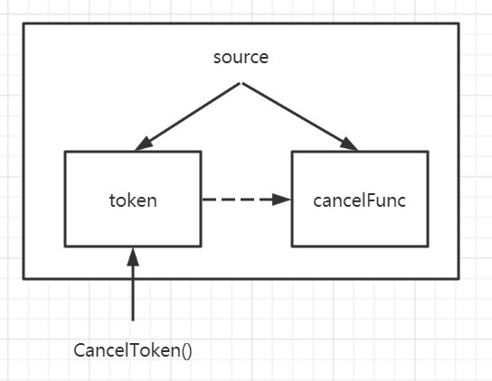
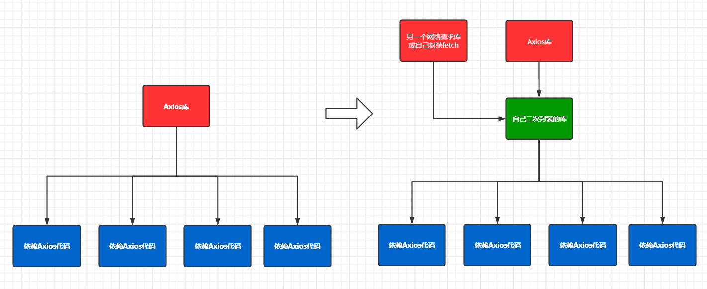

## AJAX

### 定义

AJAX全称：**A**synchronous **J**avaScript **A**nd **X**ML（异步JavaScript和XML）

Ajax是一种在不刷新（不提交表单）的前提下，可以和服务器进行数据交互的技术，带来更好的用户体验

### AJAX请求与HTTP请求区别

AJAX请求是一种特殊的 HTTP 请求

对于服务端：两者没有任何区别

对于浏览器：
1. 只有XHR与Fetch发出的请求才是 AJAX 请求，使用AJAX引擎发送请求
2. 其他所有的都是非 AJAX 请求，使用HTTP引擎发送请求

浏览器响应
1. 一般请求的响应：浏览器直接进行刷新或跳转
2. AJAX请求的响应：浏览器不会进行刷新，会调用回调函数


## XMLHttpRequest (XHR)

### 概念

`XMLHttpRequset`（简称XHR）是由微软提出来的技术，可用于发送网络请求和接收网络响应

### 创建

使用 `XMLHttpRequest` 构造函数来创建`XHR`对象

```js
const xhr = new XMLHttpRequest();
```

### 请求

设置请求头

```js
xhr.setRequestHeader(name, value);
```

初始化请求

```js
xhr.open(method, url, [,isAsync(默认true)]);
```

发送请求：data必须为字符串

```js
xht.send(data);
```

设置超时时间，单位毫秒

```js
xhr.timeout = 3000;
```

绑定超时事件

```js
xhr.ontimeout = (event) => {console.log("超时了");};
```

中断请求

```js
xhr.abort();
```

绑定中断请求事件

```js
xhr.onabort = (event) => {console.log("请求中断了");};
```

绑定错误事件

```js
xhr.onerror = (event) => {console.log("发送错误了");};
```

是否允许跨域携带凭据

```js
xhr.withCredentials = true; // 允许跨域携带凭据
```

### 流转

获取请求状态：标识请求状体的只读属性

* 0：未初始化，尚未调用open方法
* 1：启动，已经调用open()方法，但还没调用send方法
* 2：发送，已经调用send()方法，但未接收到响应
* 3：接收，已经接收部分响应数据
* 4：完成，已经接收全部数据，且已经可以在客户端中使用了

```js
xhr.readyState;
```

绑定状态流转事件：使用xhr对象闭包，而不要使用this，因为有的浏览器不能使用this，会报错

```js
xhr.onreadystatechange = (event) => {
    switch(xhr.readyState) {// 不要使用 this.readyState
        case 0:
            console.log("未open，未初始化");
            break;
        case 1:
            console.log("已open，但未send");
         	break;
        case 2:
            console.log("已send，但未接收到数据");
            break;
        case 3:
            console.log("已send，已接收到部分数据，但还不完整");
            break;
        case 4:
            console.log("已接收全部数据，可以进行处理了");
            break;
    }
};
```

绑定响应完毕事件：在 readyState 为 4 时，会触发的事件，目的是简化onreadystatechange的写法 

```js
xhr.onload = (event) => {console.log("已接收全部数据，可以进行处理了");};
```

绑定进度事件

* 这个事件会在接收新数据期间周期性触发，三个属性
* lengthComputable：表示进度信息是否可用的布尔值
* position：表示已经接收到的字节数
* totalSize：表示根据Content-Length响应头去预估的字节数

```js
xhr.onprogress = function(event) {
    var divStatus = document.getElementById("status");
    if (event.lengthComputable) {
        divStatus.innerHTML = "Received " + event.position + " of" + event.totalSzie + " bytes";
    }
}
```

### 响应

获取指定名称响应头值

```js
xhr.getResponseHeader(name);
```

获取所有响应头组成的字符串

```js
xhr.getAllResponseHeaders();
```

获取响应状态码：如 200，404

```js
xhr.status;
```

获取响应状态文本：如 OK, Not Found

```js
xhr.statusText;
```

设置响应类型：如果是`json`，得到响应后会**自动进行解析**

```js
xhr.responseType = "json";
```

重写XHR响应的MIME类型

```js
var xhr = new XMLHttpRequest();
xhr.open();
xhr.overrideMimeType("text/xml");
xhr.send(null);
```

获取响应体数据

```js
xhr.response;
```

获取XML数据：如果类型为 text/xml 或 application/xml，则存储响应数据的XML DOM文档

```js
xhr.responseXML;
```

绑定响应事件：在接收到响应数据的第一个字节时触发

```js
xhr.onload = (event) => {console.log("已经接收到了第一个字节了")}
```

绑定响应事件：在接收到完整的响应数据时执行

```js
xhr.onload = (event) => {console.log("已接收到完整响应了")}
```

绑定响应事件：在通信完成或触发，error，abort或load事件后执行

```js
xhr.onloadend = (event) => {console.log("通信已完毕/发生error了/中断了")}
```

### 封装实例

```js
function myRequest({ // 对象解构语法
    url, // 请求地址
    method="GET", // 请求方法
    params={}, // GET等的query参数
    data={} // POST等请求体参数
}) {
    method = method.toUpperCase();
    
    const queryArray = [];
    
    Object.keys(params).forEach(key => {
        queryArray.push(`${key}=${params[key]})`;
    });
        
    const queryString = queryArray.join("&");
    url = url + "?" + queryString;
    
    return new Promise((resolve,reject) => {
    	const request = new XMLHttpRequest();
        
        request.open(method, url, true);
        
        if (method === "GET") {
            request.send();
        } else if (method === "POST" || method === "PUT") {
            request.setRequestHeader("Content-Type", "application/json;charset=utf-8");
            request.send(JSON.stringify(data));
        }
        
        request.onreadystatechange = function() {
            if (request.readyState !== 4) {
                return;
            }
            
            const { status, statusText } = request;
            
            if (status >= 200 && status < 300 || status == 304) {
                const response = {
                    data: JSON.parse(request.response),
                    status,
                    statusText
                };
                resolve(response);
            } else {
                reject(new Error("request error status is " + status));
            }
        }
    });
}
```

### XHR与AJAX区别

AJAX是一种规范，一种技术，一种标准（类似 ECMAScript）

XHR是对AJAX的具体实现（类似JavaScript）


## Fetch

### 概念

[Fetch API](https://developer.mozilla.org/en-US/docs/Web/API/Fetch_API) 提供了一个 JavaScript 接口，用于访问和操纵 HTTP 管道的一些具体部分，例如请求和响应。它还提供了一个全局 [`fetch()`](https://developer.mozilla.org/zh-CN/docs/Web/API/GlobalFetch/fetch) 方法，该方法提供了一种简单，合理的方式来跨网络异步获取资源。

### 请求

语法格式为

```js
fetch(url, 配置对象)
```

配置对象有下列常用参数

```js
{
    method: "POST",
    mode: "cors",
    body: "data",
    cache: "no-cache",
    headers: {
    	'user-agent': 'Mozilla/4.0 MDN Example',
    	'content-type': 'application/json'
    },
    credentials: 'include', //include允许跨域携带, same-origin只能同源携带，omit不能携带(默认值)
}
```

### 响应

fetch请求返回的是Promise对象，可以在then中获取响应，在catch中处理错误

```js
const url = 'https://example.com/profile';
const data = {username: 'example'};

fetch(url, {
    method: 'POST', // or 'PUT'
    body: JSON.stringify(data), // data can be `string` or {object}!
    headers: new Headers({
        'Content-Type': 'application/json'
    })
}).
  then(res => res.json()).
  catch(error => console.error('Error:', error)).
  then(response => console.log('Success:', response));
```

### Fetch与XHR区别

* Fetch基于Promise，XHR使用传统回调
* Fetch不能取消请求，XHR可以取消请求
* Fetch不能获取进度，XHR可以获取进度
* Fetch默认情况下是不携带凭据（包括同源情况）

### Fetch缺点

* 只对网络请求报错，对于4xx，5xx状态码，都认为是成功的
* 默认不会携带Cookie
* 不支持Abort，不支持超时控制
* 没办法检测请求的进度


## jQuery Ajax

### 概念

jQuery Ajax是jQuery库对XMLHttpRequest对象的封装，使用配置式进行请求

### 引入

通过CDN

```html
<script src="http://code.jquery.com/jquery-migrate-1.2.1.min.js"></script>
```

通过本地引入

```html
<script src="./jquery.js"></script>
```

### 请求

```js
$.ajax({
	url: "https://foo.com", // 请求地址
    type: "get", // 请求方法
    timeout: 2000, // 超时时间
    async: true, // 是否异步
    cache: true, // 是否读取缓存
    contentType: "application/json", // 请求内容的编码格式
    data: {}, // 请求参数
});
```

### 响应

```js
$.ajax({
    dataType: "json", // 设置响应内容的编码格式，如果是json，则会自动解析
    success: function(msg) {}, // 请求成功的回调函数
    error: function(msg) {}, // 请求失败的回调函数
    complete: function(msg) {} // 请求完成的回调函数
})
```


## Axios

### 概念

Axios是 `Ajax I/O System` 的缩写 ，Axios是前端最流行的 AJAX 请求库

`react`和`vue`官方都推荐使用`Axios`发送 AJAX 请求

### 特点

1. 基于 Promise 异步的 Ajax 请求库，基于XHR对象封装
2. 浏览器端和node端都可以使用
3. 支持请求/响应拦截器
4. 支持请求取消
5. 批量发送多个请求
6. 请求/响应数据转换
7. 能防御CSRF攻击

### 引入

使用cdn引入

```html
<script src="https://cdn.bootcdn.net/ajax/libs/axios/0.20.0-0/axios.min.js"></script>
```

使用npm安装

```shell
npm install axios --save
yarn add axios
```

### 配置

Axios类似于jQuery Ajax，都采用配置式参数进行请求

#### Axios常用配置

| 配置             | 说明                   | 默认值 |
| ---------------- | ---------------------- | ------ |
| method           | 请求方法               | GET    |
| headers          | 设置请求头             |        |
| baseURL          | 设置基础url            |        |
| url              | 设置请求url            |        |
| data             | 请求体参数             |        |
| params           | query参数              |        |
| timeout          | 超时时间               |        |
| responseType     | 响应类型               | json   |
| maxContentLength | 允许最大响应大小       |        |
| withCredentials  | 是否允许跨域时携带凭据 | false  |

```js
const config = {
    method: "POST", // 请求方法，默认是GET
    headers: { // 设置请求头
    	"X-Requested-With": "XMLHttpRequest",  
    },
    baseURL: "https://domin.com/api", // 基础url
    url: "/foo", // 请求路径
    data: { // 设置post体数据
        username: "username",
        password: "password"
    },
    params: { // 设置URL query参数
        id: 12345
    },
    timeout: 1000,
    responseType: "json", // 设置响应类型，默认为json
    maxContentLength: 2000,
    withCredentials: false
}
```

#### 设置默认配置

可以对Axios设置默认配置，从而简化写法，通过`axios.default`对象进行设置

```js
axios.default.baseURL = "https://demo.com/" // 设置默认的baseURL
axios.default.timeout = 2000; // 设置默认的超时时间
axios.default.withCredientials = true; // 允许跨域携带凭据
```

### 请求

axios({config})

```json
axios({
    method: "GET",
    url: "/foo",
    data: {
        username: "username",
        password: "password"
    },
    timeout: 2000
});
```

axios(url, {config})

```js
// 相当于下列的语法糖
axios({
    url,
    ...config
});
```

axios.request({config})

```js
// 相当于axios的语法糖
// 之所以设置这个API，是为了设计上的对称
axios(...config);
```

axios.head(url, {config})

```js
// 相当于下列的语法糖
axios({
    url,
    method: "HEAD",
    ...config
});
```

axios.get(url, {config})

```js
// 相当于下列的语法糖
axios({
    url,
    method: "GET",
    ...config
});
```

axios.delete(url, {config})

```js
// 相当于下列的语法糖
axios({
    url,
    method: "DELETE",
    ...config
});
```

axios.post(url[, data[, config]])

```js
// 相当于下列的语法糖
axios({
    url,
    method: "POST",
    data,
    ...config
});
```

axios.put(url[, data[, config]])

```js
// 相当于下列的语法糖
axios({
    url,
    method: "PUT",
    data,
    ...config
});
```

axios.patch(url[, data[, config]])

```js
// 相当于下列的语法糖
axios({
    url,
    method: "PATCH",
    data,
    ...config
});
```

### 响应

Axios请求返回是Promise对象，可以使用`then`获取结果和使用`catch`捕获错误

Response响应体结构如下

```js
{
	// `data` 由服务器提供的响应
	data: {},

	// `status` 来自服务器响应的 HTTP 状态码
	status: 200,

	// `statusText` 来自服务器响应的 HTTP 状态信息
	statusText: 'OK',

	// `headers` 服务器响应的头
	headers: {},

	// `config` 是为请求提供的配置信息
	config: {}
}
```

使用示例

```js
axios.
	get("/foo").
	then(response => {
    	console.log(response.data);
    	console.log(response.status);
    	console.log(response.statusText);
    	console.log(response.headers);
    	console.log(response.config);
	});
```

### 多请求多响应

可以使用`axios.all`同时发送多个`axios`请求，使用`axios.spread`处理`axios`多响应

#### axios.all

接收一个数组，数组中每一项为一个`axios`请求

#### axios.spread

接收一个回调函数，回调函数的每一个参数对应请求的返回值

#### 使用示例

```js
// 创建一个axios请求
function getUserList() { 
  return axios.get('/foo/userlist');
}

// 创建另外一个axios请求
function getNews() {
  return axios.get('/foo/news');
}

axios.all([getUserList(), getNews()])
  .then(axios.spread((userlist, news) => {
    // 两个请求都完成后
    console.log(userlist);
    console.log(news);
  }));
```

### 上传下载进度

可以使用`onDownloadProgress`和`onUploadProgress`事件来处理进度相关操作

这两个事件会由Axios不定期**自动**触发

```js
axios({
    onDownloadProgress: (progress) => {console.log("当前上传的进度为：", progress);},
    onUploadProgress: (progress) => {console.log("当前下载的进度为：", progress);}
})
```

### 拦截器

#### 拦截器是什么

拦截器可以拦截请求和响应，在发出请求前做一些处理工作，在处理响应前进行一些处理工作

拦截器是回调函数，分为请求拦截器和响应拦截器

#### 请求拦截器

请求拦截器格式

```js
// 拦截器成功的回调函数
function (config) { // 必须传入config
    return config; // 必须返回config，为了给下一个拦截器使用
}
// 拦截器失败的回调函数
function(err) {
    return Promise.reject(err);
}
```

注册请求拦截器，有两个参数，分别为成功的回调函数和失败的回调函数

```js
axios.interceptors.request.use(config=>{}, err=>{});
```

使用示例

```js
axios.interceptors.request.use(config => {
    // 1. 发送网络请求时，在页面中添加一个loadding组件作为动画
    // 2. 某些网络请求要求用户必须登录，可以检查 token
    // 3. 都某些请求参数进行序列化
    return config;
}, err => {
    return err;
})
```

#### 响应拦截器

响应拦截器格式

```js
function (response) {
    return response;
}
// 拦截器失败的回调函数
function(error) {
    return Promise.reject(error)
}
```

注册响应拦截器，有两个参数，分别为成功的回调函数和失败的回调函数

```js
axios.interceptors.response.use(response=>{}, err=>{});
```

使用示例

```js
axios.interceptors.response.use(response => {
    return response.data,
}, err => {
    if (err && err.response) {
		switch(err.response.status) {
            case 400:
                err.message = "请求错误"
                break;
            case 401:
                err.message = "未授权访问"
                break;
        }
    }
    return err;
})
```

#### 多个拦截器顺序

多个请求拦截器：后添加，先执行，相当于 **unshift**，栈结构

多个响应拦截器：后添加，后执行，相当于 **push**，队列结构

### 创建axios实例

#### axios实例是什么？

根据配置创建一个新的axios(本质是函数对象)

#### 为什么需要axios实例？

需求：项目中有部分接口需要的配置与另一部分接口需要的配置不太一样，如何处理？

解决：创建一个新的axios，每个axios都有自己特有的配置，分别应用于不同的要求的接口请求中，能够为不同的axios设置不同的拦截器

#### 如何创建axios实例

使用`axios.create(config)`函数

```js
const myAxios = axios.create({
    baseURL: "https://otherapi.com"
});
```

#### axios实例与原axios区别

axios实例没有取消请求和批量发送请求的功能，其他所有功能都是一样的

### 取消请求

#### 获取token和cancel函数



方式1：CancelToken.source工厂方法 ==> souce实例对象 ==> token和cancel函数

``` js
//使用工厂方法获取source实例对象
const source = axios.cancelTokenFactory.source(); 
// 获取token
const token = source.token;
// 获取cancel函数
const cancelFunc = source.cancel; 
```

方式2：构造函数CancelToken创建token，并获取cancel函数

```js
let cancelFunc; // 创建变量，用于存储cancel函数

// axios.CancelToken返回值是一个token，执行器函数的参数c表示cancel函数，需要使用将其传出保存
const token = new axios.CancelToken(function exectuor(c) {
    // 
    cancelFunc = c;
}) 
```

#### 绑定token到axios请求中

```js
//使用工厂方法获取source实例对象
const {token, cancelFunc} = axios.cancelTokenFactory.source(); 

axios({
    cancelToken: token
})
```

#### 取消cancel函数引用

当cancel函数使用完毕后，要手动释放，否则会造成内存泄露

```js
// 需要在执行成功或失败的回调中取消掉引用
response => {
    cancelFunc = null;
}
error => {
    cancelFunc = null;
}
```

#### 处理取消事件

一旦取消请求，则认为请求失败了，会进入错误处理函数中，这时，传入对象类型为 `axios.Cancel` 类型

可以使用 `axios.isCancel`来判断是否是 `axios.Cancel` 类型对象

```js
axios({}).then().catch(error => {
    if (axios.isCancel(error)) {
        console.log("取消了请求")
    } else {
        console.log("真的发生了错误");
    }
})
```

### 二次封装

#### 为什么要二次封装？

默认情况下是可以直接使用axios来进行开发的，但是考虑一个问题，假如项目中有100多处中都直接依赖axios，突然间有一天axios出现了重大bug，并且该库已经不再维护， 这个时候你如何处理呢？

大多数情况下我们会寻找一个新的网络请求库或者自己进行二次封装，但是有100多处都依赖了axios，方便我们进行修改吗？我们所有依赖axios库的地方都需要进行修改



#### 二次封装示例

设置请求的基础URL和超时时间

```js
const devBaseURL = "http://dev_base_url.com";
const proBaseURL = "http://pro_base_url.com";
export const baseURL = process.env.NODE_ENV === "development" ? devBaseURL : proBaseURL;
export const TIMEOUT = 5000;
```

设置请求拦截器

```js
const instance = axios.create({
    timeout: TIMEOUT,
    baseURL: baseURL
})

instance.interceptors.request.use(config => {
    // 1. 发送网络请求时，在页面中添加一个loadding组件作为动画
    // 2. 某些网络请求要求用户必须登录，可以检查 token
    // 3. 都某些请求参数进行序列化
    return config;
}, err => {
    return err;
})
```

设置响应拦截器

```js
instance.interceptors.response.use(response => {
    return response.data,
}, err => {
    if (err && err.response) {
		switch(err.response.status) {
            case 400:
                err.message = "请求错误"
                break;
            case 401:
                err.message = "未授权访问"
                break;
        }
    }
    return err;
})
```


## 前端网络请求的选择

### XMLHttpRequest

非常底层的API，但不好用，能基于它封装出新的网络请求库

为什么不选择它呢? 

* 配置和调用方式等非常混乱
* 编码起来看起来非常难维护
* 所以真实开发中很少直接使用, 而是使用jQuery-Ajax

### jQuery-Ajax

相对于传统的Ajax非常好用

为什么不选择它呢？

* jQuery整个项目太大，单纯使用ajax却要引入整个JQuery非常的不合理（如果采取个性化打包的方案又不能享受CDN服务）
* 尽管JQuery对前端的开发工作曾有着深远的影响，但是的确正在退出历史舞台；

### Fetch

选择或者不选择它?

* Fetch是AJAX的替换方案，基于Promise设计，很好的进行了关注分离，有不少人使用fetch进行项目开发
* Fetch的缺点也很明显，Fetch是一个 low-level（底层）的API，没有封装好各种各样的功能和实现
* 比如发送网络请求需要自己来配置Header的Content-Type，不会默认携带cookie等
* 比如错误处理相对麻烦（只有网络错误才会reject，HTTP状态码404或者500不会被标记为reject）
* 比如不支持取消一个请求，不能查看一个请求的进度

### Axios

* 推荐使用
* axios是目前前端使用非常广泛的网络请求库，包括Vue作者也是推荐在vue中使用axios
* 主要特点包括：在浏览器中发送 XMLHttpRequests 请求、在 node.js 中发送 http请求、支持 Promise API、拦截请求和响应、转换请求和响应数据等等

### 总结

1. 不要使用XHR
2. 如果项目本身引入了jQuery，则可以考虑 jQuery Ajax
3. 能用Axios就用Axios