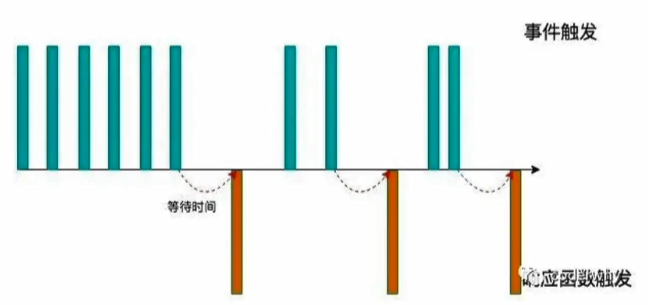
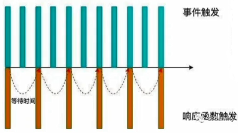

## 概述

防抖节流的概念其实最早不是出现在软件工程中，防抖是出现在电子元件中，而节流是出现在流体运动中的

JavaScript 是事件驱动的，大量的操作会触发事件，加入到事件队列中处理，而对于某些频繁的事件处理（如滚动）会造成性能的损耗，就可以通过防抖和节流来限制事件频繁的发生


## 防抖debounce

### 需求场景

在搜索框中输入想要搜索的内容时，在还没输入完成时，可能就发送了网络请求到服务器中，但这样的请求是不必要且耗费服务器性能的

正常的用法应该是等待用户输入完毕后等待一定时间，再发送网络请求

### 理解防抖

当事件触发时，相应的事件处理函数并不会立即触发，而是等待一段时间

当事件密集触发时，函数的触发会被频繁地推迟

只有等待了一段时间后也没有事件触发，才会真正执行相应的事件处理函数



### 使用场景

1. 输入框中频繁输入内容，搜索或提交信息
2. 频繁的点击按钮，触发某个事件
3. 监听浏览器滚动事件，完成某些特定操作
4. 用户缩放浏览器的resize事件

### 实现

可以使用`loadsh`中的版本，也可以自己简单实现

#### 基本实现

```js
function debounce(fn, delay) {
    let timer = null;
    return function() {
        if (timer) clearTimeout(timer);
        timer = setTimeout(function() {
            fn();
        }, delay);
    };
}
```

#### 优化版

支持参数和修正this的指向

```js
function debounce(fn, delay) {
    let timer = null;
    return function(...args) {
        if (timer) clearTimeout(timer);
        let _this = this;
        
        timer = setTimeout(function() { 
            fn.call(_this, ...args);
        }, delay);
    };
}

// 也可以考虑使用箭头函数

function debounce(fn, delay) {
    let timer = null;
    return function(...args) {
        if (timer) clearTimeout(timer);
        timer = setTimeout(() => { 
            fn.call(this, ...args);
        }, delay);
    };
}
```


## 节流throttle

### 需求场景

在射击类游戏中，按下鼠标左键会发射出一个子弹，如果按住鼠标左键不放，子弹也会保持一定的频率射出，而不会出现一条连续的直线

这就是节流操作，在一段时间内函数只会触发一次

### 理解节流

一段时间内，某个函数只会触发一次



### 使用场景

1. 监听页面的滚动事件
2. 鼠标移动事件
3. 用户频繁点击按钮操作
4. 游戏中的一些设计

### 实现

可以使用`loadsh`中的版本，也可以自己简单实现

```js
function throttle(fn, interval) {
    let lastTime = 0;
    return function(...args) {
        const _this = this;
        const newTime = new Date().getTime();
        
        if (newTime - lastTime > interval) {
            fn.call(_this, ...args);
            lastTime = newTime;
        }
    };
}
```

