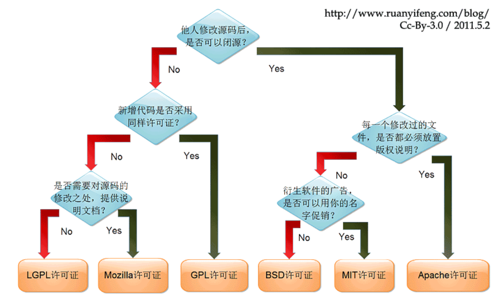

## 初识package.json

### package.json简介

 `Node.js` 中，一个项目就是一包，而包必须有一个描述文件，即 `package.json`

### 创建package.json

方式1：直接创建文件`package.json`

方式2：通过命令


## 必备属性

| 必备属性 | 说明       |
| -------- | ---------- |
| name     | 包的名称   |
| version  | 包的版本号 |

`name`与`version`共同构成了包的唯一标识

### name属性的限制

* 包名会成为定位包的`URL`，所以不能含有非法URL字符
* 如果包名称中存在一些符号，则符号去除后不得与现有包名重复
* 如果包名与现有的包名太相近导致你不能发布这个包，则可以创建组件，将发布到该组织下

### version

详细看npm的版本管理一节


## 可选属性

### 程序入口

| 程序入口字段 | 说明                     |
| ------------ | ------------------------ |
| main         | 用于指定程序的主入口文件 |

例子

```json
{
    "main": "./src/main.js"
}
```

### 脚本命令

| 脚本命令字段 | 说明                       |
| ------------ | -------------------------- |
| scripts      | 用于指定一些脚本命令的缩写 |

例子

```json
{
    "scripts": {
        "dev": "webpack --config webpack.config.dev.js",
        "build": "webpack --config webpack.config.prod.js"
    }
}
```

### 描述信息

| 描述信息字段 | 说明                                 |
| ------------ | ------------------------------------ |
| description  | 用于描述包的作用                     |
| keywords     | 用于给包添加关键字，方便其他用户搜索 |

例子

```json
{
    "description": "这是描述信息",
    "keywords": [
        "关键字1",
        "关键字2"
    ]
}
```

### 开发人员

| 开发人员字段 | 说明           |
| ------------ | -------------- |
| author       | 包的主要作者   |
| contributors | 包的其他贡献者 |

例子

```json
{
    "author": "foobar",
    "contributors": ["a", "b", "c"]
}
```

### 仓库地址

| 仓库地址字段 | 说明            |
| ------------ | --------------- |
| homepage     | 包的官方主页    |
| repository   | 包的仓库的主页  |
| bugs         | 用于提供bug信息 |

例子

```json
{
  "homepage": "http://example.com/",
  "repository": {
    "type": "git",
    "url": "https://github.com/example"
  },
  "bugs": {
    "url": "https://github.com/example/issues",
    "email": "example@email.com"
  },
}
```

### 依赖配置

| 依赖配置字段    | 说明         |
| --------------- | ------------ |
| dependencies    | 指定生产依赖 |
| devDependencies | 指定开发依赖 |

### 参数配置

| 参数配置字段 | 说明                                                         |
| ------------ | ------------------------------------------------------------ |
| config       | 用于配置脚本中使用的环境变量，可以在脚本中使用`process.env.npm_package_config_port`获取 |

例子

```json
{
    "config": {
        "port": "5000",
        "baseURL": "https://example.com"
    }
}
```

### 开源协议

| 开源协议字段 | 说明     |
| ------------ | -------- |
| license      | 指定协议 |

> 常见开源协议，图来自阮一峰先生的[博客](http://www.ruanyifeng.com/blog/2011/05/how_to_choose_free_software_licenses.html) 



