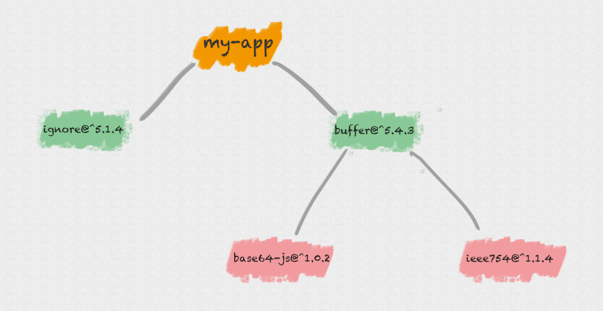
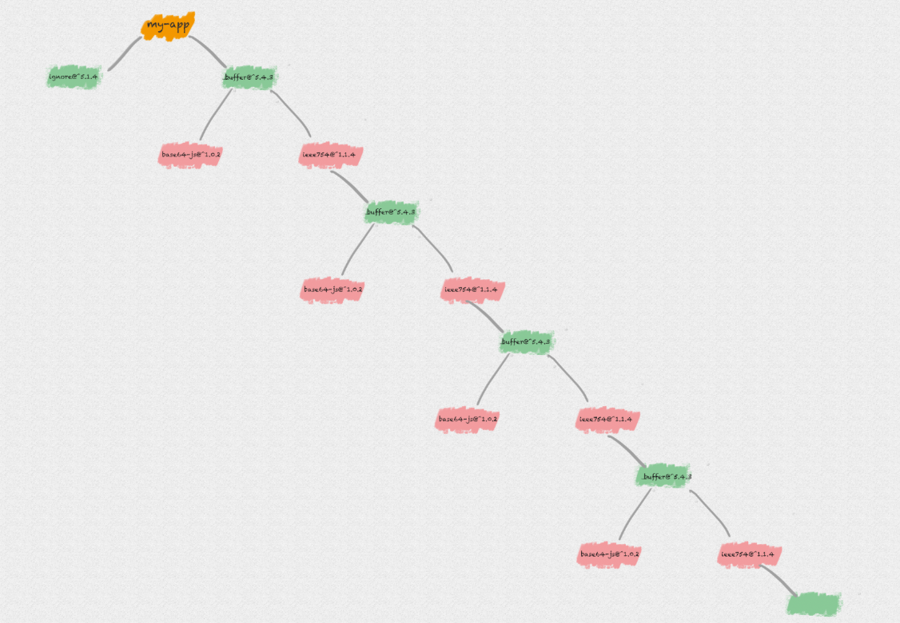
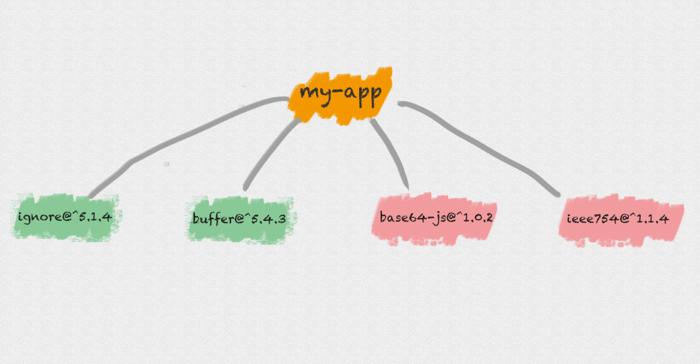
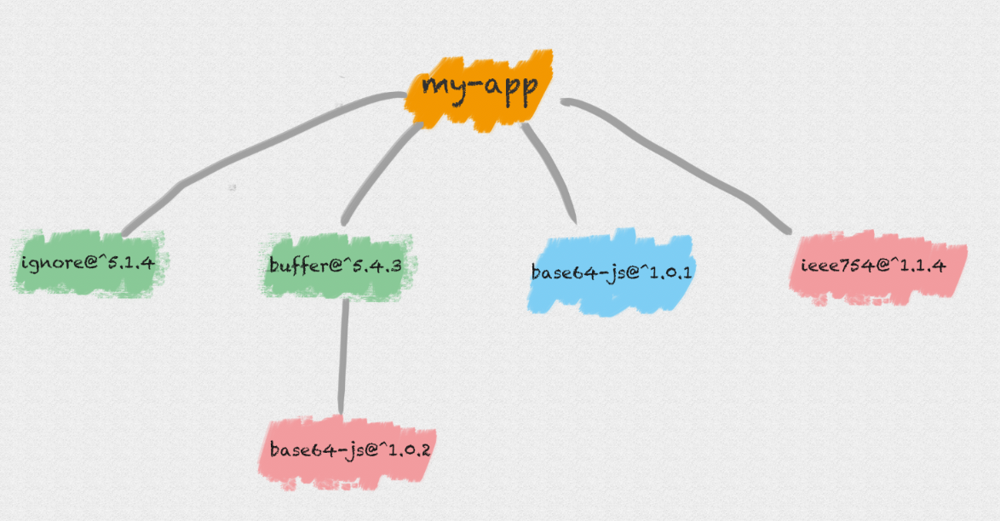
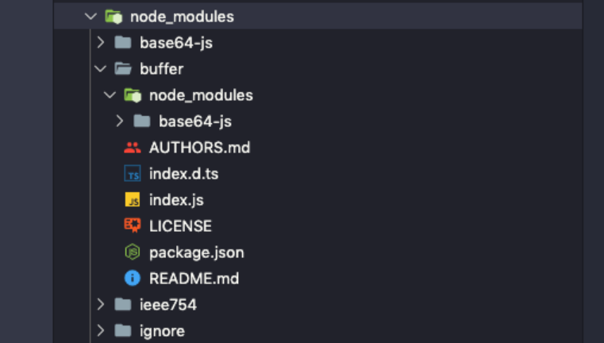
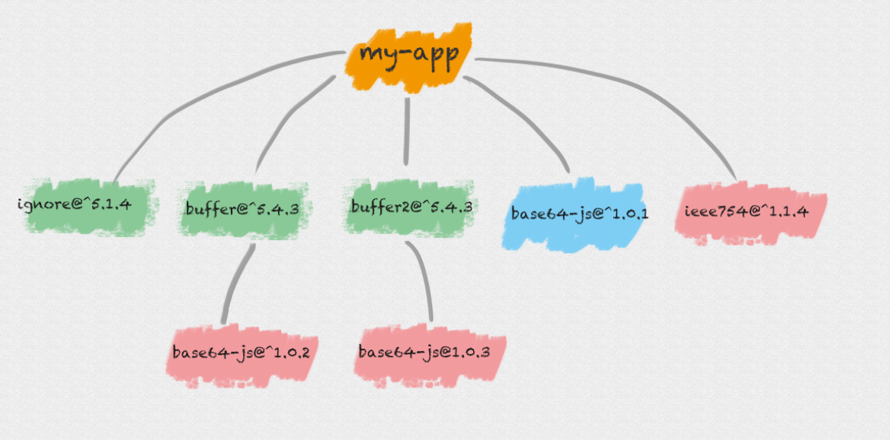
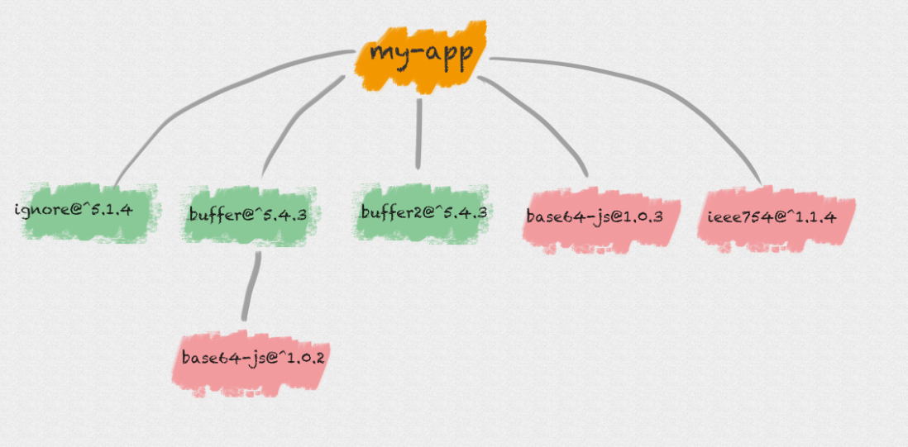
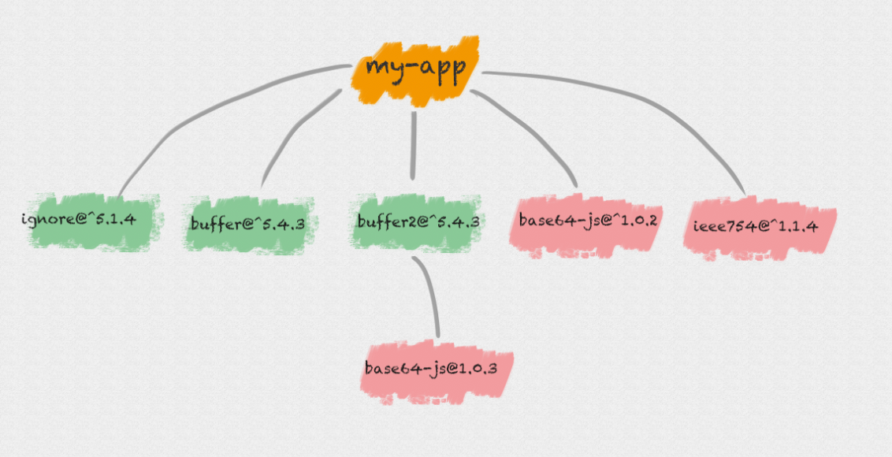
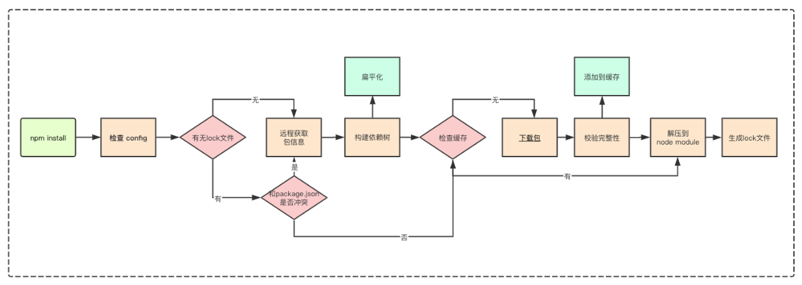

> 本文来自 ConardLi 的[博客](http://www.conardli.top/blog/article/%E5%89%8D%E7%AB%AF%E5%B7%A5%E7%A8%8B%E5%8C%96/%E5%89%8D%E7%AB%AF%E5%B7%A5%E7%A8%8B%E5%8C%96%EF%BC%88%E4%B8%89%EF%BC%89npminstall%E5%8E%9F%E7%90%86%E5%88%86%E6%9E%90.html#%E5%B5%8C%E5%A5%97%E7%BB%93%E6%9E%84)

## 嵌套结构

### 介绍

在 `npm` 的早期版本， `npm` 处理依赖的方式简单粗暴，以递归的形式，严格按照 `package.json` 结构以及子依赖包的 `package.json` 结构将依赖安装到他们各自的 `node_modules` 中，直到有子依赖包不在依赖其他模块

### 例子

假设模块 `my-app` 有两个依赖：`buffer` 和 `ignore`

```json
{
  "name": "my-app",
  "dependencies": {
    "buffer": "^5.4.3",
    "ignore": "^5.1.4",
  }
}
```

`ignore`是一个纯 `JS` 模块，不依赖任何其他模块，而 `buffer` 依赖了下面两个模块：`base64-js` 和`ieee754`

```json
{
  "name": "buffer",
  "dependencies": {
    "base64-js": "^1.0.2",
    "ieee754": "^1.1.4"
  }
}
```

那么，执行 `npm install` 后，得到的 `node_modules` 中模块目录结构就是下面这样的



### 优点

`node_modules` 的结构和 `package.json` 结构一一对应，层级结构明显，且保证了每次安装目录结构都是相同的

### 缺点

如果你依赖的模块非常之多，你的 `node_modules` 将非常庞大，嵌套层级非常之深



在不同层级的依赖中，可能引用了同一个模块，导致大量冗余

在 `Windows` 系统中，文件路径最大长度为260个字符，嵌套层级过深可能导致不可预知的问题

### 结论

**嵌套**的方案不可行


## 扁平结构

### 介绍

为了解决以上问题，`NPM` 在 `3.x` 版本做了一次较大更新。其将早期的嵌套结构改为扁平结构

安装模块时，不管其是直接依赖还是子依赖的依赖，优先将其安装在 `node_modules` 根目录

### 例子




此时我们若在模块中又依赖了 `base64-js@1.0.1` 版本

```json
{
  "name": "my-app",
  "dependencies": {
    "buffer": "^5.4.3",
    "ignore": "^5.1.4",
    "base64-js": "1.0.1",
  }
}
```

当安装到相同模块时，判断已安装的模块版本是否符合新模块的版本范围，如果符合则跳过，不符合则在当前模块的 `node_modules` 下安装该模块





对应的，如果我们在项目代码中引用了一个模块，模块查找流程如下

* 在当前模块路径下搜索
* 在当前模块 `node_modules` 路径下搜素
* 在上级模块的 `node_modules` 路径下搜索
* ......
* 直到搜索到全局路径中的 `node_modules`

### 问题

假设我们又依赖了一个包 `buffer2@^5.4.3`，而它依赖了包 `base64-js@1.0.3`，则此时的安装结构是下面这样的



所以 `npm 3.x` 版本并未完全解决老版本的模块冗余问题，甚至还会带来新的问题

试想一下，你的APP假设没有依赖 `base64-js@1.0.1` 版本，而你同时依赖了依赖不同 `base64-js` 版本的 `buffer` 和 `buffer2`

由于在执行 `npm install` 的时候，按照 `package.json` 里依赖的顺序依次解析，则 `buffer` 和 `buffer2` 在 `package.json` 的放置顺序则决定了 `node_modules` 的依赖结构：

* 先依赖`buffer2`：

  

* 先依赖`buffer`：

  

另外，为了让开发者在安全的前提下使用最新的依赖包，我们在 `package.json` 通常只会锁定大版本，这意味着在某些依赖包小版本更新后，同样可能造成依赖结构的改动，依赖结构的不确定性可能会给程序带来不可预知的问题


## Lock文件

### 简介

为了解决 `npm install` 的不确定性问题，在 `npm 5.x` 版本新增了 `package-lock.json` 文件，而安装方式还沿用了 `npm 3.x` 的扁平化的方式

`package-lock.json` 的作用是锁定依赖结构，即只要你目录下有 `package-lock.json` 文件，那么你每次执行 `npm install` 后生成的 `node_modules` 目录结构一定是完全相同的

### 例子

例如，我们有如下的依赖结构：

```json
{
  "name": "my-app",
  "dependencies": {
    "buffer": "^5.4.3",
    "ignore": "^5.1.4",
    "base64-js": "1.0.1",
  }
}
```

在执行 `npm install` 后生成的 `package-lock.json` 如下：

```json
{
  "name": "my-app",
  "version": "1.0.0",
  "dependencies": {
    "base64-js": {
      "version": "1.0.1",
      "resolved": "https://registry.npmjs.org/base64-js/-/base64-js-1.0.1.tgz",
      "integrity": "sha1-aSbRsZT7xze47tUTdW3i/Np+pAg="
    },
    "buffer": {
      "version": "5.4.3",
      "resolved": "https://registry.npmjs.org/buffer/-/buffer-5.4.3.tgz",
      "integrity": "sha512-zvj65TkFeIt3i6aj5bIvJDzjjQQGs4o/sNoezg1F1kYap9Nu2jcUdpwzRSJTHMMzG0H7bZkn4rNQpImhuxWX2A==",
      "requires": {
        "base64-js": "^1.0.2",
        "ieee754": "^1.1.4"
      },
      "dependencies": {
        "base64-js": {
          "version": "1.3.1",
          "resolved": "https://registry.npmjs.org/base64-js/-/base64-js-1.3.1.tgz",
          "integrity": "sha512-mLQ4i2QO1ytvGWFWmcngKO//JXAQueZvwEKtjgQFM4jIK0kU+ytMfplL8j+n5mspOfjHwoAg+9yhb7BwAHm36g=="
        }
      }
    },
    "ieee754": {
      "version": "1.1.13",
      "resolved": "https://registry.npmjs.org/ieee754/-/ieee754-1.1.13.tgz",
      "integrity": "sha512-4vf7I2LYV/HaWerSo3XmlMkp5eZ83i+/CDluXi/IGTs/O1sejBNhTtnxzmRZfvOUqj7lZjqHkeTvpgSFDlWZTg=="
    },
    "ignore": {
      "version": "5.1.4",
      "resolved": "https://registry.npmjs.org/ignore/-/ignore-5.1.4.tgz",
      "integrity": "sha512-MzbUSahkTW1u7JpKKjY7LCARd1fU5W2rLdxlM4kdkayuCwZImjkpluF9CM1aLewYJguPDqewLam18Y6AU69A8A=="
    }
  }
}
```

### 优点

`package-lock.json` 文件 和 `node_modules` 目录结构是一一对应的，即项目目录下存在 `package-lock.json` 可以让每次安装生成的依赖目录结构保持相同

`package-lock.json` 中已经缓存了每个包的具体版本和下载链接，不需要再去远程仓库进行查询，然后直接进入文件完整性校验环节，减少了大量网络请求

### 使用建议

#### 普通使用

开发系统应用时，建议把 `package-lock.json` 文件提交到代码版本仓库，从而保证所有团队开发者以及 `CI` 环节可以在执行 `npm install` 时安装的依赖版本都是一致的

#### 开发npm包

在开发一个 `npm`包 时，你的 `npm`包是需要被其他仓库依赖的

由于上面我们讲到的扁平安装机制，如果你锁定了依赖包版本，你的依赖包就不能和其他依赖包共享同一 `semver` 范围内的依赖包，这样会造成不必要的冗余，所以我们不应该把`package-lock.json` 文件发布出去

`npm` 默认也不会把 `package-lock.json` 文件发布出去。


## 缓存机制

### 介绍

在执行 `npm install` 或 `npm update`命令下载依赖后，除了将依赖包安装在`node_modules` 目录下外，还会在本地的缓存目录缓存一份

### 管理机制

| 命令             | 说明                                                         |
| ---------------- | ------------------------------------------------------------ |
| npm cache add    | 这个命令主要是 `npm` 内部使用，但是也可以用来手动给一个指定的 package 添加缓存 |
| npm cache clean  | 删除缓存目录下的所有数据，为了保证缓存数据的完整性，需要加上 `--force` 参数 |
| npm cache verify | 验证缓存数据的有效性和完整性，清理垃圾数据                   |

### 基于缓存的安装方式

| 安装方式         | 说明                                                         |
| ---------------- | ------------------------------------------------------------ |
| --prefer-offline | 优先使用缓存数据，如果没有匹配的缓存数据，则从远程仓库下载   |
| --prefer-online  | 优先使用网络数据，如果网络数据请求失败，再去请求缓存数据，这种模式可以及时获取最新的模块 |
| --offline        | 不请求网络，直接使用缓存数据，一旦缓存数据不存在，则安装失败 |


## 整体流程

