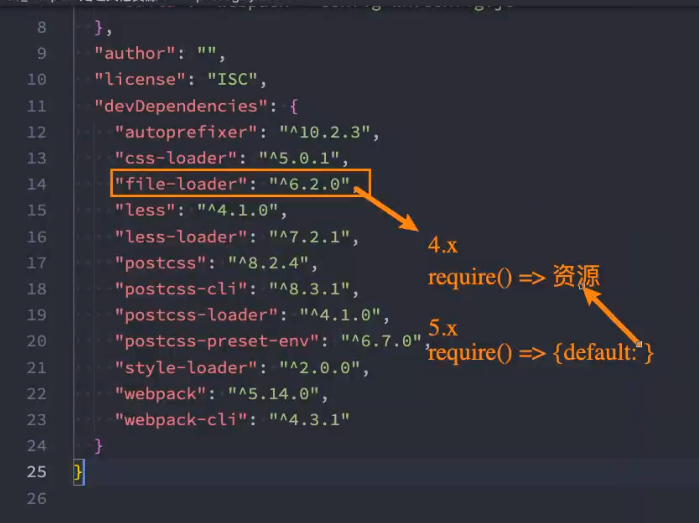
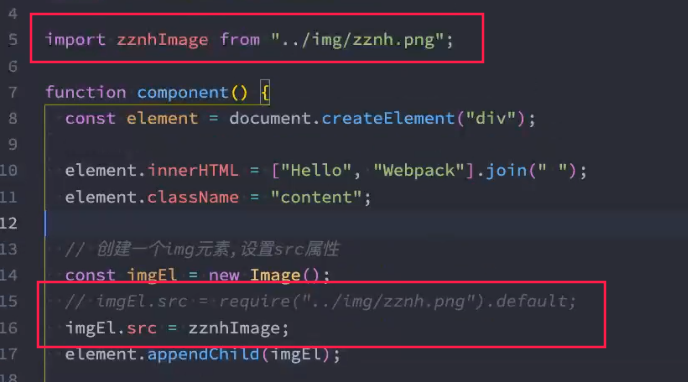

## 核心概念之Loaders

webpack开箱即用只支持js和json两种文件类型，通过Loaders去支持其他文件类型并且把它们转换为有效的模块，并且可以添加到依赖图中

Loaders本身一个函数，接收源文件作为参数，返回转换的结果

核心功能：将webpack不支持的文件类型，进行支持


## 常见Loaders

| 名称          | 功能                           |
| ------------- | ------------------------------ |
| babel-loader  | 转换ES6+新特性语法为es5        |
| css-loader    | 支持.css文件的加载和解析       |
| less-loader   | 将less文件转为css              |
| ts-loader     | 将ts转为js                     |
| file-loader   | 进行图片，字体，富媒体等的打包 |
| raw-loader    | 将文件以字符串的形式进行导入   |
| thread-loader | 多进程打包js和css              |


## Loaders用法

> test：指定匹配规则
>
> use：指定使用的loader名称
>
> exclude:  排除
>
> include：指定
>
> oneOnf：只会生效一个
>
> loader执行顺序：从后到前，从下到上

```js
const path = require("path");

module.exports = {
    output: {
        filename: "bundle.js"
    },
    module: {
        rules: [
            {
                test: /\.txt$/,
                use: 'raw-loader'
            }，
            {
            	oneOf: [ // 下面的loader只会执行其中一个
					{
            			test: "1"
            			loader: "loader1"
            		},
    				{
						test: "2",
    					loader: "loader2"
                    },
    				{
						test: "3",
    					loader: "loader3"
                    }
                ]
            }
        ]
    }
}
```


## 常见loader

| 常见loader   | 说明 |
| ------------ | ---- |
| css-loader   |      |
| style-loader |      |


### 内联loader

```js
import "css-loader!../css/index.css"
```

### CLI方式(webpack5 不支持)

### 配置方式：最常用，最方便管理


### 写法1：完整写法

```js
module.exports = {
    module: {
        rules: [
            {
                test: "",
                use: [
                    {
                        loader: "css-loader",
                    	options: {}
                    }
                ]
            }
        ]
    }
}
```

### 写法2：只写loader名，不配置

```js
module.exports = {
    module: {
        rules: [
            {
                test: "",
                use: [
                    "css-loader"
                ]
            }
        ]
    }
}
```

### 写法3

```js
module.exports = {
    module: {
        rules: [
            {
                test: "",
                loader: "css-loader"
            }
        ]
    }
}
```


 ### loader加载顺序：从后往前

```shell
npm install less -D

npx less ./src/css/component.less > component
```


## postcss

### 浏览器适配

autoprefiexer 

babel 

postcss-preset-env

eslint-plugin-compat

postcss-normalize

### 项目到底需要支持哪些浏览器

提供条件告诉工具到底需要适配哪些浏览器

### 浏览器占用率：

https://caniuse.com/usage-table

### browserslist（安装webpack时就会自动安装）

在不同的前端工具之间，共享目标浏览器和Nodejs版本的配置

```shell
npx browserslist ">1%, last 2 versions, not dead"
npx browserslist # 默认条件
```

### 编写方式1 package.json

会自动查询

```json
{
  "browserslist": [
      ">1%",
      "last 2 versions",
      "not dead"
  ]
}
```

### 编写方式2 .browserslistrc

```
">1%",
"last 2 versions",
"not dead"
```


## postcss

```shell
yarn add -D postcss postcss-cli autoprefixer
```

```shell
npx postcss -o result.css ./src/css/test.css
```

```shell
npx postcss --use autoprefixer -o result.css ./src/css/test.css
```

```js
module.exports = {
    module: {
        rules: [
            {
                test: /\.css$/,
                use: [
                    {
                    	loader: "postcss-loader",
                    	options: {
                        	postcssOptions: {
                                plugins: [
                                    require("autoprefixer")
                                ]
                            }
                    	}
                	}
                ]
            }
        ]
    }
}
```

```shell
npm install postcss-preset-env -D
```

```js
module.exports = {
    module: {
        rules: [
            {
                test: /\.css$/,
                use: [
                    {
                    	loader: "postcss-loader",
                    	options: {
                        	postcssOptions: {
                                plugins: [
                                    // require("autoprefixer"), 可以删掉，因为下面自带了
                                    require("postcss-preset-env"),
                                    // 写法2："postcss-preset-env"
                                ]
                            }
                    	}
                	}
                ]
            }
        ]
    }
}
```

#### 配置

```js
module.exports = {
    module: {
        rules: [
            {
                test: /\.css$/,
                use: [
                    "postcss-loader",
                ]
            }
        ]
    }
}
```

```js
// postcss.config.js

module.exports = {
    plugins: [
        require("postcss-preset-env")
    ]
}
```

### 注意事项

解决@import的问题

回马强：importLoaders：n ——再被之前的n个loaders处理

```js
{
    loader: "css-loader",
    options: {
        importLoaders: 1
    }
},
{
    test: /\.less$/
    use: [
        "style-loader",
        {
            loader: "css-loader",
            options: {
                importLoader: 2 // 再被 less-loader和postcss-loader处理
            }
        },
        "postcss-loader",
        "less-loader"
    ]
}
```


## 加载其他资源

### 加载图片

```js
const imgEl = new Image()
imgEl.src = require("../img/zznh.png")
element.appendChild(imgEl)
```

file-loader

```shell
npm install -D file-loader
```

```js
module.exports = {
    module: {
        rules: [
            {
                test: /\.(jpg|png|jpeg)$/,
                use: [
                    {
                        loader: "file-loader"
                    }
                ]
            }
        ]
    }
}
```





算法：md4算法，128长度bit，变为32个十六进制长度的hash值

```js
{
    loader: "file-loader",
    options: {
        name: "img/[name].[hash:6].[ext]",
        // outputPath: "img"
    }
}
```


### url-loader

特点：能够把小文件变为base64

减少HTTP请求

```shell
npm install url-loader
```

```js
{
    loader: "url-loader",
    options: {
        name: "",
        limit: 100 * 1024 // 单位 byte, 100Kb
    }
}
```

理论上：有了 url-loader就不需要使用 file-loader了，虽然url-loader是基于file-loader的