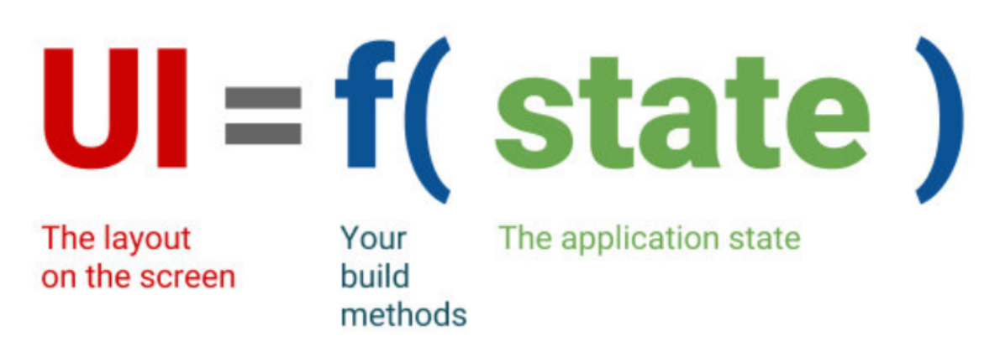
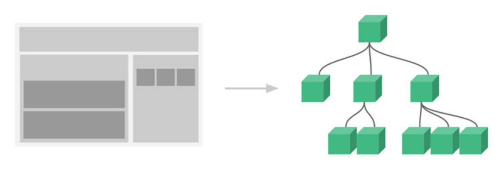

## 前端发展历史

| 发展历史                | 说明                                           |
| ----------------------- | ---------------------------------------------- |
| HTML + CSS              | 页面纯静态，以展示为主                         |
| HTML + CSS + JavaScript | 页面支持表单，以展示为主，提供简单交互         |
| Ajax 出现               | 页面无需刷新也可以获取服务器数据，交互效果提升 |
| jQuery 出现             | 操作 DOM 简单且兼容性强                        |
| Angular.js              | 前端开始支持 MVC 开发模式，开始支持前后端分离  |
| Angular + React + Vue   | 三大框架出现，前后端分离流行                   |

## React介绍

### React是什么

React 是 **2013** 年，Facebook 开源的 JavaScript 框架，用来构建用户界面的库

React是库，专注于处理视图层，并不是一个框架

### React出现背景

React出现是因为传统的开发方式存在下列问题

- 操作 DOM 兼容性的问题
- 过多兼容性代码的冗余问题
- 代码组织和规范的问题

总结：直接操作DOM太麻烦了！

### React 特点

#### 声明式编程

**虚拟DOM帮助我们从命令式编程转到了声明式编程的模式**

这种编程的方式赋予了React声明式的API：

* 你只需要告诉React希望让UI是什么状态；
* React来确保DOM和这些状态是匹配的；
* 你不需要直接进行DOM操作，只可以从手动更改DOM、属性操作、事件处理中解放出来；

多平台适配

* 2013 年：React 发布之初主要是开发 Web 页面
* 2015 年：Facebook 推出了 React Native，用于开发移动端跨平台
* 2017 年：Facebook 推出 React VR，用于开发虚拟现实 Web 应用程序

补充

* 你只需要告诉React希望让UI是什么状态；
* React来确保DOM和这些状态是匹配的；
* 你不需要直接进行DOM操作，只可以从手动更改DOM、属性操作、事件处理中解放出来；

声明式编程：面向数据编程，只需要维护自己的状态，当状态改变时，React可以根据最新的状态去渲染UI界面

Vue、React、Flutter、SwiftUI等等框架与库都采用声明式范式

总结：数据决定视图

#### 组件化开发

开发中会将复杂的界面拆分成一个个小的组件，然后通过组件组装为组件树，从而描述和渲染页面

#### 单向数据流

组件中的数据传递，只允许由父组件传递给子组件

单向数据流优点：让数据清晰，代码容易维护，如果每个子组件都能直接修改父组件的数据，那么维护和调试将很困难

#### 虚拟DOM

原生DOM的操作成本是很高的：资源占用多，速度慢

用 JavaScript 描述、存储并操作节点信息，从而提高性能，这称为虚拟DOM

#### JSX

JSX是一种JavaScript的语法扩展，特点是能在JavaScript代码中写html代码

### React 技术栈

React本身是一个库，而不是框架，如果想要获得全面的开发支持，需要使用React的周边生态，即技术栈

| 需求层面 | 方案                                                         |
| -------- | ------------------------------------------------------------ |
| 视图层   | react                                                        |
| 路由层   | react-router                                                 |
| 状态管理 | 方案1：redux + react-redux 方案2：mobx 方案3：react context |

## React开发环境

在使用React开发前，必须配置好React开发环境

### 依赖库

#### 三个依赖库

要想使用React，必须依赖下列三个库

| 依赖库    | 说明                                 |
| --------- | ------------------------------------ |
| react     | 包含 react 所必须的核心代码          |
| react-dom | react 渲染在不同平台所需要的核心代码 |
| babel     | 将 jsx 转换成 react 代码的工具       |

#### 感到繁琐？

1. 对于 Vue 来说，我们只是依赖一个 vue.js 文件即可，但是 React 居然要依赖三个库

2. React将依赖拆为三个库的原因是让每一个库只单纯做自己的事情，减少库之间的耦合度

3. 关于 react-dom

   在 react 的 0.14 版本之前是没有 react-dom 这个概念的，所有功能都包含在 react 里，那么为什么后来要进行拆分呢？

   原因就是为了兼容其他平台，如react-native
   
   react 包中包含了 react 和 react-native 所共同拥有的核心代码
   
4. 关于 babel

   理论上，并不是必须使用babel的，使用babel是为了处理 JSX，而理论上，react可以不用 JSX，单纯使用 `React.createElement`函数

   实际上，几乎不能只用`React.createElement`，所以实际上需要 JSX，所以实际上需要babel

#### react-dom

react-dom 针对 web 和 native 所完成的事情不同

- web 端：react-dom 会讲 jsx 最终渲染成真实的 DOM，挂载到HTML文件的dom节点上，从而显示视图在浏览器中
- native 端：react-dom 会讲 jsx 最终渲染成原生的控件，然后进行视图的渲染

#### Babel

Babel ，又名 Babel.js，是目前前端使用非常广泛的编译器、转移器，作用是能够对代码进行编译

比如有些浏览器并不支持 ES6 的语法，但我们想在开发时使用它，那么编写源码时我们就可以使用 ES6 来编写，之后通过 Babel 工具，将 ES6 转成大多数浏览器都支持的 ES5 的语法

#### React 和 Babel 关系

理论上 React 可以不使用 Babel，但是前提是我们自己使用 `React.createElement` 来编写源代码，它编写的代码非常的繁琐和可读性差

所以我们需要编写 JSX的语法，并且让 Babel 帮助我们转换成 `React.createElement` 语法

### 引入 React 依赖

#### 通过CDN 引入

| 库        | CDN地址                                                     |
| --------- | ----------------------------------------------------------- |
| react     | https://unpkg.com/react@16/umd/react.development.js         |
| react-dom | https://unpkg.com/react-dom@16/umd/react-dom.development.js |
| babel     | https://unpkg.com/babel-standalone@6/babel.min.js           |

#### 本地引入

可以从CDN中将依赖库下载到本地，然后使用本地引入

这种方式与CDN引入区别并不大

#### 脚手架引入

通过 npm，webpack 等工具引入，可以使用官方的 `create-react-app` 脚手架

具体使用方式在以后的文章中会说明