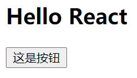

## JSX介绍

JSX是一种JavaScript的语法扩展，也在很多地方称之为JavaScript XML，因为看起就是一段XML语法

JSX特点是能够在JS代码中写HTML代码，从而方便描述UI界面

JSX不同于Vue中的模块语法，不需要专门学习模块语法中的一些指令（如v-for、v-if、v-else、v-bind等），只要会JavaScript和HTML就能写JSX

JSX转换后是一个函数调用(React.createElement)，本质是一个对象(ReactElement)


## JSX语法

### 基础规则

1. JSX的顶层**只能有一个根元素**，所以我们很多时候会在外层包裹一个div原生

2. JSX如果要多行书写，则需要在外层套入`()`

3. JSX中的标签可以是单标签，也可以是双标签

   如果是单标签，则必须闭合，即以`/>`结尾；

示例

```jsx
(<div>
  <h2>当前计数：</h2>
  <button>-1</button>
  <button>+1</button>
  
</div>)
```

### 注释

形式为`{/* */}`

```jsx
(
	<div>
        {/* 我是一段注释 */}
        <h2>Hello World</h2>    
	</div>
)
```

### 嵌入内容值

无论是标签属性还是标签内容，都是使用`{}`进行包裹，`{}`中写的是值，不能写语句

所以可以写：变量，运算表达式，三元表达式，函数调用（因为函数有返回值，返回值作为表达式）等等

现在来分析8大类型的显示情况：

| 类型                     | 说明                                |
| ------------------------ | ----------------------------------- |
| Number, String           | 正常显示，但如果值为NaN则会报错     |
| Boolean, Undefined, Null | 不能显示（忽略，为空）              |
| Symbol, BigInt           | 不显示，但也不报错                  |
| Array                    | 会将 Array 元素取出来进行显示       |
| PlainObject              | 报错                                |
| Function                 | 默认报错，但用于RenderProps时不报错 |

如果想要显示`NaN/true/false/null/undefined/Plain Object`内容，需要转为字符串

注意：在 JavaScript 中，0被认为是 `false` 值，但在 `JSX` 中，0是会被渲染出来的	

### 嵌入属性

一样都是使用`{}`

```jsx
return (
	<div>
    	<h2 title={this.state.title}>标题</h2>
    </div>
);
```

#### 注意两个特殊的属性值

for 改名为 htmlFor，因为for是关键字

class 改名为 className，因为 class 是关键字

#### 绑定className技巧

```jsx
return (
	<div>
    	<h2 className={"box title " + (active ? "active" : "")}>标题</h2>
    </div>
);
```

#### 绑定 style的技巧

多个单词连接时，不使用`-`，而是使用驼峰命名

```jsx
return (
	<div>
    	<h2 style={ {color: "red", fontSize: "50px"} }>标题</h2>
    </div>
);
```

### 绑定事件

#### 概念

React 事件的命名采用驼峰式，而不是纯小写

需要通过`{}`传入一个事件处理函数，这个函数会在事件发生时被执行

传入的表达式的值最终一定要是一个函数对象

#### 合成事件

React中的事件并不是浏览器原生事件，而React内部合成的事件

这是为了兼容多平台，React针对不同的平台进行不能的合成方式，从而实现跨端

#### this指向问题

react中的事件回调函数是由react内部触发执行的

即函数的调用者为react库内部的对象，而不是类对应的实例对象

所以要非常注意事件回调函数中的`this`指向问题

```js
// 假设事件回调函数为 fn
// 则 react 中调用 fn 的形式为
fn.apply(undefined);
```

#### 解决this指向问题

* 在赋值回调函数时，进行`bind`绑定

  缺点：bind会耗费一些性能且不方便传入参数

  ```js
  <button onClick={this.btnClick.bind(this)}>改变文本</button>
  ```

* 在构造函数中，进行`bind`绑定

  缺点：bind会耗费一些性能且不方便传入参数

  ```js
  constructor() {
      super();
      
      this.state = {
          message: "Hello World",
      };
      
      this.btnClick = this.btnClick.bind(this);
  }
  
  <button onClick={this.btnClick}>改变文本</button>
  ```

* 使用 ES6 class fields 语法 + 箭头函数

  虽然通过箭头函数解决了this问题，不需要bind的性能消耗，但这种写法比较丑：明明是函数，却用属性的写法

  这种写法也不方便传入参数

  ```jsx
  class App extends React.Component {
  	btnClick = () => {console.log(this)}
      
      render() {
          return <button onClick={this.btnClick}>改变文本</button>
      }
  }
  ```

* 在绑定时使用箭头函数（**推荐写法**）

  通过箭头函数的特性：在定义时进行this静态绑定，解决了this问题，且写法优雅，推荐

  ```js
  <button onClick={() => this.btnClick(参数, 参数, 参数)}>改变文本</button>
  ```

#### 事件获取参数

因为事件回调函数是React内部调用，所以React内部默认会传入event对象

注意：event不是浏览器原生事件对象，而是React内部合成的事件对象

#### 写法1

```jsx
render() {
    return (
    	<div>
            {/* 因为事件回调函数是React内部调用，所以React内部默认会传入event对象 */}
        	<button onClick={this.btnClick}></button>
        </div>
    );
    
    btnClick(event) {
        console.log(event);
    }
}
```

#### 写法2

```jsx
render() {
    return (
    	<div>
            {/* 因为事件回调函数是React内部调用，所以React内部默认会传入event对象 */}
        	<button onClick={(e) => this.btnClick(e)}></button>
        </div>
    );
    
    btnClick(event) {
        console.log(event);
    }
}
```


### 条件渲染

在vue中，我们会通过指令来控制：比如v-if、v-show

在React中，所有的条件判断都和普通的JavaScript代码一致

> 下面代码实现等价 v-if 的效果

#### 方式1：条件判断语句

适合逻辑代码多的时候，也可以抽取为函数

```jsx
render() {
    let welcome = null;
    if (this.state.isLogin) {
        welcome = <h2>欢迎回来</h2>
    } else {
        welcome = <h2>请先登录</h2>
    }
    
    return (
    	<div>
        	{welcome}
        </div>
    );
}
```

#### 方式2：三元运算符

适合逻辑简单时

```jsx
render() { 
    return (
    	<div>
        	{this.state.isLogin ? "欢迎回来" : "请先登录"}
        </div>
    );
}
```

#### 方法3：&&

利用&&表达式返回值的特点

```jsx
render() {
    return (
    	<h2>this.state.isLogin && "你好啊"</h2>
    );
}
```

#### 实现 v-show效果

```jsx
<h2 style={ {display: isLogin?"block":"none"} }></h2>
```

### 列表渲染

写数组即可，JSX会自动拆开数组

获取数组最实用的方式：使用 map 高阶函数，或者 filter

### 默认属性值

如果没给属性传值，那么它默认为 `true` ，下面两个 JSX 表达式是等价的

```jsx
<MyTextBox autocomplete />
// 等价于
<MyTextBox autocomplete={true} />
```

### 属性展开

如果已经有一个 object 类型的属性值对象，并且希望在 JSX 中传入，那么可以使用展开操作`...`，传入整个对象

这两个组件是等效的

```jsx
function App1() {
  return <Greeting firstName="Ben" lastName="Hector" />;
}

function App2() {
  const props = {firstName: 'Ben', lastName: 'Hector'};
  return <Greeting {...props} />;
}
```

### 渲染HTML字符串

React为了防止`XSS`攻击，默认情况下会转义渲染HTML字符串，在确保没有安全问题的前提想要渲染HTML字符串

定义 `__html` 对象，然后使用`dangerouslySetInnerHTML` 属性

```jsx
render() {
    const rawHTML = '<span>文本内容<i>斜体</i><b>加粗</b></span>';
    const rawHTMLData = {
        __html: rawHTML // 键名必须是 __html
    }
    
    return <div dangerouslySetInnerHTML={ rawHTMLData }></div>
}
```


## JSX本质

在React中，JSX 仅仅只是 `React.createElement(component, props, ...children)` 函数的语法糖

所有的JSX最终都会通过Babel被转换成`React.createElement`的函数调用，该函数的返回类型为`ReactElement`

**即`JSX`本质是就是一个`ReactElement`对象**

### createElement函数

```js
createElement(type, config, ...children);
```

#### 参数一：type

类型：String

含义：当前ReactElement的类型

说明：

* 如果是标签元素，那么就使用字符串表示，比如 `"div"`
* 如果是组件元素，那么就直接使用组件的名称，比如 `"Home"`

#### 参数二：config

类型：Plain Object

含义：用于描述标签的属性值

说明：所有JSX中的属性都在config中以对象的属性和值的形式存储

注意：这里的属性是JSX的属性，而不是原生的属性，即注意className，htmlFor，onClick等写法

#### 参数三：...children

类型：ReactElement

含义：嵌套的子ReactElement对象

说明：以Rest形式传入

### 示例

示例代码

```html
<html lang="en">
  <head>
    <meta charset="UTF-8" />
    <title>React体验</title>
    <script src="https://unpkg.com/react@16/umd/react.development.js"></script>
    <script src="https://unpkg.com/react-dom@16/umd/react-dom.development.js"></script>
    <script src="https://unpkg.com/babel-standalone@6/babel.min.js"></script>
  </head>
  <body>
    <div id="app"></div>
    <script type="text/babel">
      const element = React.createElement(
        "div",
        {
          className: "container",
          title: "这是一个div",
        },
        React.createElement(
          "h2", 
          null, 
          "Hello React"
        ),
        React.createElement(
          "button",
          {
            onClick: () => {
              console.log("button");
            },
          },
          "这是按钮"
        )
      );

      ReactDOM.render(element, document.getElementById("app"));
    </script>
  </body>
</html>

```

效果图



等价的JSX写法为

```html
<html lang="en">
  <head>
    <meta charset="UTF-8" />
    <title>React体验</title>
    <script src="https://unpkg.com/react@16/umd/react.development.js"></script>
    <script src="https://unpkg.com/react-dom@16/umd/react-dom.development.js"></script>
    <script src="https://unpkg.com/babel-standalone@6/babel.min.js"></script>
  </head>
  <body>
    <div id="app"></div>
    <script type="text/babel">
      ReactDOM.render(
        <div className="container" title="这是要给div">
          <h2>Hello React</h2>
          <button onClick={() => console.log("button")}>这是按钮</button>
        </div>,
        document.getElementById("app")
      );
    </script>
  </body>
</html>
```

### 总结

1. `JSX`是语法糖，最终会被babel转为一个`React.createElement`的函数调用

2. `JSX`本质是对应一个`ReactElement`对象

3. 如果想要渲染`ReactElement`对象，则必须调用`ReactDOM.render`方法

4. ReactDOM.render的准确参数为

   ```jsx
   ReactDOM.render(ReactElement对象,要挂载的dom节点)
   ```


## React本质工作原理

React本质工作原理是使用 `ReactDOM.render` 渲染视图到指定的DOM节点上

而想要使用 `ReactDOM.render` 则需要创建出 `ReactElement` 对象

而如果直接使用 `React.createElement` 函数来创建 `ReactElement` 对象，则几乎没有可写性和可读性

所以需要使用 `JSX` 语法和 `babel`