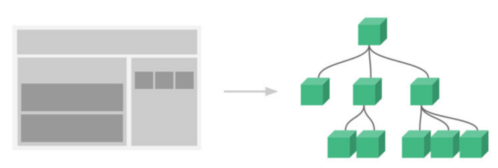

## 初识组件化

React设计哲学：`All in JS`

React认为渲染逻辑本质上与其他UI逻辑存在内在耦合，密不可分的

* 比如UI需要绑定事件
* 比如UI中需要展示数据状态，在某些状态发生改变时，又需要改变UI

所以React没有将UI和逻辑分离到不同的文件中，而是将它们组合到了一起，这个组成就称为组件



组件的意义

* 解耦：降低单一模块/组件的复杂度
* 复用：保证组件一致性，提高开发效率


## React组件分类

| 分类方式                 | 分类1      | 分类2      |
| ------------------------ | ---------- | ---------- |
| 按组件定义方式分类       | 函数组件   | 类组件     |
| 按是否有内部状态需要维护 | 无状态组件 | 有状态组件 |
| 按照组件的职责           | 展示型组件 | 容器型组件 |
| 按照操作表单的方式       | 受控组件   | 非受控组件 |
| 按照是否有异步操作       | 异步组件   | 同步组件   |
| 按照功能                 | 高阶组件   | 非高阶组件 |

这些概念有很多重叠，但是他们最主要是关注数据逻辑和UI展示的分离

* 函数组件、无状态组件、展示型组件主要关注UI的展示
* 类组件、有状态组件、容器型组件主要关注数据逻辑


## 组件名要求

无论是类组件还是函数式组件，组件都必须**以大写字母开头**

这是 `JSX` 语法的要求，只有**以大写字母开头**的标签，会被 babel 转为 **React.createElement**语法


## 组件属性 

### state

#### 定义

state是组件内完整且最小的状态集合

#### 初始化：有两种方式

1. state的初始化一般在constructor函数中进行

   ```js
   class extends Component {
       constructor(props) {
           super(props);
           this.state = {
               name: "react.js"
           }
       }
   }
   ```

2. 可以使用class field模式

   ```js
   class extends Component {
       this.state = {
           name: "react.js"
       }
   }
   ```

#### 更新

state的更新需要使用setState方法

React可以将连续发生的多个setState改变合并为一个setState，从而提升性能，这称为浅合并

setState是异步的，可以这样写实现在完成setState后再执行相应的操作

```js
this.setState({
  // setState 操作
}, () => {
  // console.log('setState异步执行完后，执行的回调函数')
});
```

判断是否该存在于state

* 是否通过父组件props传入
* 是否会随时间或交互改变
* 是否可以通过其他的state或props计算得到

### props

定义：props父组件传递的数据集合

初始化：props是类组件的constructor的第一个参数，或者函数式组件的第一个参数

### PropTypes

作用：对props对象的属性进行类型约束

安装：create-react-app脚手架自动集成

导入

```js
import PropTypes from "prop-types";
```

使用

propTypes: 类型约束，isRequired: 必须传入

```js
// 类型检查
组件.propTypes = {
  属性1: PropTypes.array.isRequired,
  属性2: PropTypes.func.isRequired,
  属性3: PropTypes.number.isRequired
}
```

defaultProps: 默认值

```jsx
// 默认参数
组件.defaultProps = {
  属性1: "default value"
}
```

### props.children

在 JSX 表达式中可以包含开放标签和闭合标签，标签中的内容会被传递一个特殊值 `props.children`

`props.children`视情况为字符串或数组

#### 内容为字符串

可以在开放标签和闭合标签中放入一个字符串，那么 `props.children` 就是那个字符串

```jsx
<MyComponent>Hello world!</MyComponent>
```

`MyComponent` 组件中的 `props.children` 类型为`string`，值为 `"Hello world!"`

JSX会删除每行开头和结尾的所有空格，并且也会删除空行，邻接标签的空行也会被移除，字符串之间的空格会被压缩成一个空格，因此下面的渲染效果都是相同的

```jsx
<div>Hello World</div>
// 等价于
<div>
  Hello World
</div>
// 等价于
<div>
  Hello
  World
</div>
// 等价于
<div>

  Hello World
</div>
```

#### 内容为一个元素/组件

可以提供一个元素/组件作为 children，此时组件中的`props.children`为这个元素/组件

```jsx
<App>
    <span>Hello</span>
</App>
```

```jsx
<App>
	<Main />
</App>
```

#### 内容为多个元素/组件

可以提供多个元素/组件作为 children，此时组件中的`props.children`为数组

```jsx
<App>
    Here is a list:
    <div>111</div>
    <div>222</div>
    <div>333</div>
    <div>444</div>
</App>
```


## render函数返回值

当 render 被调用时，它会检查 this.props 和 this.state 的变化并返回以下类型之一

| 类型                     | 渲染结果                                       |
| ------------------------ | ---------------------------------------------- |
| ReactElement / JSX       | 渲染为组件                                     |
| 数组或Fragments          | 使得 render 方法可以返回多个元素，渲染多个元素 |
| Portals                  | 可以渲染子节点到不同的 DOM 子树中              |
| 字符串或数值             | 渲染为文本节点                                 |
| boolean, null, undefined | 什么都不渲染                                   |

示例

```jsx
export default function App() {
    return (
    	[
            <div>Hello World</div>
            <div>Hello React</div>
        ]
    );
}
```
