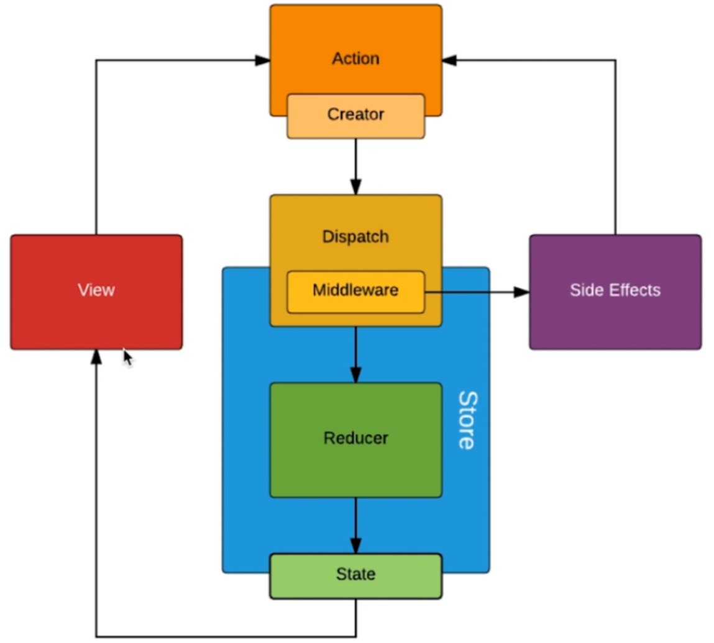

## Redux中间件

### 中间件概述

Redux中间件是一个函数，它的作用是增强`store`中的`dispatch`方法

### 示意图



### 使用中间件

因为中间件增强的是`store`的`dispatch`方法，所以必须在创建`store`时注入中间件

想要注入中间件，必须使用到一个`store enhancer`，为`applyMiddleware`

```js
import { createStore, applyMiddleware } from "redux";

const store = createStore(reducer, {}, applyMiddleware(中间件1, 中间件2, ..., 中间件n));
```

### 中间件结构

| 参数与返回值 | 说明                   |
| ------------ | ---------------------- |
| 参数1        | Redux的store           |
| 参数2        | 后一个`dispatch`方法   |
| 返回值       | 增强后的`dispatch`方法 |

所以理论上的中间件结构为

```js
function (store, next) {
    // store：Redux中的store
    // next：后一个dispatch方法
    return (action) => { // 返回增强后的dispatch方法
    	// 增强逻辑
        next(action); // 调用下一个dispatch方法
    }
}
```

但Redux要求中间件需要进行函数柯里化，所以实际中间件结构为

```js
function (store) {
    return function(next) { // 这一步是为了满足函数柯里化的要求
        return (action) => { // 返回增强后的dispatch方法
            // 增强逻辑
            next(action); // 调用下一个dispatch方法
    	}
    }
}
```

上述的写法过于繁杂，所以使用ES6的箭头函数进行简化

```js
const middleware = store => next => action => {
    // 增强逻辑
    next(action); // 调用下一个dispatch方法
}
```


## 中间件公式

```js
// 定义中间件
const middleware = (store) => (next) => (action) => {}

// redux内部调用
middleware(store)(next)(action)
```


## 中间件案例

### 案例1

#### 功能

在每次dispatch前记录日志

#### 实现

```js
const logger = store => next => action => {
    console.group(action.type);
    
    console.log("dispatching: ", action);
    
    const result = next(action);
    
    console.log("next: state: ", store.getState());
    
    console.groupEnd();
    
    return result;
}
```

#### 使用

```js
import { createStore, applyMiddleware } from "redux";

const store = createStore(reducer, {}, applyMiddleware(logger));
```

### 案例2

```js
// 自己修改 dispatch，增加 logger
let next = store.dispatch;

store.dispatch = function dispatchAndLog(action) {
    console.log("dispatching", action);
    next(action);
    console.log("next state", store.getState());
}
```

### 案例3

```js
import { Middleware } from "redux";

export const actionLog: Middleware = (store) => (next) => (action) => {
	console.log("state 当前", store.getState());
	console.log("fire action ", action);

	next(action);

	console.log("stat 更新", store.getState());
};
```

### 案例4

```tsx
import { Middleware } from "redux";

export const actionLog: Middleware = (store) => (next) => (action) => {
    console.log("state 当前: ", store.getState());
   	console.log("fire action: ", action);
    next(action);
    console.log("state 更新: ", store.getState());
}
```

