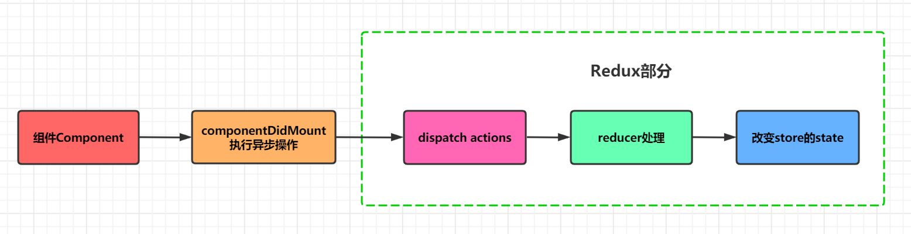
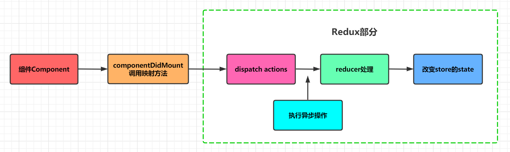

## 关于异步操作

### 概述

在React程序中，难免会进行例如网络请求的异步操作，一般地，我们会将异步操作放在`ComponentDidMount`中进行

### 普通写法



```jsx
componentDidMount() {
    axios({
        url: "https://example.com/test"
    }).then(res => {
        const data = res.data.data;
        console.log("轮播图: ", data.banner.list);
        console.log("推荐: ", data.recommend.list);
        
        this.props.changeBanners(data.banner.list);
        this.props.changeRecommends(data.recommend.list);
    })
}
```

### 普通写法缺陷

必须将网络请求的异步代码放到组件的生命周期中来完成

事实上，网络请求到的数据也属于状态管理的一部分，更好的一种方式应该是将其也交给redux来管理



### 问题：Redux中不能进行异步操作

1. 放在 `action_creators.js` 中？

   明显不行，因为这里都是action的工厂方法，只用来产生action

2. 放在 `action_types.js` 中?

   明显不行，这里连函数都没有，只用来定义和导出 type 常量字符串

3. 放在 `index.js` 中？

   明显不行，这里只用来定义初始state，并创建store

4. 放在 `reducer.js` 中？

   好像可以，因为这里有函数的执行，但有个关键性问题：reducer要求是**纯函数**，即reducer中肯定不能有异步操作（有副作用）

### 解决：使用Redux中间件

因为Redux中间件可以增强`store`中的`dispatch`方法，从而实现能够在`dispatch`中进行异步操作的功能


## redux-thunk

### 概念

redux-thunk是一个redux的中间件，作用是能够在redux中执行异步操作

### 实现原理

store的`dispatch`的参数`action`默认情况下只能是一个朴素JS对象（Plain Object），而使用redux-thunk中间件增强后，action不仅可以是朴素JS对象，还可以是函数

store在dispatch时，会判断action是否是函数，如果是函数，则会执行函数，所以可以在action函数中进行异步操作

### action函数签名

```js
function (dispatch, getState, extraArgument) {}
```

dispatch函数：用于在函数中再次派发action

getState函数：考虑到函数中的一些操作需要依赖原来的状态，用于让我们可以获取之前的状态

extraArgument：创建thunkMiddleware时传入的额外参数

### 使用示例

安装redux-thunk

```shell
yarn add redux-thunk
```

在创建store时应用redux-thunk中间件

```js
import { createStore, applyMiddleware } from "redux";
import thunk from "redux-thunk";

const store = createStore(rootReducer, applyMiddleware(thunk));
```

定义action函数

```js
function getData(dispatch, getState, extraArgument) {
    axios({
        method: "GET",
        url: "http://foo.com/data"
    }).then(res => {
        const data = res.data;
        dispatch(changeDataAction(data));
    });
}
```

dispatch action函数

```js
store.dispatch(getData);
```

### redux-thunk源码

```js
function createThunkMiddleware(extraArgument) {
  return ({ dispatch, getState }) => next => action => {
    if (typeof action === 'function') {
      return action(dispatch, getState, extraArgument);
    }

    return next(action);
  };
}

const thunk = createThunkMiddleware();

thunk.withExtraArgument = createThunkMiddleware;

export default thunk;
```


## redux-thunk执行网络请求的示例代码

### 1.定义action_type常量

```js
export const FETCH_RECOMMEND_PRODUCTS_START = "FETCH_RECOMMEND_PRODUCTS_START";

export const FETCH_RECOMMEND_PRODUCTS_SUCCESS = "FETCH_RECOMMEND_PRODUCTS_SUCCESS";

export const FETCH_RECOMMEND_PRODUCTS_FAIL = "FETCH_RECOMMEND_PRODUCTS_FAIL";
```

### 2.定义action_creator

```js
export const fetchRecommendProductStartActionCreator = () => {
    return {
        type: FETCH_RECOMMEND_PRODUCTS_START
    };
}

export const fetchRecommendProductSuccessActionCreator = (data) => {
    return {
        type: FETCH_RECOMMEND_PRODUCTS_SUCCESS,
        payload: data
    };
}

export const fetchRecommendProductFailActionCreator = (error) => {
    return {
        type: FETCH_RECOMMEND_PRODUCTS_FAIL,
        payload: error
    };
}
```

### 3.定义对应的reducer

```js
export default (state = defaultState, action) => {
    switch (action.type) {
        case FETCH_RECOMMEND_PRODUCTS_START:
            return { ...state, loading: true };
        case FETCH_RECOMMEND_PRODUCTS_SUCCESS:
            return { ...state, loading: false, productList: action.payload };
        case FETCH_RECOMMEND_PRODUCTS_FAIL:
            return { ...state, loading: false, error: action.payload };
        default:
            return state;
    }
}
```

### 4.综合的action_creator

```js
export const giveMeDataActionCreator = () => async (dispatch, getState) => {
	dispatch(fetchRecommendProductsStartActionCreator());
	try {
		const { data } = await axios.get("http://localhost:9999/productCollections");
		dispatch(fetchRecommendProductsSuccessActionCreator(data));
	} catch (error) {
		dispatch(fetchRecommendProductsFailActionCreator(error.message));
	}
};
```

### 5.实际使用

```js
function HomePage() {
    const dispatch = useDispatch();
    
    useEffect(() => {
        dispatch(giveMeDataActionCreator())
    }, [dispatch]);
}
```

