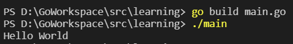

## 注释

### 行注释

```go
// 这是行注释
```

### 块注释

```go
/*
  这是块注释1
  这是块注释2
  这是块注释3
*/
```


## Go程序基础结构

> main.go

```go
// 每个go源文件都需要指定它所属的包名
// 如果包名是main，表示该文件含有main函数，编译后可以运行
// 如果包名不是main，表示该文件编译后不可直接运行，而是用作库
package main 

// 导入包
import "fmt" 

// 函数外只能是变量的声明和定义，不能是其他语句
var num int = 10
// fmt.Println(num) // error

// go程序入口函数
func main() { 
  fmt.Println("Hello World") // 在终端进行打印
}
```


## 编译

在编写好 `Go` 源文件后，需要进行编译

```shell
go build [源文件名]
```

运行可执行文件

```shell
./[源文件名]
```

