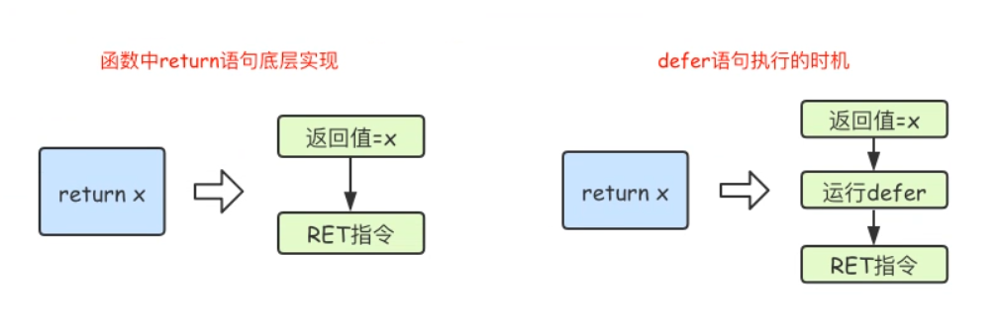

## 定义函数

```go
func 函数名 (形参列表) (返回值列表) {
  // code
}
```


## 函数参数

### 普通写法

```go
func foo(a int, b int, c int) {}
```

### 简化写法

```go
func foo(a, b, c int) {}
```

### 可变参数

可变参数需要使用 `...` 进行修饰

如果一个函数的形参列表中有可变参数，则可变参数需要放在形参列表最后

编译器会把可变参数封装为一个切片

```go
func sum (args ...int) (total int) {
  for _, val := range args {
    total += val
  }
  return
}

sum(1,2,3,4,5,6,7)
```

#### 注意事项

* 基本数据类型和数组默认是值传递的，即进行值拷贝，在函数内部修改，不会影响到原来的值
* 如果希望函数内部修改可以影响到外面，则需要使用指针
* `Go`中不存在默认参数


## 函数返回值

`Go` 语言可以返回多个值，如果返回不想接收，可以用 `_` 来省略

如果只返回一个值，则返回值列表可以不加`()`

### 不指定返回值名称

```go
func add(a int, b int) int {
    result = a + b
    return result
}

func foo(a int, b int) (int, string) {
    result = a + b
    return result, "golang"
}
```

### 指定返回值名称

```go
func add(a int, b int) (result int) {
  result = a + b
  return
}
```

### 返回值列表不能同时存在指定名称和不指定名称

```go
func f() (a int, err error) //ok，同时指定名称
func f() (int, error) // ok，同时不指定名称
func f() (a int, error) // error，不能同时存在指定名称和不指定名称
func f() (int, err error) // error，不能同时存在指定名称和不指定名称
```


## 高阶函数

`Go` 函数本身也是一种数据类型，可以将函数作为参数传递，也可以起别名

参数或返回值中有其他的函数类型的函数称为高阶函数

```go
// 给函数类型起别名
type myf func(int,int) int

// 将函数作为参数传递
func getSum(n1 int,n2 int) int {
  return n1 + n2
}

// myFunc是高阶函数
func myFunc(fn func(int,int) int, num int, num2 int) int {
  return fn(num1, num2)
}
```


## 匿名函数

因为函数内部无法再定义函数，所以出现了匿名函数

### 定义方式

```go
func (形参列表) (返回值列表) {
  // code
}
```

### 匿名函数分类

立即执行函数，可调用多次的匿名函数，全局匿名函数

### 立即执行函数

```go
func (n1 int, n2 int) {
  sum := n1 + n2
  fmt.Println(sum)
}(1,2) // 3
```

### 可调用多次的匿名函数

```go
foo := func (n1 int, n2 int) int {
  return n1 + n2
}

foo(1,2)
foo(3,4)
foo(5,6)
```

### 全局匿名函数

```go
var (
  gFoo = func(n1 int, n2 int) int {
    return n1 + n2
  }
)
```


## 内置函数

| 内置函数 | 作用                                                         |
| -------- | ------------------------------------------------------------ |
| len      | 用来求长度，string，array，slice，map，channel               |
| cap      | 用来求容量，array，slice，channel，注意：不能用于 map        |
| append   | 用于往切片中添加元素                                         |
| new      | 用于分配参数类型的内存空间，并把分配的内存置为零，然后返回指向该空间的指针 |
| make     | 只用于slice，map，channel的初始化，返回的不是指针类型，而是slice/map/channel类型 |
| panic    | 引出异常                                                     |
| recover  | 用在defer语句中，用于获取panic中的信息，从而进行异常处理，使程序恢复正常状态 |
| close    | 主要用于关闭channel                                          |
| println  | 打印函数，不是必须使用 fmt 包                                |

### new函数

```go
func new(Type) *Type
```
* 参数：任意的类型

* 返回值：参数类型的指针

* 作用：用于分配参数类型的内存空间，并把分配的内存置为零，然后返回指向该空间的指针

```go
// 错误的代码：
// 因为a的值是nil
var a *int
*a = 100
fmt.Println(*a)

// 正确的代码：
var a *int
a = new(int)
*a = 100
fmt.Println(*a)
```

### make函数

```go
func make(map|slice|chan, length, capacity) map|slice|chan
```

* 参数

  | 参数             | 说明     | 参数要求                                         |
  | ---------------- | -------- | ------------------------------------------------ |
  | map\|slice\|chan | 生成类型 | 必须                                             |
  | length           | 长度     | 如果是slice，则必须<br />如果是map或chan，则可选 |
  | capacity         | 容量     | 如果是slice则可选<br />如果是map或chan，则不能选 |

  ```go
  s := make([]int) // error
  s := make([]int, 10) // ok
  s := make([]int, 10, 20) //ok
  
  m := make(map[string]int) // ok
  m := make(map[string]int, 10) // ok
  m := make(map[string]int, 10, 20) // error
  
  ch := make(chan int) // ok
  ch := make(chan int, 10) // ok
  ch := make(chan int, 10, 20) // error
  ```

  

* 返回值：map|slice|chan

* 作用：`make`只用于`slice`，`map`和`chan`的内存创建，且`make`返回是这三个类型本身，而不是它们的指针类型，这是因为这三种类型都是引用类型，所以就没有必要再返回它们的指针了

* 注意：`make`函数无法进行替代，在使用`slice`，`map`和`chan`时，都必须用它来进行初始化操作，否则`map`和`chan`都无法使用

### new和make区别

* new：只用于申请内存，并会将内存进行清零，但不会初始化，返回的是指针类型

* make：也用于申请内存，但只用于map|slilce|chan的初始化操作，返回的是map|slice|chan


## init函数

### 特点

名字固定，无形参，无返回值

### 注意事项

每一个 `Go `源文件中都可以包含这样的一个函数，该函数在 `main` 函数执行前，会先被调用，可以用作初始化操作

如果一个包引入了别的包，则会先执行被引用包的 `init` 函数，再执行本包的 `init` 函数

### 初始化顺序总结

```go
main包 ==> import包 ==> 全局常量 ==> 全局变量 ==> init函数 ==> main函数
```


## main函数

`main`函数不能有参数，不能有返回值

`main`只有在`main`包中才能作为程序的入口

`main`函数中如果想获取命令行参数，则需要配合`flag`包或者`os.Args`


## defer

### 作用

`defer` 是函数中的延时执行机制，当函数将要结束时 `defer` 语句才调用

### 使用场景

`defer` 语句一般用于释放资源，比如文件关闭，资源清理，解锁以及记录时间等等

### 特点

多个 `defer` 语句会放到一个栈中，最先声明的`defer`语句会在最后执行

遇到`defer`语句时，会**计算**`defer`函数中参数的值，并将参数的值**进行拷贝**

`defer`不管是否发生异常，即使发生异常，`defer`语句也会执行

### defer执行时机

`Go`中，`return`语句并不是原子操作，而是会拆分为两步：

* 将`return`语句中的值赋值给**命名返回值变量**（如无，则创建**临时变量**，并赋值给该**临时变量**）

* 返回**命名返回值变量**（或**临时变量**）

示例伪代码

  ```go
return x
// 实际执行过程如下
temp := x
return temp
  ```

`defer`语句的执行时机就在`return`语句的两步之间

* 将`return`语句中的值赋值给**命名返回值变量**（如无，则创建**临时变量**，并赋值给该**临时变量**）
* defer语句
* 返回**命名返回值变量**（或**临时变量**）



示例伪代码

```go
return x
// 实际执行过程如下
temp := x
[defer语句]
return temp
```

经典练习题：

```go
func f1() int {
  x := 5
  defer func() {
    x++
  }()
  return x
}

func f2() (x int) {
  defer func() {
    x++
  }()
  return 5
}

func f3() (y int) {
  x := 5
  defer func() {
    x++
  }()
  return x
}

func f4() (x int) {
  defer func(x int) {
    x++
  }(x)
  return 5
}

func f5() (x int) {
  defer func(x *int) {
    (*x)++
  }(&x)
  return 5
}

func main() {
  fmt.Println(f1()) // 5
  fmt.Println(f2()) // 6
  fmt.Println(f3()) // 5
  fmt.Println(f4()) // 5
  fmt.Println(f5()) // 6
}
```

经典练习题：

```go
func calc(index string, a int, b int) int {
  ret := a + b
  fmt.Println(index, a, b, ret)
  return ret
}

func main() {
  a := 1
  b := 2
  defer calc("1", a, calc("10", a, b))
  a = 0
  defer calc("2", a, calc("20", a, b))
  b = 1
}

// 输出结果？

// 10 1 2 3
// 20 0 2 2
// 2 0 2 2
// 1 1 3 4
```


## 闭包

`Go` 语言支持闭包

### 本质

闭包本质就是 `一个函数` + `该函数所保存的作用域的变量`

### 例子

```go
// 实现一个累加器
func adder(initNumber int) func(int) int {
  return func(num int) int { // 匿名函数
    initNumber += num // 该匿名函数保存了作用域元素x
    return initNumber
  }
}

func main() {
  myAdder := adder(1) // 获得累加器，累加器中的初始值为1
  fmt.Println(myAdder(10)) // 累加器中的值为11
  fmt.Println(myAdder(50)) // 累加器中的值为61
  fmt.Println(myAdder(100)) // 累加器中的值为161
}
```


## 函数注意事项

`Go` 不支持函数重载，不支持函数嵌套定义，不支持默认参数，不支持命名参数