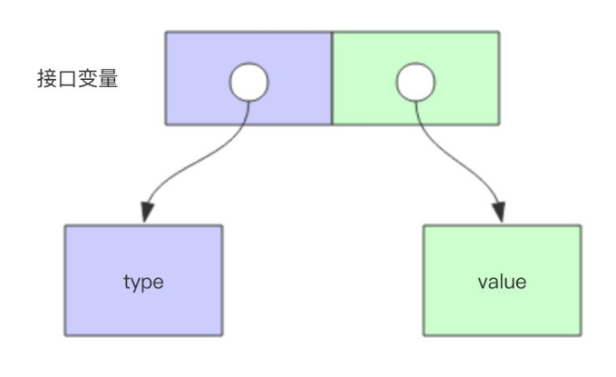
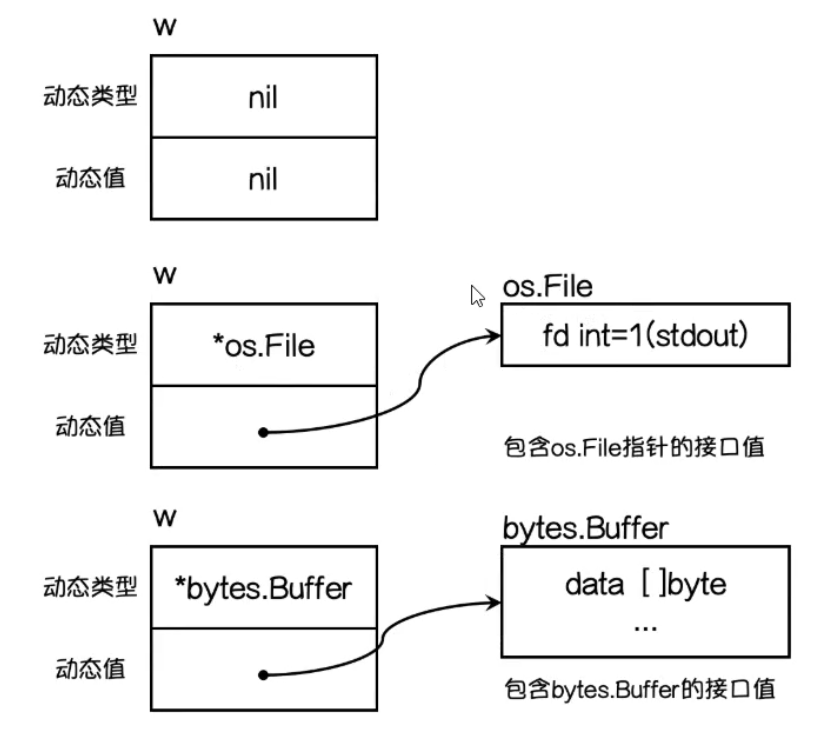

## 接口是什么

接口是一种类型，其用于定义规范


## 接口定义

```go
type 接口名 interface {
  方法名1(参数列表) (返回值列表)
  方法名2(参数列表) (返回值列表)
  ...
  方法名n(参数列表) (返回值列表)
  其他接口名1
  其他接口名2
  ...
  其他接口名n
}
```


## 实现接口

接口是隐式实现的，一个类型只要实现了接口的所有方法，则该类型实现了该接口，并不需要显式说明


## 接口嵌套

接口中除了可以定义方法签名外，还可以嵌套别的接口

```go
type mover interface {
  move()
}

type eater interface {
  eat()
}
 
type animal interface {
  mover
  eater
}
```


## 空接口

`Go`存在空接口，空接口没必要起名，一般使用下列的格式

```go
interface{}
```

特点：所有类型都实现了空接口，即`interface{}`类型变量能够接收任何其他类型的值

类比：空接口作用类似于`JAVA`中的`Object`类型


## 接口类型底层存储结构

接口类型分为两部分：Type(动态类型) 指针和 Value(动态值)指针，这样就能够让接口变量存储不同的值






## 接收者和接口关系

| 关系                   | 说明                                           |
| ---------------------- | ---------------------------------------------- |
| 使用值接收者实现接口   | 接口类型既能存结构体类型和也能存结构体指针类型 |
| 使用指针接收者实现接口 | 接口类型只能存结构体指针                       |


## 接口和类型的关系

一个类型可以实现多个接口

一个接口可以被多个类型实现