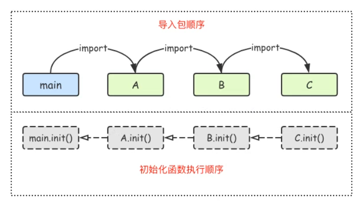

## 包的概述、作用

### 概述

`Go` 中每一个文件都属于一个包

### 作用

声明某个`go`文件是某个包，区分相同名字的文件或标识符

对函数以及变量进行管理，控制函数，变量的作用域


## 包的命名规范

包的名字规范是全小写且不用 `_` 进行分隔，比如

```go
package httpserver
package databasemodel
```


## 声明包

在`go`源文件第一行进行定义

```go
package 包名 // 源文件第一行
```


## 包的导入

传统包依赖管理：包名是从 `$GOPATH/src/` 之后开始计算的，使用`/`进行分隔，包名需要用`""`进行包裹

```go
// 单个导入
import "fmt"
import "strconv"

// 批量导入
import (
  "fmt"
  "net/http"
  "os/ioutil"
)
```

导入包时，可以给包起别名，从而避免冲突

* 如果别名是 `_` 则说明只执行该包的`init`函数，而不导入该包内容
* 如果别名是 `.` 则说明将要导入的包的导出内容混入到当前文件中

```go
// 如果包太长，可以给包改名，也可以避免重名的问题
import util "os/ioutil"
// 只执行 mysql 包的 init 函数，而不导入 mysql 包
import _ "mysql"
// 将 fmt 包中的导出内容混入到当前文件中
import . "fmt"

func main() {
  Println("fmt包的导出内容混入到当前文件中了")
}
```

导入包可以写绝对路径和相对路径

* 绝对路径：从 `$GOPATH/src` 目录起，写绝对路径
* 相对路径：以当前文件为基准点

```go
import (
  "myProject/db" // 绝对路径导入
  "../mylog"     // 相对路径导入
)
```


## 包的搜索路径

传统包依赖管理：`标准库($GOROOT/src)` ==> `$GOPATH/src`


## 包的init函数

一个包一旦被导入，就会自动执行这个包中的 `init` 函数，`init`函数只能由`Go`来调用，程序员无法主动调用

一个包中可以有多个 `init` 函数，但最好只有一个

包的`init`函数只会执行一次，哪怕它被多处导入，也只会执行一次





## 包的注意事项

不能将多个包放在同一目录下，也不能将一个包拆分到多个目录下，总结：一个包唯一对应一个目录

目录名，文件名，包名三者不需要相同，三者名称不同也符合规定

如果导入了包而不使用则会编译错误，如果只想执行包中的 `init` 函数而不想使用，则可以用 `_`

```go
import _ "mysql"
```

如果想要定义一个 `Go` 文件是可执行文件，则需要将这个文件所属包声明为 `main`

`main`包中不同的文件的代码不能互相调用，即`main `包最好只有一个文件


## 导出与未导出

### 导出与未导出的含义

如果一个标识符（类型，方法，函数等）是导出的，则在其他包中可以使用该标识符

如果一个标识符（类型，方法，函数等）是未导出的，则在其他包中不可以使用该标识符

### 使用首字母大写决定是否导出

如果一个标识符（类型，方法，函数等）名字的首字母是大写字母，则它是导出的，否则它是未导出的

### 使用未导出标识符的方法

使用未导出标识符的方法是：

* 定义一个导出的方法，在里面使用该未导出的标识符，然后通过使用这个导出的方法来间接使用该未导出的标识符

* 短变量声明操作符，有能力捕获引用的类型，并创建一个未公开的类型的变量，永远不能显式创建一个未公开的类型的变量，但短声明操作符能够这么做