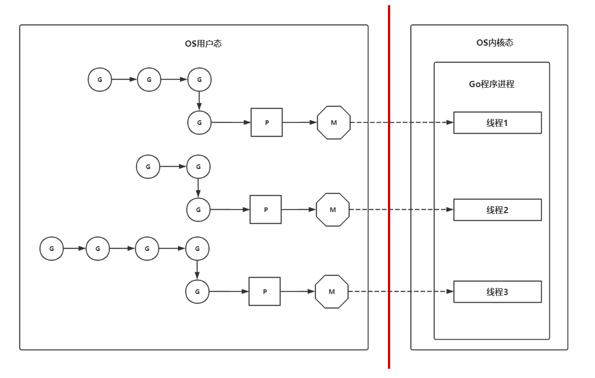

> 本篇文章仅涉及goroutine和channel，Go并发还有sync和atomic两个重要的包，请到对应文章查看


## goroutine

### 概述

`goroutine`一般称为`协程`，功能类似操作系统的线程，属于`OS`中的`用户级线程`

### 特点

#### goroutine性能高

因为`goroutine`是用户级别的线程，所以对`goroutine`的操作（创建，切换，销毁等）属于用户态的操作，不涉及用户态与内核态转换的过程，所以 `goroutine` 性能高

#### 能够同时创建很多个goroutine

因为 `goroutine` 是 `runtime` 在用户态层面创建的线程，且它的默认占用大小为`2KB`，而`OS`的线程默认占用大小大概为`2MB`，所以不同于其他的语言，`Go` 能同时创建很多个 `goroutine`

### 使用

创建一个 `goroutine` 非常简单，只要使用关键字`go` 后跟要执行的函数（任务）即可

一个 `goroutine` 必定对应一个函数

```go
package main

import (
  "fmt"
  "time"
)

func job() {
  fmt.Println("这是一个新的goroutine")
}

func main() {
  go job() // 启动一个新的 goroutine 去执行函数(任务) job
  time.Sleep(time.Second) // 之后会解释为什么需要睡眠
  fmt.Println("完成")
}
```

#### 使用匿名函数

一个`goroutine`对应一个函数，而该函数可以是`匿名函数`

```go
package main

import (
  "fmt"
  "time"
)

func main() {
  // 启动一个新的 goroutine 去执行匿名函数(任务)
  go func() {
    fmt.Println("匿名函数：这是一个新的goroutine")
  }()
  
  time.Sleep(time.Second) // 之后会解释为什么需要睡眠
  fmt.Println("完成")
}
```

### main goroutine

把示例代码中的`time.Sleep`去除后执行

```go
package main

import (
  "fmt"
  "time"
)

func main() {
  // 启动一个新的 goroutine 去执行匿名函数(任务)
  go func() {
    fmt.Println("匿名函数：这是一个新的goroutine")
  }()
  
  // time.Sleep(time.Second) // 这里去除了time.Sleep
  fmt.Println("完成")
}
```

执行后输出为

```go
完成
```

#### 问题

为什么`"匿名函数：这是一个新的goroutine"`这段话不会被打印？

#### 解释

这是因为`main`函数本身处于一个`goroutine`中，该`goroutine`称为`main goroutine`，程序在执行`main`函数时，`Go`的`runtime`会创建`main goroutine`，让`main`函数执行在这个`main goroutine`中

而`main goroutine`有一个很重要特点：**当`main goroutine`结束时，其他的`goroutine`会被销毁**

也就是说语句`fmt.Println("匿名函数：这是一个新的goroutine")` 还没执行时，`main goroutine` 就已经结束，该语句所属的`goroutine`也被销毁了，所以就不会进行打印了

#### 原理

这是因为`goroutine`是用户态的线程，它们的资源归属于程序进程的，所以当`main goroutine`结束时，程序的进程会被销毁，`OS` 会回收该程序的所有资源，所以其他的`goroutine` 也会被销毁

#### 协程同步

为了避免`main goroutine`结束导致其他`goroutine`还没执行完的问题，需要进行协程的同步

* 方法1：使用睡眠（**很不可行的方法**）

  可以让协程进行睡眠，从而达到协程同步的问题

  但这种方案有个很大的弊端就是无法确定需要睡眠多长时间，而且在睡眠时该goroutine无法执行任何操作，效率太低

* 方法2：使用`sync.WaitGroup`（**推荐方法**）

  详细见 `sync` 包用法的文章

* 方法3：使用`select多路复用语句`

  详细见下文`channel`中的内容

### FAQ

#### 什么是 goroutine 的泄露？

`goroutine`的泄露指的是：`goroutine`一直阻塞占着系统资源却不执行任务，且因为它占用着资源，所以它不会被`GC`回收

可能发生 `goroutine` 泄露的场景

* 向没有接收者的`channel`写入信息
* 从没有发送者的`channel`中读取信息
* 向 `nil channel` 发送和接收数据

#### goroutine什么时候结束？

当 `goroutine` 封装的函数（任务）执行结束了，该 `goroutine` 就结束了

### GMP调度模型

`goroutine` 是用户态的线程，它是由 `Go` 的 `runtime` 来完成调度，而不是由 `OS` 进行调度

`goroutine` 的调度模型称为 `GMP` 调度模型

#### G

含义：`G` 取的是 `goroutine` 的首字母，代表一个任务

功能：`G` 它是对`goroutine`的抽象，是`goroutine`的控制结构，包含了`goroutine`的各种信息，比如下列信息

* `goroutine`的任务对象
* 执行的函数指令和参数
* 协程切换时的上下文信息
* 用于现场保护和现场恢复的寄存器的信息

#### M

含义：`M` 取的是 `Machine` 的首字母，代表一个虚拟线程

功能：`M` 是`Go` 的 `runtime` 对`OS`线程的虚拟

特点：`M` 与内核线程一般是`一一映射`的关系， 每次创建一个`M`的时候，都会有一个底层线程创建，一个 `groutine` 最终是要放到 `M` 上执行的

#### P

含义：`P` 取的是 `Processer` 的首字母，代表一个虚拟处理器

功能：`P` 用于调度 `G` 在 `M` 上的运行

特点：每个 `P`  都管理着一组本地 `G` 队列和全局 `G` 队列，`P` 会对本地`goroutine` 队列进行调度（比如把占用CPU时间较长的`goroutine`暂停，运行后续`goroutine`等等），当自己的队列消费完成后就回去全局队列中取，如果全局队列里也消费完，则会去其他的 `P` 中抢任务执行

设置：`P` 的个数可以通过 `runtime.GOMAXPROCS` 设定的，最大值为 `256`，`Go1.5`版本之后默认为CPU核心数

```go
package main

import "runtime"

func main() {
  runtime.GOMAXPROCS(4) // 设置 P 的个数为 4
  runtime.GOMAXPROCS(runtime.NumCPU()) // 设置 P 的个数为 CPU 核心数
}
```

#### P和M的关系

`P` 和 `M` 也是一一对应的，关系是：`P` 管理着一组 `G` 挂载在 `M` 上运行



#### m:n调度技术

`GMP`调度器使用了名为`m:n`的调度技术，即调度`m`个`goroutine`到`n`个`OS`线程（`m >= n`）

`goroutine` 和 `OS` 线程是多对多关系

#### G阻塞时的操作

当一个 `G` 长时间阻塞在一个 `M` 上时，`runtime` 会新建一个 `M`，阻塞 `G` 所在的 `P` 会把其他的 `G` 挂载在新建的 `M` 上，当原来的 `G` 阻塞完成或认为其已经死亡时，`runtime`会回收旧的`M`


## channel

### 概述

`Go`中秉承的`CSP`并发模型，即主张通过通信实现共享内存，而不是通过共享内存来实现通信

`Go`中实现`goroutine`之间通讯的工具是`channel`（`管道`），`channel`是可以让一个`goroutine`发送特定值到另一个`goroutine`的通信机制

`Go`中的`channel`是一种特殊的类型，它类似于队列结构，遵循先入先出的规则，保证收发数据的顺序

### 声明

`channel`是一种引用类型，定义语法如下

``` go
var channel变量名 chan 元素类型
```

#### 例子

```go
var ch1 chan int   // 声明一个传递整型的通道
var ch2 chan bool  // 声明一个传递布尔型的通道
var ch3 chan []int // 声明一个传递int切片的通道
```

### 初始化

`channel`是引用类型，默认值是`nil`，则类似于`map`，`channel`需要使用`make`初始化后才能使用

```go
make(chan 元素类型, [缓冲大小])
```

缓冲大小是可选的，如果不设置，则默认为0

#### 例子

```go
var ch1 chan int = make(chan int, 10) // 缓冲大小为10
var ch2 chan bool = make(chan bool, 0) // 缓冲大小为0
var ch3 chan string = make(chan string) // 缓冲大小为0
```

### 操作

#### 写入channel中

使用操作符`<-`

```go
var ch chan int = make(chan int, 10)
ch <- 10 // 往channel中写入 10
```

#### 从channel中读取

使用操作符`<-`，有两种写法：

* 取值
* 取值，判断是否取值成功

```go
var ch chan int = make(chan int, 10)
ch <- 10 // 往channel中写入 10
ch <- 20 // 往channel中写入 20

// 写法1：取值
num := <-ch             // 从ch中读取
fmt.Printf("%d\n", num) // 10

// 写法2：取值，判断是否取值成功
num, ok := <-ch
if ok {
  fmt.Println(num, ok)
}
```

#### 遍历channel读取

使用`for-range`

```go
var ch chan int = make(chan int, 10)

// 往管道中写入10个数据
for i := 0; i < 10; i++ {
  ch <- i
}

go func() {
  for num := range ch {
    fmt.Println(num)
  }
}()

```

#### 关闭channel

使用内置函数`close`

```go
var ch chan int = make(chan int, 10)
close(ch)
```

关闭后不能再往`channel`中写，但还可以继续从`channel`中读

当 `channel` 关闭且读空后，再继续读，也不报错

```go
ch1 := make(chan int, 2)
ch1 <- 1
ch1 <- 2
close(ch1) // 关闭 channel
fmt.Println(<-ch1) // 1
fmt.Println(<-ch1) // 2
// 此时 ch1 已关闭，且读空
x, ok := <- ch1
fmt.Println(x, ok) // 不报错，结果为  0(类型零值), false
```

#### 获取channel大小和容量

获取大小：使用内置函数`len`

获取容量：使用内置函数`cap`

```go
var ch chan int = make(chan int, 20)
ch <- 1
ch <- 2
ch <- 3
fmt.Println(len(ch)) // 3
fmt.Println(cap(ch)) // 20
```

### 有/无缓冲channel

有缓冲`channel`：缓冲大于`0` 的`channel`称为有缓冲`channel`，有缓存`channel`是异步的

无缓冲`channel`：缓冲为 `0`的`channel`称为无缓冲`channel`，有缓存`channel`是同步的，也称为`同步通道`

> 无缓冲channel只有在读取操作的前提下才能进行写入操作

#### 例子

```go
func main() {
  ch := make(chan int)
  ch <- 10
  fmt.Println("发送成功")
}

// 上述代码会死锁，因为 ch 是无缓冲通道，它没有读取操作，所以不能使用写入操作，解决方案如下

func recv(c chan int) {
  ret := <- c
  fmt.Println("接收成功", ret)
}

func main() {
  ch := make(chan int)
  go recv(ch) // 启用goroutine从通道接收值
  ch <- 10
  fmt.Println("发送成功")
}
```


### 单向channel

规定`channel`只能读取或者只能写入

```go
<-chan int // 只能读取
chan<- int // 只能写入
```

单向`channel`常用在函数的参数或返回值类型中，对参数/返回值进行限制，增加程序的健壮性和可读性

```go
func f1(ch chan<- int) // 只能往 ch 中添加数据
func f2(ch <-chan int) // 只能从 ch 中取数据
```

并不强制使用单向通道，只是没那么严谨


### select多路复用

#### 使用场景

处理多个`channel`的通信操作

#### 工作原理

`select`的使用类似于`switch`语句，它有一系列`case`分支和一个默认的分支，每个`case`会对应一个`channel`的读取或写入操作

`select`会一直等待，直到某个`case`的通信操作完成时，就会执行`case`分支对应的语句，如果有多个`case`满足要求，则随机选择一个执行

#### 使用方法

```go
select{
  case <-ch1:
    // code
  case data := <-ch2:
    // code
  case ch3<-data:
    // code
  default:
    // default code
}
```

#### 示例代码

```go
func main() {
  ch := make(chan int, 1)
  for i := 0; i < 10; i++ {
    select {
    case x := <-ch:
      fmt.Println(x)
    case ch <- i:
    }
  }
}
```

#### 特殊用法

* 阻塞`main`：对于没有`case`的`select{}`会一直等待，可用于阻塞`main`函数，而不一定要用`sync.WaitGroup`
* 设置超时：配合 `time.After` 使用
* 定时任务：配合 `time.Tick` 使用


### 总结

| channel状态 | 读取                                         | 写入     | 关闭     |
| ----------- | -------------------------------------------- | -------- | -------- |
| nil         | 阻塞                                         | 阻塞     | panic    |
| 空的        | 阻塞                                         | 写入成功 | 关闭成功 |
| 非空没满    | 读取成功                                     | 写入成功 | 关闭成功 |
| 满了        | 读取成功                                     | 阻塞     | 关闭成功 |
| 已经关闭    | 读取成功<br />如果读完继续读，则返回类型零值 | panic    | panic    |
