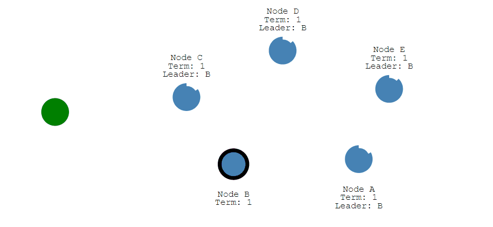

## raft算法概述

### raft算法背景

在只有一个服务器节点时，写入和读取是不存在共识问题的，因为写入和读取都是通过该服务器节点完成

在存在有多个服务器节点时，写入和读取就会出现共识问题，比如

* 数据写入时如何保证每个节点都写了这个数据？
* 如果保证多个节点之间的数据一致性问题？
* ...

而 `raft` 算法可以解决多点系统中的数据一致性问题

### raft算法是什么

`raft` 算法是基于 `paxos` 算法简化的分布式共识算法，比起 `paxos` 算法更加容易理解和实现，但其性能、可靠性、可用性方面是不输于 `Paxos` 算法的

### raft算法应用

`etcd` 是基于 `raft` 算法实现的分布式一致性数据库

### raft算法子问题

`raft` 算法划分出两个子问题：`leader election` 和 `log replication`

## 基础知识

### 节点状态

`raft` 中，一共存在三种状态，每个节点会处于三种状态中的其中一种

* Follower：【跟随者】

  

* Candidate：【选举者】

  

* Leader：【领导者】

  

### 节点信息

每个节点都包含以下两个信息

* `Term`：任期，每有一次新的 `leader`，`Term` 加1
* `timeout`：计时器，每个节点不管处于哪个状态都有一个计时器，它的倒计时时间是随机的

### 节点数量

集群节点数量要求是奇数，这是为了保证在发生分区时，每个分区拥有 `多数票` 的状态

## leader election

### leader选举流程

1.初始阶段，所有的节点都是 `follower` 状态

2.如果 `follower` 在其自身计时器结束前无法收到来自 `leader` 的心跳信息，则变为 `candidate`

3.`candidate`向其他节点发送申请成为 `leader` 的请求

4.其他的节点会返回其投票，如果 `candidate` 获得多数票，则它竞选成功，成为 `leader`

5.`candidate` 拥有其计时器，如果在计时器结束时还没有获取到多数票或者集群中还没有其他的 `leader` 时，`candidate` 会进入下一轮选举

### 领导者发送心跳包

`leader` 会定时向 `follower` 发送心跳包，`follower` 接收到心跳包后会重置其计时器

当 `follower` 在其 `timeout` 内没有接收到来自 `leader` 的心跳包时，其会切换状态为 `candidate`，重复 `leader` 选举流程

### 多 candidate 情况

集群中，可能发生多个节点同时成为 `candidate` 并且它们获取票数都占集群多数，则 `candidate` 自身的 `timeout` 结束时会进入下一轮选举

## log replication

### leader写入数据

所有的写入请求都会经过 `leader`，`leader` 接收写入请求，并将其发送它的 `follower`，告诉 `follower` 将数据进行写入，此时数据并未提交成功

所有的 `follower` 在接收来自 `leader` 的写入请求后，并完成写入后，会告诉 `leader` 写入完成，当 `leader` 接收到集群中多数 `follower` 的写入完成通知后，该写入请求提供成功，并通知其 `follower` 该请求写入成功

### 分区问题

如果集群中发送网络故障，集群被划分为两个小集群，则没有 `leader` 的集群中的 `follower` 在其计时器结束后，会转为 `candidate`，从而进行新一轮选举

> 小集群中的选举能成功是因为集群节点数量为奇数，所以发生分区时，每个小集群都能存在多数票的情况

此时每个小集群都有自己的 `leader`，它们各自接收写入请求，但如果某个小集群中的节点数量不满足总集群中的大多数，则无法完成提交

### 分区恢复后数据同步问题

分区恢复后，每个小集群的 `leader` 会比较其 `term`，`term`小的集群会放弃掉它自己的数据，而去同步 `term` 大的集群的数据

## 其他资源

* [动画演示 raft 算法](http://thesecretlivesofdata.com/raft)

* [模拟各种集群情况](https://raft.github.io/)