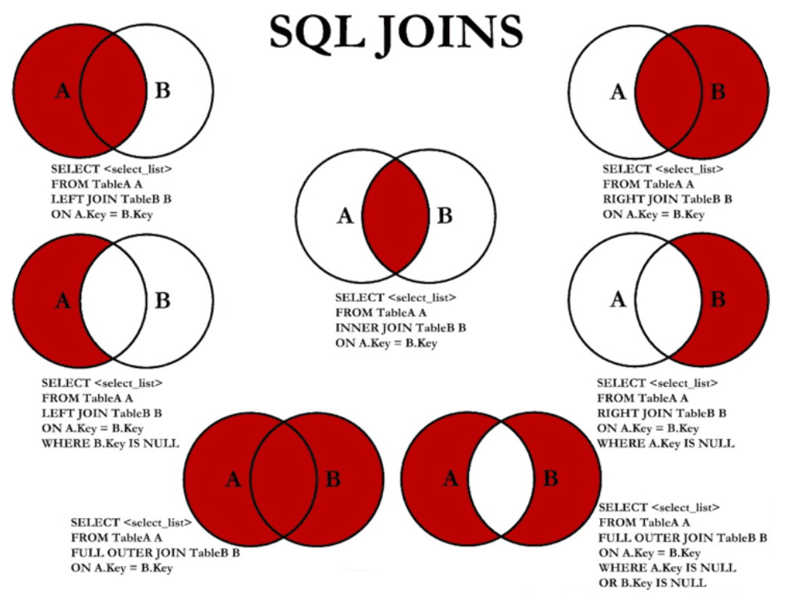

## 基础查询

### SELECT子句

```sql
SELECT 查询字段 FROM 表名;

-- 查询字段包括：表的字段，常量值，表达式，函数
-- 查询的结果是一个虚拟的表
```

### 查询表中单个字段

```sql
SELECT last_name FROM employees;
```

### 查询表中多个字段

```sql
SELECT last_name, salary, email FROM employees;
```

### 查询表中所有字段

```sql
SELECT * FROM employees;
```

### 查询常量值、表达式、函数

```sql
SELECT 100; -- 查询常量值
SELECT 1+2; -- 查询表达式
SELECT version(); -- 查询函数
```

### 字段起别名

```sql
SELECT last_name AS 姓 FROM employees; -- 方式1
SELECT last_name 姓 FROM employees; -- 方式2
SELECT last_name AS "OUT#PUT" FROM employees; -- 特殊符号
```

### 查询结果去重

```sql
SELECT DISTINCT department_id FROM employees;
```

### + 号的使用

MySQL中 + 仅仅只有运算的作用，没有拼接的作用

| 操作数A | 操作数B | 作用                                    |
| ------- | ------- | --------------------------------------- |
| 数值    | 数值    | 加法运算                                |
| 字符    | 数值    | 尝试将字符转换为数值，成功：继续做加法  |
| 字符    | 数值    | 尝试将字符转换为数值，失败：字符被当作0 |
| NULL    | 任意    | 只要有一个为 NULL，结果一定为 NULL      |


## 条件查询

### WHERE子句

```sql
SELECT 查询列表 
FROM 表名
WHERE 条件表达式;
```

### 比较运算符

```sql
> < >= <= = !=(<>) 
```

### 逻辑运算符

```sql
&&  ||  !
AND OR NOT
```

### 模糊查询

#### 模糊查询关键字

| 模糊查询语句      | 注意事项                                                     |
| ----------------- | ------------------------------------------------------------ |
| LIKE              | 与通配符配合使用                                             |
| BETWEEN  x  AND y | 包含边界，等价于 >= x && <= y                                |
| IN                | IN ( 待选列表 )，待选列表中的元素类型要相同                  |
| IS NULL           | 不能用 = 判断是否是 NULL，只能用 IS 判断是否是 NULL，仅可以判断 NULL |
| IS NOT NULL       | 判断非 NULL                                                  |

#### 通配符

```sql
% ：任意多个字符，包含0个
_ ：任意1个字符
```

#### 转义通配符

```sql
\_
\%
```


## 排序查询

### ORDER BY子句

```sql
SELECT *
FROM employees
ORDER BY salary DESC; -- DESC：降序，ASC:升序，默认为 ASC
```

### 多重排序标准

```sql
-- 先按 salary 进行升序排序，保证满足前提条件的情况下，按 employee_id 进行降序排序
SELECT *
FROM employees
ORDER BY salary ASC, employee_id DESC;
```


## 常用函数

### 字符函数

LENGTH

```sql
-- 求出字节的个数
SELECT LENGTH(last_name)
FROM employees;
```

CONCAT

```sql
SELECT CONCAT('a','b','c','d') AS 结果;
SELECT CONCAT(last_name, first_name) AS name FROM employee;
```

UPPER

```sql
SELECT UPPER(last_name) FROM employees;
```

LOWER

```sql
SELECT UPPER(last_name) FROM employees;
```

SUBSTR

```sql
SELECT SUBSTR("123456789", 5) // 56789 索引从1开始
SELECT SUBSTR("123456789", 5, 2) // 567 从索引5开始，长度为2
```

INSTR

```sql
SELECT INSTR("123456789", "567") // 返回第一次出现的索引 5
SELECT INSTR("123456789", "xxx") // 找不到返回0
```

TRIM

```sql
SELECT TRIM("    xxx    ") // 去除前后空格
SELECT TRIM("a" FROM "aaaaaaaaaaaaaxxxaaaxxxaaaaaaaaa") // 返回 "xxxaaaxxx"
```

LPAD

```sql
SELECT LPAD("abc", 15, "*") // "***************abc"
SELECT LPAD("abc", 2, "*") // "ab"
```

RPAD

```sql
SELECT RPAD("abc", 15, "*") // "abc***************"
SELECT RPAD("abc", 2, "*") // "bc"
```

### 数学函数

ROUND

```sql
SELECT ROUND(4.56); // 5
SELECT ROUND(-1.56) // -2
SELECT ROUND(-1.567, 2) // -1.57 
```

CELL

```sql
SELECT CELL(1.0001) // 2
SELECT CELL(-1.02)  // -1
SELECT CELL(1.00)   // 1
```

FLOOR

```sql
SELECT FLOOR(1.0001) // 1
SELECT FLOOR(-9.8)   //-10
```

TRUNCATE

```sql
SELECT TRUNCATE(1.699999,1);  // 1.6
```

### 日期函数

NOW

```sql
SELECT NOW();
```

CURDATE

```sql
SELECT CURDATE();
```

CURTIME

```sql
SELECT CURTIME();
```

YEAR

```sql
SELECT YEAR(NOW());
SELECT YEAR("2018-9-14 08:23:57");
```

> MONTH，DAY，HOUR，MINUTE，SECOND 同上

STR_TO_DATE

```sql
STR_TO_DATE("9-13-1999", "%m-%-%y")

%y 18 %Y 2018
%m 08 %c 8
%d 08
%H 24小时制
%h 12小时制
%i 35
%s 05
```

DATE_FORMAT

```sql
DATE_FORMAT("2018/6/6","%Y年%m月%d日")
```

### JSON函数

JSON_OBJECT，将多个字段数据，放到一个对象中，组合为一个对象字段（主要用于**一对多**）

```sql
SELECT 
	product.id as id, products.title as title, products.price as price
	JSON_OBJECT('id', brand.id, 'name', brand.name, 'website', brand.website) as brand # 合并
FROM `products`
LEFT JOIN `brand` ON products.brand_id = brand.id;
```

JSON_ARRAYAGG，将多个字段数据，放到一个数组中，组成一个数组字段（主要用于**多对多**）

```sql
SELECT
  stu.id, stu.name, stu.age
  JSON_ARRAYAGG(JSON_OBJECT('id', cs.id, 'name', cs.name, 'price', cs.price))
FROM `students` stu
JOIN `students_select_courses` ssc ON stu.id = ssc.student_id
JOIN `courses` cs ON ssc.course_id = cs.id
GROUP BY stu.id;
```


### 其他函数

IFNULL函数

```sql
-- IFNULL(exp1, exp2)
-- exp1：将要进行判断的字段
-- exp2：替换的字段
-- 如果 exp1 为 NULL，则返回替换的字段

SELECT IFNULL(commission_pct, 0) AS "奖金率", commission_pct
FROM employees;
```


## 分组查询和聚合函数

### 概述

默认情况下，MySQL将整张表的数据看作**一组**数据，而**聚合函数**操作的数据对象是**一组一组**的数据，所以**分组查询**需要配合**聚合函数**使用

### 聚合函数（分组函数）

对**组**形式的数据进行处理，默认情况下，MySQL将整张表的数据看作**一组**数据

| 分组函数（聚合函数） | 作用                |
| -------------------- | ------------------- |
| SUM                  | 求和，忽略 NULL     |
| AVG                  | 求平均数，忽略 NULL |
| MAX                  | 求最大值，忽略 NULL |
| MIN                  | 求最小值，忽略 NULL |
| COUNT                | 求数量，忽略 NULL   |

注意事项

* sum avg 可以处理数值
* max，min，count可以处理任何类型
* 分组函数都忽略 NULL
* 可以和 distinct 配合实现去重
* COUNT(*) ：统计行数，只要有不含 NULL 的，都算一行
* COUNT(1)：统计行数，只要有不含 NULL 的，都算一行 
* 和分组函数一同查询的字段要求是 group by 后的字段

### 分组查询

GROUP BY子句：能够以某个字段为基准，将整个表的数据进行分组，然后配合聚合函数查询

HAVING子句：对**分组结果**进行条件筛选，HAVING一定是对分组结果进行筛选的，WHERE一定是对整张表进行筛选的

### 示例

```sql
SELECT MAX(price) FROM `products`;
SELECT MAX(price), MIN(price) FROM `products`;
SELECT MAX(price), MIN(price), price FROM `products`; #Error：price并不能从分组查询的结果中筛选出来

SELECT brand, AVG(price), COUNT(*), AVG(score)
FROM `products`
GROUP BY `brand`;

SELECT brand, AVG(price) AS `avg_price`, COUNT(*) AS `count`, AVG(score) as `avg_score`
FROM `products`
GROUP BY `brand`;

SELECT title, AVG(price) AS `avg_price`, COUNT(*) AS `count`, AVG(score) as `avg_score`
FROM `products`
GROUP BY `brand`; # ERROR，因为 title 不是分组项，因为MySQL无法查出title

SELECT brand, AVG(price) AS `avg_price`, COUNT(*) AS `count`, AVG(score) as `avg_score`
FROM `products`
GROUP BY `brand`
HAVING `avg_price` > 2000;

# 求评分大于7.5分的手机的平均价格
SELECT AVG(price) FROM `products` WHERE score > 7.5;

# 求评分大于7.5分的手机的平均价格，并按照品牌
SELECT brand, AVG(price) 
FROM `products` 
WHERE score > 7.5
GROUP BY(brand);
```


## 连接查询

### 分类

| 大类     | 小类         | 写法                       |
| -------- | ------------ | -------------------------- |
| 内连接   | 等值连接     | INNER JOIN，可以省略 INNER |
| 外连接   | 左外连接     | LEFT JOIN                  |
|          | 右外连接     | RIGHT JOIN                 |
|          | 全外连接     | FULL JOIN                  |
| 交叉连接 | 就是笛卡尔积 | CROSS JOIN                 |

### 语法

```sql
SELECT 查询列表
FROM 表1 AS 别名
连接类型 表2 AS 别名
ON 连接条件
WHERE
GROUP BY
HAVING
ORDER BY
```

### 例子

```sql
SELECT last_name, department_name
FROM employees AS e
INNER JOIN department AS d
ON e.department_id = d.department_id;
```

### 图例




## 分页查询

### LIMIT的使用

放在全部SQL语句最后

```sql
LIMIT 开始索引，条目个数 -- 如果开始索引是0，则可以省略

LIMIT 数量 OFFSET 偏移量
LIMIT 偏移量, 数量
```

例子

```sql
-- user 表最开始的10条数据
SELECT * FROM user
LIMIT 0, 10;
```

### 分页通用写法

```sql
SELECT 查询列表
FROM 表
LIMIT (页码-1) * 每页条目个数, 每页条目个数;
```


## 联合查询

### 概念

将多条查询语句的结果集合并为一个结果集

关键字：UNION

### 例子

```sql
SELECT * FROM employees WHERE email LIKE '%a%'
UNION
SELECT * FROM employees WHERE department_id > 90;
```

### 注意事项

要求多条查询语句的查询结果列数相同

UNION关键字默认去重，如果不想去重则 UNION ALL可以包含重复项