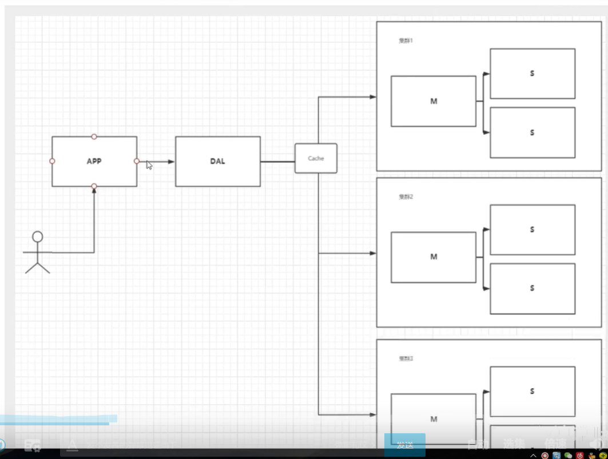
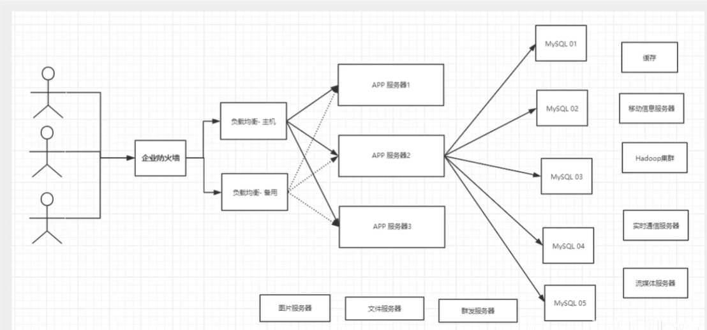

## MySQL的发展历史

### 单体MySQL

APP => DAL => MySQL

1. 数据量大，一个机器放不上
2. 数据的索引（B+ Tree），一个机器内存放不下
3. 访问量（读写混合），一个服务器承载不了

### MySQL + 主从复制 + 读写分离 + 缓存

​                                                     MySQL 读

App => DAL => Cache => MySQL 写

​                                                     MySQL 读

### 集群（分库分表）

早年：MyIAM：表锁

现在：InnoDB：行锁

### 现代

数据量很大，MySQL不够用了

### 解决方案

使用 NoSQL：REdis

## NoSQL

泛指非关系型数据库，Web 2.0 时代，MySQL 不足以支撑

### 特点

1. 数据之间没有关系，很好扩展
2. 大数据量高性能(1秒写8w，读11w)
3. 数据类型是多样的（8种）
4. 不需要事先设计数据库

### 对比

关系型数据库

* 结构化组织
* SQL
* 数据和关系都存储在单独的表中
* 严格的一致性
* 基础的事务

NoSQL

* 没有关系
* 没有查询语言
* 最终一致性
* CAP和BASE（异地多活）
* 三高：高性能、高可用、高可扩展

3V3高

* 海量、多样性、实时（Volumn、Varety、Velocity）
* 高并发、高可扩展（水平拆分）、高性能

真正的实践：NoSQL + MySQL