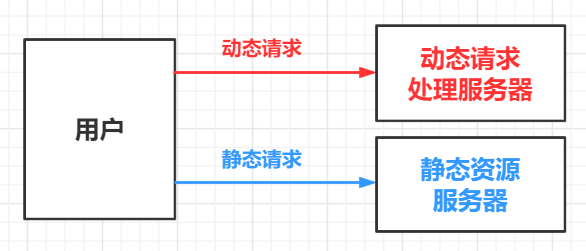
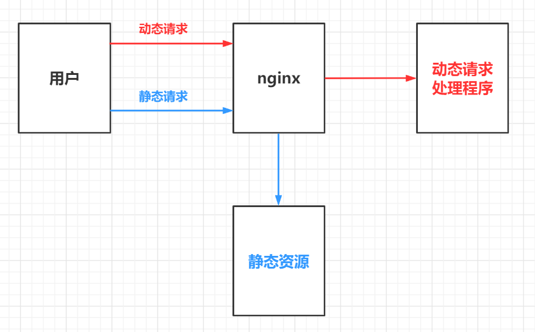

## 动静分离

### 概述

Nginx动静分离指的是把动态请求和静态请求分开

### 实现

#### 方式1：单独的静态资源服务器

纯粹地把静态文件独立成单独的域名，放在独立的服务器（即静态资源服务器）上，这是目前主流的做法



#### 方式2：混合发布

将动态（程序）与静态（文件）混合放在同一台服务器上，通过nginx进行分流

* 通过 location 指定不同的名字以实现把不同的请求转发

* 通过 expires 参数，可以设置浏览器缓存过期时间，返回状态码304




## 静态资源服务器

### 配置项

配置`server块`，以及`server块`中的`location`项

| 配置项             | 说明                                    |
| ------------------ | --------------------------------------- |
| server.listen      | 监听端口                                |
| server.server_name | 主机名，可以是ip或域名                  |
| location.root      | 静态文件根目录，会拼接匹配路径前缀      |
| location.alias     | 静态文件根目录，不会拼接匹配路径前缀    |
| location.index     | 设置index首页                           |
| location.autoindex | on \| off，设置是否开启自动索引         |
| location.expires   | 过期时间，常用单位：`d(day)`和`h(hour)` |

### 示例

```nginx
worker_processes 1;

events {
    worker_connections 1024;
}

http {
    server {
        listen 80;
        server_name localhost;
        
        location /www/ {
            expires 24h; /* 缓存24小时 */
            root /data/;
            index index.html index.htm;
        }
        
        location /image/ {
            root /data/;
            autoindex on;
        }
    }
}
```

### alias与root区别

#### 概述

alias：实际访问文件路径不会拼接路径前缀

root：实际访问文件路径会拼接路径前缀

#### 示例1

对于下列配置，使用`alias`，不会自动拼接`tea`

```nginx
location ^~ /tea/ {
    alias /usr/local/nginx/html/static/;
}
```

* 请求：http://demo.com/tea/main.html
* 实际访问：`/usr/local/nginx/html/static/main.html`

#### 示例2

对于下列配置，使用`root`，会自动拼接`/tea`

```nginx
location ^~ /tea/ {
    root /usr/local/nginx/html/;
}
```

* 请求：http://demo.com/tea/main.html
* 实际访问：`/usr/local/nginx/html/tea/main.html`


## 配置前端 history 模式路由

### 指令介绍

使用 `try_files` 指令，设置当资源访问失败后定向到 `index.html`

指令格式：`try_files file ... uri`

### 例子

```nginx
server {
	listen 80;
    server_name demo.mneumi.cn;

	location /{
        root /opt/html/;
        try_files $uri $uri/ /default.gif; 
    }
```

当请求 `http://demo.mneumi.cn/test.gif` 时，会按下列顺序依次寻找

1. `http://demo.mneumi.cn/opt/html/test.gif`
2. `http://demo.mneumi.cn/opt/html/test.gif/index.html`
3. `http://demo.mneumi.cn/default.gif`

### 具体配置

```nginx
server {
    listen 80;
    server_name demo.mneumi.cn;

    location / {
        root /home/menumi/demo;
        try_files $uri $uri/ /index.html;
        index index.html;
    }
}
```

