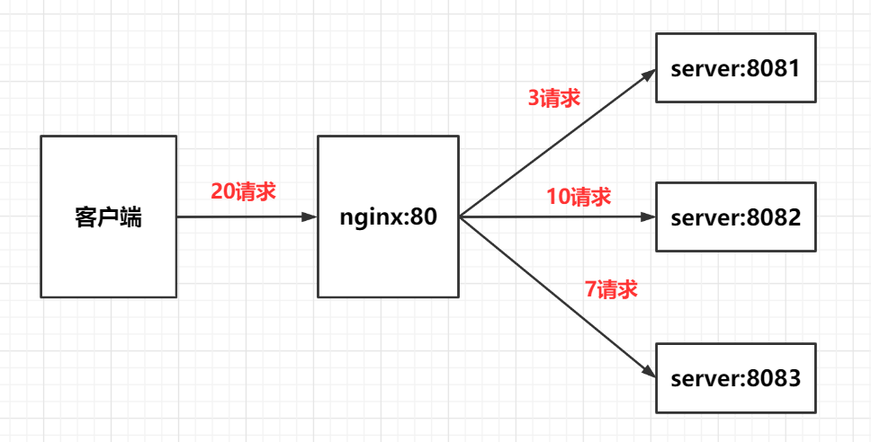

## 概述

### 背景

随着信息数量的不断增长，访问量和数据量的飞速发展，以及系统业务的复杂度增加，传统的单机架构会造成服务器响应客户端的请求逐渐变慢，在并发量大的时候，还容易造成服务器直接崩溃，面对这种问题，可以使用**负载均衡**来应对

### 概念

负载均衡是指将请求分发到不同的服务器上，从而保证服务的可用性，又保证响应足够快

### 选型

linux下的负载均衡产品很多，常用的有：nginx，LVS，Haproxy等


## 示意图




## 配置项

### 概述

配置`全局http块`和`server块`中的`proxy_pass`

| 配置项              | 说明                       |
| ------------------- | -------------------------- |
| upstream            | 负载均衡服务名             |
| upstream.server     | 服务器ip地址或域名         |
| server.listen       | 监听端口                   |
| server.server_name  | 主机名，可以是ip或域名     |
| location.proxy_pass | 代理地址，写负载均衡服务名 |

```nginx
http {
	upstream [负载均衡服务名] {
        <负载均衡策略>
        server 服务器ip地址或域名1 <权重>;
        server 服务器ip地址或域名2 <权重>;
        ...
        server 服务器ip地址或域名n <权重>;
    }
    
    server {
        listen 80;
        server_name demo.com;
        
        location / {
            proxy_pass http://[负载均衡服务名]
        }
    }
}
```

### 示例配置

实现效果：浏览器输入`http://127.0.0.1/demo/main.html`，负载均衡效果，平均到`8080`和`8081`端口中

```nginx
http {
    upstream myserver {
        server 127.0.0.1:8080;
        server 127.0.0.1:8081;
    }
    
    server {
        listen 80;
        server_name 127.0.0.1;
        
        location / {
            proxy_pass http://myserver;
        }
    }
}
```


## 负载均衡策略

### loop

轮询（默认项），每个请求按时间顺序逐一分配到不同的后端服务器

如果后端服务器宕机，能自动剔除

```nginx
upstream server_pool {
    server 192.168.12.34:80;
    server 192.168.33.56:80;
    server 192.168.46.65:80;
}
```

### weight

权重，默认权重为1，权重越高越大，则被分配的客户端越多

```nginx
upstream server_pool {
    server 192.168.12.34:80 weight=5;
    server 192.168.33.56:80 weight=5;
    server 192.168.46.65:80 weight=20;
}
```

### ip_hash

每个请求按访问ip的hash结果分配，这样每个访客固定一个后端服务器，解决了session问题

```nginx
upstream server_pool {
    server 192.168.12.34:80;
    server 192.168.33.56:80;
    server 192.168.46.65:80;
    ip_hash;
}
```

### fair

按照后端服务器的响应时间来动态分配请求，响应时间短的优先分配

```nginx
upstream server_pool {
    server 192.168.12.34:80;
    server 192.168.33.56:80;
    server 192.168.46.65:80;
    fair
}
```


