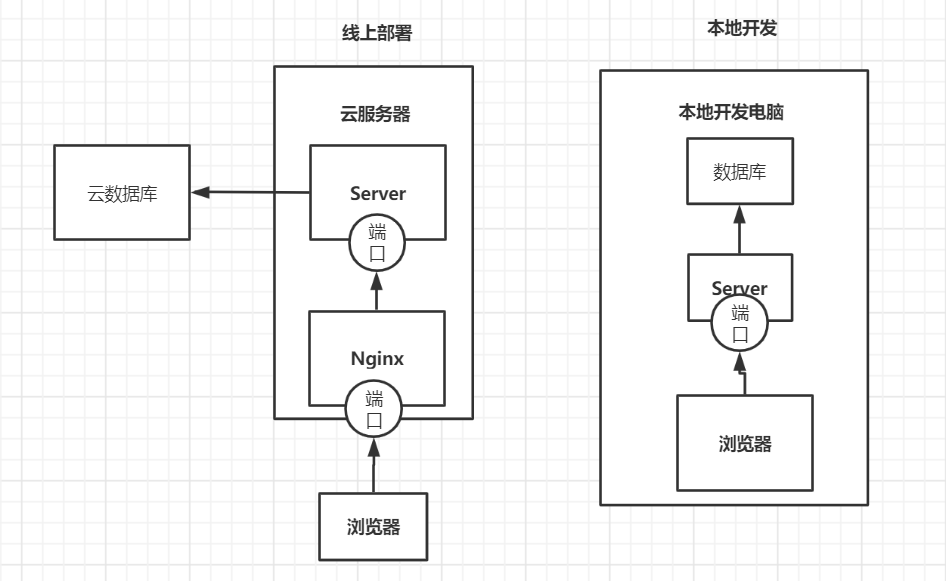

## 示意图

## 存在的问题

1. 模块之间耦合，某个模块更新后，其他的模块也要进行回归测试
2. 很难换技术栈（语言，版本等等）
3. 代码难以复用
4. 系统之间调用（存在强依赖关系）
5. 接口不仅仅对外提供服务，还需要对内提供服务
6. 数据分析功能会导致数据库性能问题，影响业务
7. 数据库被多个服务依赖，无法升级和拆分
8. 系统难以升级（数据库、redis等等）
9. 某个接口写的不好，导致数据库出现严重问题
10. 测试部署困难