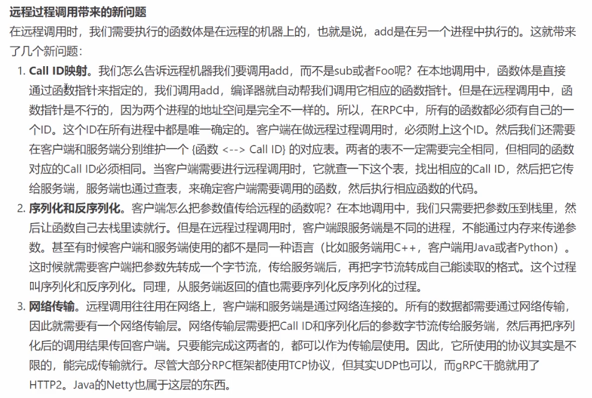
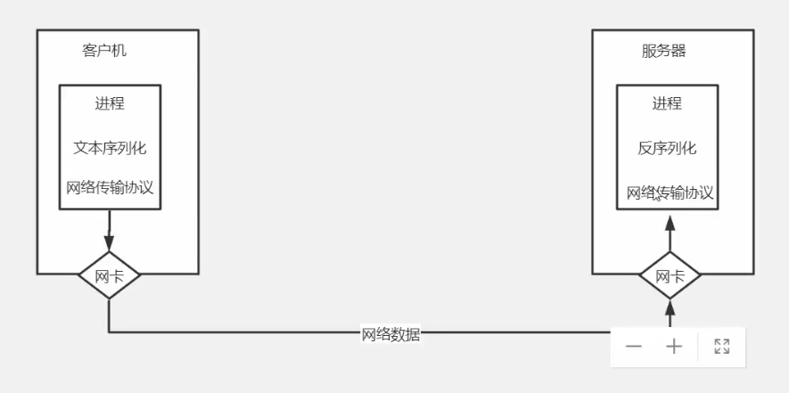
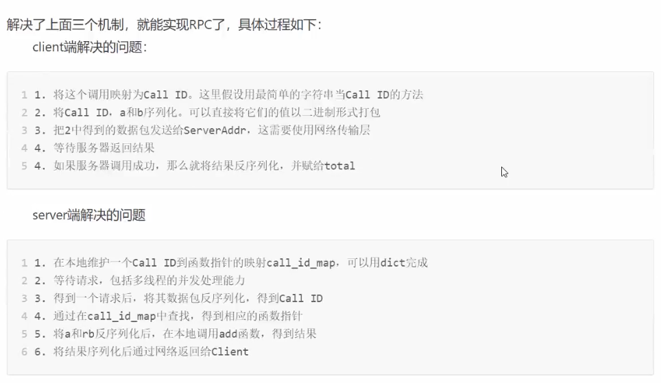
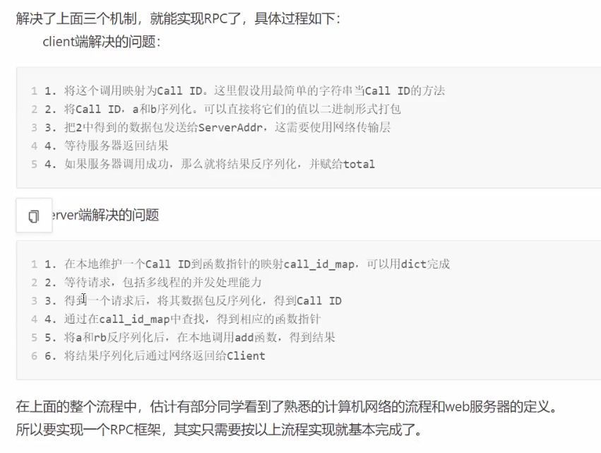
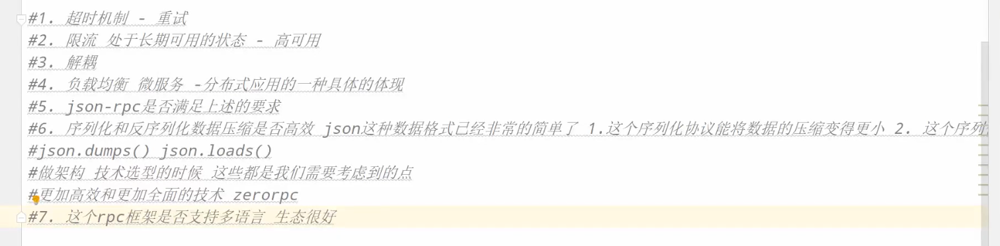
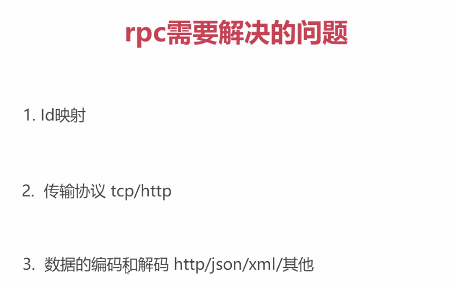
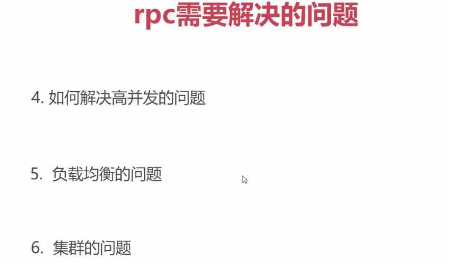
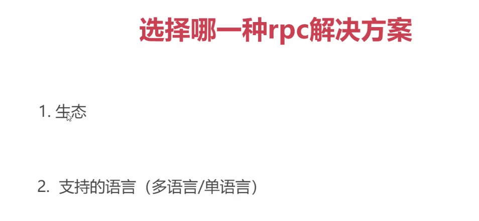

## 什么是RPC

RPC，Remote Procedure Call，远程过程调用

简单理解就是一个网络节点请求另外一个网络节点的服务

对应RPC的是本地过程调用，函数调用是最常见的本地过程调用

将本地过程调用变为远程调用会面临各种问题


## 本地调用过程

```go
func add(a, b int) int {
    sum := a + b
    return sum
}

total := add(1,2)
```

函数调用过程

1. 将1，2压入add函数的栈
2. 进入add函数，从栈中取出1和2分别赋值给a和b
3. 执行a + b 将结果赋值给局部的 sum 变量并压栈
4. 将栈中的值取出来赋值给 total 变量，并返回


## 远程过程调用面临的问题

1. Call的id的映射
2. 序列化和反序列化
3. 网络传输



 






## JSON RPC的问题




========================









