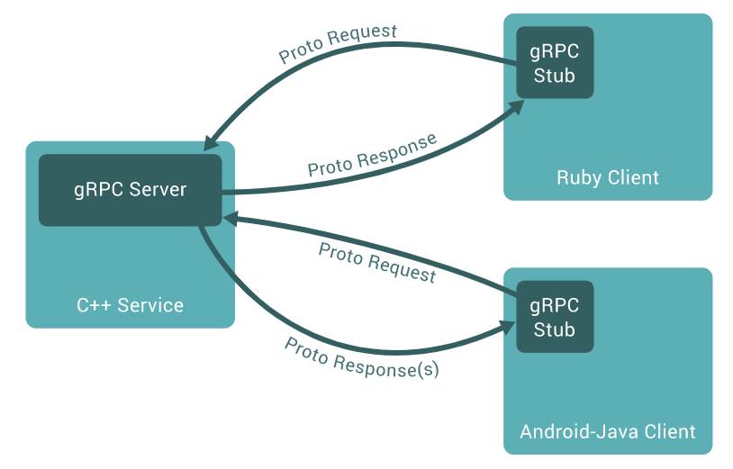

## 初识gRPC

### gRPC是什么

gRPC是一个高性能、开源和通用的RPC框架，面向移动和HTTP/2设计

gRPC目前支持 Go、Node.js、Java、C++、C# 等多种语言

### gRPC和Protobuf联系

1. gRPC和Protobuf都是由 google 发明并开源的
2. Protobuf是通信协议，gRPC是RPC框架，两者并不是同一个类别的东西
3. gRPC框架中，序列化/反序列化协议使用的是 Protobuf

### 工作原理

使用代理模式，服务端代理称为**Server Proxy**，客户端代理称为**Client Stub**




```shell
protoc -I . hello.proto --go_out=plugins=grpc:.
```

服务端

```go
package main

import (
	"context"
    "proto"
    
    "google.golang.org/grpc"
)

type Server struct{}

func (s *Server) SayHello(ctx context.Context, request *proto.HelloRequest) (*proto.HelloReply, error) {
    return &proto.HelloReply{
        Message: "Hello " + request.Name
    }, nil
}

func main() {
    // 1.创建监听器
    lis, err := net.Listen("tcp", ":8080")
    if err != nil {
        panic("failed to listen: ", err.Error())
    }
    
    // 2.创建服务器
    g := grpc.NewServer()
    
    // 3.注册服务
    proto.RegisterGreeterServer(g, &Server{})
    
    // 4.启动服务器
    err = g.Serve(lis)
    if err != nil {
        panic("failed to start: ", err.Error())
    }
}
```

客户端

```go
func main() {
    // 1.创建连接
    conn, err := grpc.Dial("127.0.0.1:8080", grpc.WithInsecure())
    
    if err != nil {
        panic(err)
    }
    
    // 2.创建客户端
    c := proto.NewGreeterClient(conn)
    
    // 2.1延迟关闭连接
    defer conn.Close()
    
    // 3.使用客户端
    rsp, err := c.SayHello(context.Background(), &proto.HelloRequest{Name: "alice"})
    
    if err != nil {
        panic(err)
    }
    
    println(rsp.Message)
}
```


## RPC框架的选择

生态如何

支持语言多吗

支持集群吗

支持高并发吗

负载均衡做的如何


## 分包

proto对象定义 <++> proto序列化/反序列化

grpc服务定义 <++> grpc 服务器与客户端


## gRPC四种数据流

| 数据流       | 说明 |
| ------------ | ---- |
| 简单模式     |      |
| 服务端数据流 |      |
| 客户端数据流 |      |
| 双向数据流   |      |


## 简单模式

这种模式最为传统，即客户端发起一次请求，服务端响应一个数据


## 服务端数据流

这种模式是客户端发起一次请求，服务端返回一段连续的数据流

典型例子：客户端发送股票代码，服务端实时推送数据给客户端

典型例子：监控功能


## 客户端数据流

这种模式是客户端不断向服务端发送数据流，而在发送结束后，服务端返回一个响应

典型例子：物联网终端向服务器推送数据


## 双向数据流

客户端与服务端都可以给对方发送数据流，可以同时发送和接收（全双工）

典型例子：聊天机器人


```protobuf
syntax = "proto3"

option go_package="./proto"

service Greeter {
	rpc GetStream (StreamReqData) returns (stream StreamResData); // 服务端流模式
	rpc PutStream (stream StreamReqData) returns (StreamResData); // 客户端流模式
	rpc AllStream (stream StreamReqData) returns (stream StreanResData); // 双向流模式
}

message StreamReqData {
	string data = 1;
}

message StreamResData {
	string data = 1;
}
```


### server

```go
package main

const PORT = ":50052"

type server struct {}

func (s *Server) GetStream(req *proto.StreamReqData, serverStream proto.Greeter_GetStreamServer) error {
    i := 0
    for {
        i++
        
        _ = res.Send(&proto.StreamResData{
            Data: fmt.Sprintf("%v", time.Now().Unix())
        })
        
        time.Sleep(time.Second)
        
        if i > 10 {
            break
        }
    }
    
    return nil
}

func (s *Server) PutStream(clientStream proto.Greeter_PutStreamServer) error {
    for {
        a, err := clientStream.Recv()
        
        if err != nil {
            panic(err)
        }
        
        fmt.Println(a.Data)
    }
    
    return nil
}

func (s *Server) AllStream(allStream proto.Greeter_AllStreamServer) error {
    wg := sync.WaitGroup{}
    wg.Add(2)
    
    go func() {
        defer wg.Done()
        for {
            data, _ := allStream.Recv()
            fmt.Println("收到客户端消息："+data.Data)
        }
    }()
    
    go func() {
        defer wg.Done()
        for {
            _ = allStream.Send(&proto.StreamResData{
                Data: "我是服务器"
            })
            time.Sleep(time.Second)
        }    
    }()
    
    wg.Wait()
    return nil
}

func main() {
    lis, _ := net.Listen("tcp", PORT)
    s := grpc.NewServer()
    proto.RegisterGreeterServer(s, &server{})
    _ = s.Serve(lis)
}
```

### client

```go
package main

func main() {
    conn, err := grpc.Dial("localhost:50052", grpc.WithInsecure())
    
    if err != nil {
        panic(err)
    }
    
    defer conn.Close()
    
    c := proto.NewGreeterClient(conn)
    
    // 服务端流模式
    res, _ := c.GetStream(context.Background(), &proto.StreamReqData{
        Data: "Alice"
    })
    for {
        a, err := res.Recv()
        if err != nil {
            
        }
        fmt.Println(a.Data)
    }
    
    // 客户端流模式
    putStream, _ := c.PutStream(context.Background())
    i := 0
    for {
        i++
        puStream.Send(&proto.StreamReqData{
            Data: "Alice"
        })
        time.Sleep(time.Second)
        if i > 10 {
            break
        }
    }
    
    // 双向流模式
    allStream, _ := c.AllStream(context.Background())
    wg := sync.WaitGroup{}
    wg.Add(2)
    
    go func() {
        defer wg.Done()
        for {
            data, _ := allStream.Recv()
            fmt.Println("收到服务端消息："+data.Data)
        }
    }()
    
    go func() {
        defer wg.Done()
        for {
            _ = allStream.Send(&proto.StreamReqData{
                Data: "我是客户端"
            })
            time.Sleep(time.Second)
        }    
    }()
    
    wg.Wait()
}
```


## 包与工具总结

protoc

protoc-gen-go

google.golang.org/protobuf/proto

google.golang.org/grpc
