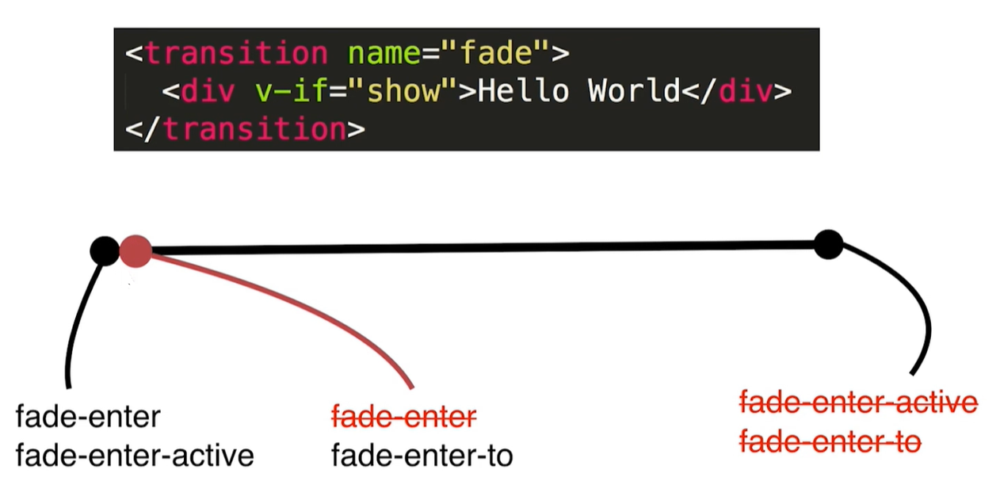
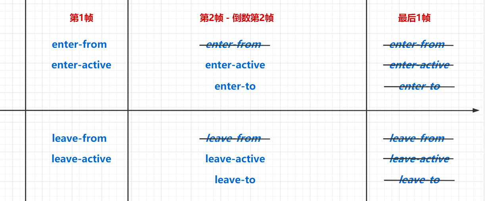

## 过渡与动画

### 过渡

过渡指从一个状态切换到另外一个状态的过程，比如颜色，大小，位置等

### 动画

动画指指一个元素运动的过程


## 基础使用

### 概述

使用`css`和数据驱动来实现过渡和动画效果

### 实现过渡

```html
<style>
    .transition {
        transition: 3s background-color ease;
    }
    .blue {
        background-color: blue;
    }
    .green {
        background-color: green;
    }
</style>

<script>
    new Vue({
        data() {
            return {
                container: {
                    transition: true,
                    blue: true,
                    green: false
                }
            }  
        },
        methods: {
            handleClick() {
                this.container.blue = !this.container.blue;
                this.container.green = !this.container.green;
            }
        },
        template: `
        <div class="container" @click="handleClick">
        	Hello World
        </div>
        `
    })
</script>
```

### 实现动画

```html
<style>
    @keyframe leftToRight {
        0% {
            transform: translateX(-100px);
        }

        50% {
            transform: translateX(-50px);
        }

        0% {
            transform: translateX(0px);
        }
    }
    .animation {
        animation: leftToRight 3s;
    }
</style>

<script>
    new Vue({
        template: `
        <div class="animation">
        	Hello World
    	</div>
		`
    })
</script>
```


## 单组件/单元素的入场/出场

### 概述

使用 Vue 内置的 `transition` 内置组件，能够方便地实现对于单组件/单元素的入场/出场的过渡和动画

### 原理

根据动画的帧数添加和移除`class名`来实现动画效果

| 系列                          | 存在时间         | 移除时机           | 作用                 |
| ----------------------------- | ---------------- | ------------------ | -------------------- |
| -enter / -leave               | 只存在于第一帧   | 第一帧结束时移除   | 决定过渡的初始状态   |
| -enter-active / -leave-active | 第一帧到最后一帧 | 最后一帧结束时移除 | 决定过渡的效果与时间 |
| -enter-to / -leave-to         | 第二帧到最后一帧 | 最后一帧结束时移除 | 决定过渡的最终状态   |

#### 示例图





### 基础使用

#### 默认类名

| 类名           | 解析                 |
| -------------- | -------------------- |
| v-enter-from   | 入场：最初的状态     |
| v-enter-to     | 入场：最后的状态     |
| v-enter-active | 入场：过渡或动画效果 |
| v-leave-from   | 入场：最初的状态     |
| v-leave-to     | 入场：最后的状态     |
| v-leave-active | 入场：过渡或动画效果 |

#### 示例：过渡

```html
<style>
    .v-enter-from {
        opacity: 0;
    }
    .v-enter-to {
        opacity: 1;
    }
    .v-enter-active {
        transition: opacity 3s ease-out;
    }
    
    .v-leave-from {
        opacity: 1;
    }
    .v-leave-to {
        opacity: 0;
    }
    .v-leave-active {
        transition: opacity 3s ease-out;
    }
</style>
<script>
new Vue({
    data() {
        return {
            show: true
        }
    },
    methods: {
        handleClick() {
            this.show = !this.show;
        }
    },
    template: `
	<div>
		<transition>
    		<div v-if="show">Hello World</div>
		</transition>
		<button @click="handleClick">Switch</button>
    </div>
	`
})
</script>
```

#### 示例：动画

更简单，只依赖于`active`

```html
<style>
    @keyframe shake {
        0% {
            transform: translateX(-100px);
        }
        50% {
            transform: translateX(-50px);
        }
        100% {
            transform: translateX(50px);
        }
    }
       
    .v-enter-active {
        animation: shake 0.3s;
    }
    
    .v-leave-active {
        animation: shake 0.3s;
    }
</style>
<script>
new Vue({
    data() {
        return {
            show: true
        }
    },
    methods: {
        handleClick() {
            this.show = !this.show;
        }
    },
    template: `
	<div>
		<transition>
    		<div v-if="show">Hello World</div>
		</transition>
		<button @click="handleClick">Switch</button>
    </div>
	`
})
</script>
```

### 自定义类名前缀

#### 默认

默认情况下，`transition`相关的`class`名称都是以`v-`开头的，可以通过设置`name`属性实现自定义类名前缀

```html
<transition name="v"></transition>
```

#### 使用

可以自定义类名前缀，从而使用多个`transtion`（避免都是`v-`开头，导致冲突）

```html
<style>
    .hello-enter-from {
        opacity: 0;
    }
    .hello-enter-to {
        opacity: 1;
    }
    .hello-enter-active {
        transition: opacity 3s ease-out;
    }
    
    
    .hello-leave-from {
        opacity: 1;
    }
    .hello-leave-to {
        opacity: 0;
    } 
    .hello-leave-active {
        transition: opacity 3s ease-out;
    }
</style>
<script>
new Vue({
    data() {
        return {
            show: true
        }
    },
    methods: {
        handleClick() {
            this.show = !this.show;
        }
    },
    template: `
	<div>
		<transition name="hello">
    		<div v-if="show">Hello World</div>
		</transition>
		<button @click="handleClick">Switch</button>
    </div>
	`
})
</script>
```

### 自定义class名称

#### 作用

能够自定义class名称，方便配合第三方动画库——如**Animate.css**

#### 用法

| 属性               | 说明                     |
| ------------------ | ------------------------ |
| enter-from-class   | 自定义 enter-from 类名   |
| enter-to-class     | 自定义 enter-to 类名     |
| enter-active-class | 自定义 enter-active 类名 |
| leave-from-class   | 自定义 leave-from 类名   |
| leave-to-class     | 自定义 leave-to 类名     |
| leave-active-class | 自定义 leave-active 类名 |

#### 示例

```html
<style>
    @keyframe shake {
        0% {
            transform: translateX(-100px);
        }
        50% {
            transform: translateX(-50px);
        }
        100% {
            transform: translateX(50px);
        }
    }
       
    .abc {
        animation: shake 0.3s;
    }
    
    .zxc {
        animation: shake 0.3s;
    }
</style>
<script>
new Vue({
    data() {
        return {
            show: true
        }
    },
    methods: {
        handleClick() {
            this.show = !this.show;
        }
    },
    template: `
	<div>
		<transition 
			enter-active-class="abc"
			leave-active-class="zxc"
		>
    		<div v-if="show">Hello World</div>
		</transition>
		<button @click="handleClick">Switch</button>
    </div>
	`
})
</script>
```

### 过渡加动画

#### 概述

在一个`transition`中，可能同时存在过渡与动画，那么它们的执行时间就值得思考

#### 指定type

可以通过`type`指定以哪个为准

`type="transition"`：以`transition`为准

 `type="animation"`：以`animation`为准

#### 指定duration

可以指定`duration`，优先级最高

duration对象如下

```js
:duration = {
    enter: 3000,
    leave: 5000
}
```

#### 示例代码

```html
<style>
    @keyframe shake {
        0% {
            transform: translateX(-100px);
        }
        50% {
            transform: translateX(-50px);
        }
        100% {
            transform: translateX(50px);
        }
    }
       
    .abc {
        animation: shake 0.3s;
        transition: color 3s ease-in;
    }
    
    .zxc {
        animation: shake 0.3s;
        transition: color 3s ease-in;
    }
</style>
<script>
new Vue({
    data() {
        return {
            show: true
        }
    },
    methods: {
        handleClick() {
            this.show = !this.show;
        }
    },
    template: `
	<div>
		<transition 
			enter-active-class="abc"
			leave-active-class="zxc"
			type="animation"
			:duration="2000"
		>
    		<div v-if="show">Hello World</div>
		</transition>
		<button @click="handleClick">Switch</button>
    </div>
	`
})
</script>
```


## 两个单元素/单组件切换

### 存在问题1：同时执行

#### 概述

两个动画同时执行，没有先后顺序效果（比如旧的先隐藏，然后新的再出现）

```html
<div>
    <transition>
        <div v-if="show">Hello World</div>
        <div v-else>bye bye</div>
    </transition>
    <button @click="handleClick">Switch</button>
</div>
```

#### 解决方式

设置`mode`属性，值有

* `in-out`：先进后出
* `out-in`：先出后进

```html
<div>
    <transition mode="out-in">
        <div v-if="show">Hello World</div>
        <div v-else>bye bye</div>
    </transition>
    <button @click="handleClick">Switch</button>
</div>
```

### 存在问题2：希望一开始就有动画

#### 概述

在元素/组件第一次渲染时，并没有出现动画，只有在切换时才出现动画

现在需求是：在一开始（首次渲染）就有动画

#### 解决方法

设置`appear`属性

```html
<div>
    <transition mode="out-in" appear>
        <div v-if="show">Hello World</div>
        <div v-else>bye bye</div>
    </transition>
    <button @click="handleClick">Switch</button>
</div>
```

### 存在问题3：希望多个单组件/单元素切换

#### 概述

希望多个单组件/单元素切换

#### 解决方法

使用动态组件 `component`

```html
<transition>
  <component :is="component" />
</transition>
```

```js
data() {
    return {
        component: "component-a"
    }
}
```


## 列表动画

### 概述

对于列表渲染，为其列表元素，添加过渡和动画，可以使用`transition-group`组件

### 用法

`transition-group`的用法和`transition`基本一致

但多了一个功能：设置列表中其他元素的过渡效果，名称为`[name]-mode`

### 示例代码

```html
<style>
    .list-item {
        display: inline-block;
        margin-right: 10px;
    }
    
    .v-enter-from {
        opacity: 0;
        transform: translateY(30px);
    }
    .v-enter-active {
        transition: all 3s ease-in;
    }
    .v-enter-to {
        opacity: 1;
        transform: translateY(0);
    }
    
    /********** 其他元素移动的样式 **********/
    .v-move { 
        transition: all .5s ease-in;
    }
</style>
<script>
new Vue({
    data() {
        return {
            list: [1,2,3]
        }
    },
    methods: {
        handleClick() {
            // 往头部追加元素
            this.list.unshift(this.list.length + 1)
        }
    },
    template: `
	<div>
		<transition-group>
			<span class="list-item" v-for="item in list" :key="item">{{ item }}</span>
		</transition-group>
		<button @click="handleClick">增加</button>
    </div>
	`
})
</script>
```


## 状态动画

### 概述

**状态动画**是指：内容本身就是渲染数据，即通过数据控制内容展示，然后通过不断改变数据，来实现**状态动画**

### 示例代码

```html
<script>
new Vue({
    data() {
        return {
            animateNumber: 1
        }
    },
    methods: {
        handleClick() {
            if (this.animateNumber < 10) {
                const animation = setInterval(() => {
                    this.animateNumber += 1;
                    if (this.animateNumber === 10) {
                        clearInterval(animation);
                    }
                }, 100)
            }
        }
    },
    template: `
	<div>
		<div>{{ animateNumber }}</div>
		<button @click="handleClick">增加</button>
    </div>
	`
})
</script>
```

### 进阶使用

可以配合改变**svg**的参数来实现非常丰富的动画


## JavaScript动画

### 概述

尽管`JavaScript`动画的性能可能没有`CSS`动画那么高，但是在某些场景下，`JavaScript`动画是需要的

### 前提：禁用CSS动画

设置`css`属性为`false`，以禁用`css`动画

```html
<transition :css="false"></transition>
```

### 定义方法

| 事件名       | 说明               |
| ------------ | ------------------ |
| before-enter | 入场动画执行前回调 |
| enter        | 入场动画执行时回调 |
| after-enter  | 入场动画执行后回调 |
| before-leave | 出场动画执行前回调 |
| leave        | 出场动画执行时回调 |
| after-leave  | 出场动画执行后回调 |

### 参数

el：元素的DOM节点对象，通过它设置动画效果

done：标注动画已结束，从而触发`after-enter`和`after-leave`钩子

### 示例代码

```html
<script>
handleBeforeEnter(el) {
    el.style.color = "red"
}
handleEnterActive(el, done) {
    const animation = setInterval(() => {
        const color = el.style.color;
        if (color === "red") {
            el.style.color = "green"
        } else {
            el.style.color = "red"
        }
    }, 1000)
    setTimeout(() => {
        clearInterval(animation)
        done(); // 用于告诉动画结束，触发 after-enter
    }, 5000)
}
handleAfterEnter(el) {}
    
handleBeforeLeave(el) {}
handleLeaveActive(el, done) {}
handleAfterLeave(el) {}
</script>

<transition 
	@before-enter="handleBeforeEnter"
    @enter="handleEnterActive"
    @after-enter="handleAfterEnter"
    @before-leave="handleBeforeLeave"
    @leave="handleLeaveActive"
    @after-leave="handleAfterLeave"
>
	<div>Hello World</div>
</transition>
```


## 总结

### transition组件总结

| 属性               | 说明                                   |
| ------------------ | -------------------------------------- |
| name               | 设置类名前缀                           |
| css                | 设置是否禁用css                        |
| mode               | 设置多个单元素/单组件切换时的先后顺序  |
| appear             | 第一次渲染就执行动画                   |
| type               | 当过渡和动画同时存在时，以哪个时间为准 |
| duration           | 设置总的执行时间，优先级最高           |
| enter-from-class   | 自定义enter-from类名                   |
| enter-to-class     | 自定义enter-to类名                     |
| enter-active-class | 自定义enter-active类名                 |
| leave-from-class   | 自定义leave-from类名                   |
| leave-to-class     | 自定义leave-to类名                     |
| leave-active-class | 自定义leave-active类名                 |
| before-enter       | JS动画：enter之前回调函数              |
| enter              | JS动画：enter时回调函数                |
| after-enter        | JS动画：enter之后回调函数              |
| before-leave       | JS动画：leave之前回调函数              |
| leave              | JS动画：leave时回调函数                |
| after-leave        | JS动画：leave之后回调函数              |

